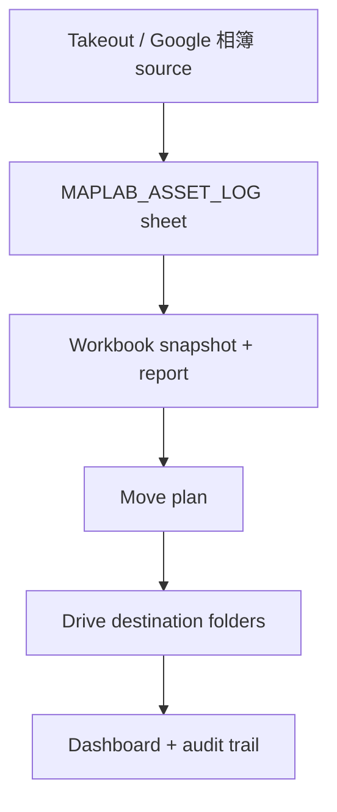

# A4 Workflow

## Flow

## Steps

1. Read the asset log.
2. Verify source folders in the current Google account.
3. Build a move plan.
4. Split into year and category folders.
5. Copy only after source and destination are confirmed.
6. Write the report back into `workbook/outputs`.

## Guardrails

- No blind move from a guessed file ID.
- No parallel archive tree.
- No destructive delete.
- Preserve original files.

## What the dashboard should show

- source snapshot
- move report
- task index
- relation graph
- links into this `docs/a4/` folder
