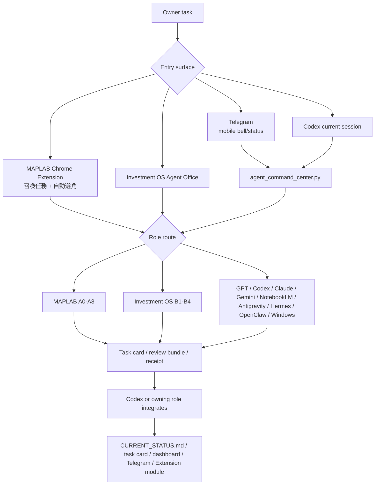
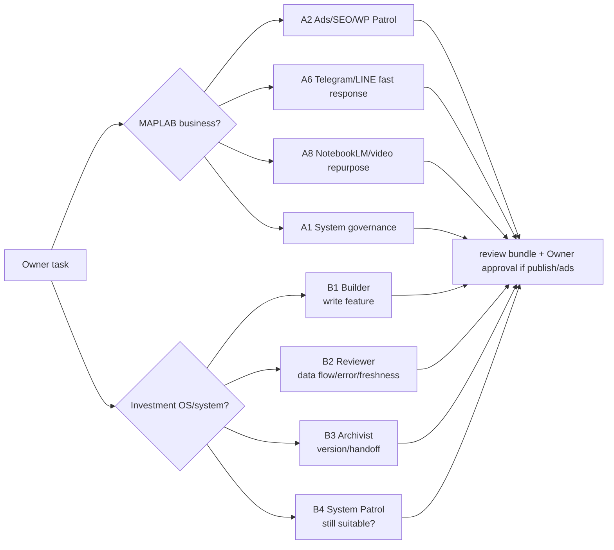
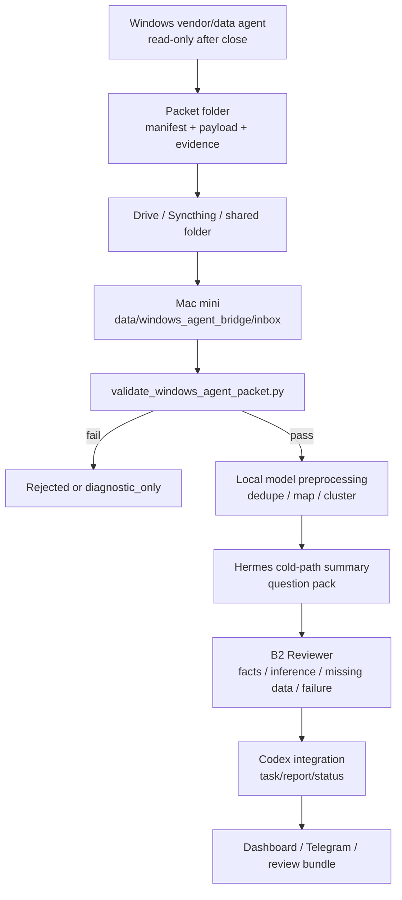

# Cross-Project Agent Summon Workflow Map

Last Updated: 2026-05-29

Scope: MAPLAB + Investment OS

Twin document in Investment OS:

- `/Users/pagemacmini/Documents/New project/docs/AGENT_SUMMON_WORKFLOW_MAP.md`

This MAPLAB copy focuses on Chrome Extension, A/B role routing, and the shared
agent vocabulary. The Investment OS copy carries the same operating model plus
the runtime and Windows-to-Mac packet details.

## 0. Why This Exists

Owner should not need to remember whether a task belongs in GPT, Codex, Claude
Code, Claude Chrome tab, Gemini, NotebookLM, Antigravity, Hermes, OpenClaw, a
Windows agent, MAPLAB A roles, or Investment OS B roles.

The system now has one rule:

```text
Say the task once.
Route by scenario.
Require evidence.
Integrate through the owning project.
```

## 1. Shared Project Map

| Project | Canonical root | Truth source | Main responsibility |
| --- | --- | --- | --- |
| MAPLAB | `/Users/pagemacmini/maplab-ai-handbook` | `CURRENT_STATUS.md` | Chrome Extension role modules, A0-A8 business roles, B1-B4 summon governance |
| Investment OS | `/Users/pagemacmini/Documents/New project` | `CURRENT_STATUS.md` | Market runtime, dashboard, Telegram, Agent Office, Windows packet bridge, Hermes/OpenClaw/local research |

When this map changes, update both project docs and both `CURRENT_STATUS.md`
files. Do not rely on chat memory as the only handoff.

## 2. Top-Level Flow



## 3. Agent Why Matrix

| Agent or function | Why it was created | Best used for | Not allowed to decide alone |
| --- | --- | --- | --- |
| Chrome Extension v5.6.0 | Owner needs a summon field and role routing instead of memorizing agents | `召喚任務`, auto route A2/B1/B2/B3/B4, runtime handoff | Runtime truth without live verification |
| GPT / ChatGPT | Strategy, language, investment logic, prompt design | Why/so-what, debate, prompt handoff, framing | Claims that files/UI/runtime changed |
| Codex | Repo integration, tests, status, commits, final safety gate | Code, docs, validation, review bundle, runtime sync | Secrets, broker/order state, destructive unrelated cleanup |
| Claude Code | Second engineering reviewer/subagent | Architecture review, code review, focused debug | Direct runtime mutation without Codex review |
| Claude Chrome tab | Legacy browser-side eye/hand | Bounded visible page reading or form help | Source of truth, publishing, settings, auth |
| Gemini | Google ecosystem, long-context, multimodal review | Ads/SEO analysis, image/text review, high-grade critique | Verified live facts without source/UI proof |
| NotebookLM | Source-grounded condensation | KOL/transcript/report notebook, podcast/audio overview | Task execution or inference beyond sources |
| Antigravity | Parallel external agent manager | Long-running external review, UI evidence analysis, implementation branch suggestions | Secrets, cookies assumptions, final merge |
| Hermes | Cold-path chief of staff | Nightly summaries, question packs, source-backed Markdown | Hot-path trading, broker/order, final decision |
| OpenClaw | Browser/computer operator | Telegram Web readback, NotebookLM smoke, browser snapshots, copy/paste | 2FA, secrets, destructive, publishing, broker/order |
| Local model / Ollama | Cheap preprocessing | Dedupe, extraction, first-pass classification | Verified fact or final investment conclusion |
| Windows agent | Windows-only vendor UI/data collector | After-close vendor packet, read-only screenshots/exports | Truth before Mac validation, order/account screens |

## 4. MAPLAB A Roles And Investment B Roles



Why B1-B4 were split:

- Builder and Reviewer must be separate because building can hide data-flow mistakes.
- Archivist exists because chat memory dies; the next agent needs files.
- System Patrol exists because "more automation" is sometimes the wrong answer.
- All B roles share Owner investment language, but none of them place trades or give final buy/sell instructions.

## 5. Standard Summon Scenarios

| Scenario | First route | Support route | Output |
| --- | --- | --- | --- |
| "I need a feature/fix" | Codex or B1 | B2/B3 | code, tests, status, review bundle |
| "The data/report looks wrong" | B2 | Codex/Hermes | evidence split, freshness review, fix request |
| "Make this handoff durable" | B3 | Codex | version note, resume prompt, status pointer |
| "Is this system still right?" | B4 | GPT/B2 | continue/pause/refactor recommendation |
| "Ads/SEO/WordPress/brand" | A2 | Gemini/Antigravity/Codex | read-only audit, proposal, approval boundary |
| "Need live browser proof" | OpenClaw/Chrome | Codex | screenshot/readback, validation report |
| "Long source or KOL" | NotebookLM | GPT/Gemini/Hermes | source notes, research card, missing data |
| "External parallel branch" | Antigravity | Codex | worker receipt, tests/smoke, Codex review |
| "Windows after-close vendor data" | Windows agent | Codex/B2/local/Hermes | packet, validation, integrated report |

## 6. Windows To Mac Mini After-Close Flow

MAPLAB must know this because the Chrome Extension and cross-project governance
may summon B2/B4 or A1 to inspect the route.



Suggested schedule, to be validated by natural runs:

| Time | Host | Action |
| --- | --- | --- |
| 14:10-15:10 | Windows | Collect vendor close snapshot and build packet |
| 15:10-15:20 | Windows | Send `[WINBRIDGE]` short bell and sync files |
| 15:20-15:30 | Mac mini | Validate manifest/payload/safety ack |
| 15:30-16:05 | Mac mini | Local model preprocessing |
| 16:05-16:20 | Mac mini | B2/Codex decide whether packet enters reports |
| 16:20 onward | Mac mini | Existing Investment OS post-close jobs may consume only validated packet evidence |
| 21:40 / 22:10 | Mac mini | Hermes roundtable / Telegram digest if packet is useful |

The Windows packet is never the final truth. It is a source packet that Mac mini
must validate before it appears in Owner-facing reports.

## 7. Function Why Table

| Function | Why | Prevents |
| --- | --- | --- |
| `召喚任務` field | Task intent must travel with the role handoff | Agents waking up without the actual assignment |
| Auto role selection | Owner should not manually classify every task | Wrong agent chosen from memory |
| Module handoff prompt | External runtimes need role, sources, boundary, output path | Chat-only instruction loss |
| Agent Office | Two projects need one switchboard | Hunting for panels and guessing project owner |
| AI-team packet | Delegation needs a folder and receipt | "Another agent said" with no evidence |
| Review bundle | Work needs proof, not vibes | Completion claims without files |
| Windows packet validator | Windows output is useful but untrusted until checked | Vendor UI text becoming false fact |
| B3 archive | Knowledge must survive session reset | Re-explaining the same task forever |
| B4 patrol | Systems must be allowed to pause or shrink | Over-building because automation is fun |

## 8. Safety Defaults

All roles must obey:

- no secrets, `.env`, API keys, passwords, cookies, OTP, private keys;
- no broker/order page manipulation;
- no order placement, modification, cancellation, or broker simulation;
- no WordPress publish, Ads setting, social post, or public change without Owner approval;
- no treating local model, GPT, Gemini, NotebookLM, Antigravity, OpenClaw, or Windows output as verified fact without integration;
- no done claim without output files, validation, or a review receipt.

## 9. Startup Prompt

```text
我是接手跨專案 Agent Summon Workflow Map 的 agent。
先讀本文件，再讀 MAPLAB CURRENT_STATUS.md / pitfalls.md，以及 Investment OS docs/AGENT_SUMMON_WORKFLOW_MAP.md。
先回答：
1. 本次影響 MAPLAB、Investment OS，還是兩者？
2. 召喚入口是 Chrome Extension、Agent Office、Telegram、Windows packet，還是 Codex？
3. 主 agent 是誰，哪些 worker 只做證據？
4. 哪些動作需要 Owner/A1/Codex 批准？
5. 輸出要寫到哪個 review bundle / task card / report？
```
