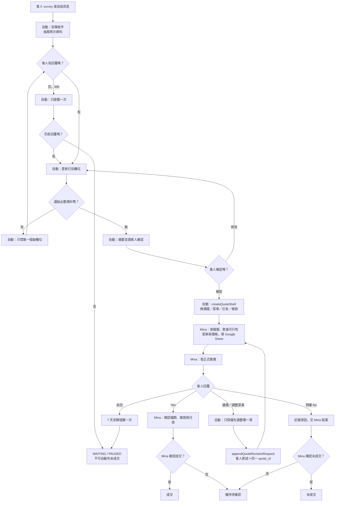

# Hermes LINE → Google Sheets 助手流程 v1

版本：2026-09-01
Owner 邊界：Hermes 不報價，只做一問一答、記錄明示需求、建立 Google Sheets 內部報價空殼，交 Mina 判斷。

## 結論

舊系統把客服、報價引擎與 Sheets 建檔接在同一條路上，會讓 Hermes 即使回覆文字較保守，後端仍自動帶入訂金、費用、菜單與條款。新路徑已拆開：Hermes 只能呼叫 `createQuoteShell` 與 `appendQuoteRevisionRequest`，不能呼叫 `createQuote`、`createQuoteVariants` 或 A5 自動選菜／計價。

目前完成的是 repo source、合約、local dry-run 與回歸測試；尚未 `clasp push`、部署 GAS、開啟 LINE 自動發送或建立任何真實客戶 Sheet。

## What / So What / Now What

### What：實際發生什麼

- 先前監工只檢查資料欄位與訓練 gate，沒有先把「誰有商務決策權」與品牌語氣放在第一層。
- 把三個越權負例放進 Owner 看見的工作簿，卻沒有先清楚標成「必須拒絕的反例」，造成它們像候選回覆。
- 舊 `createQuote` 會自動帶訂金、合約、車馬費、搬運費與「報價中」；舊 A5 還會自動選菜、以成本推價並產變體。
- `data/a7-reply-templates.md` 的 Q1–Q10 是歷史操作模板，不是逐句核准的 Mina 原話；其中多處仍含價格、檔期與服務承諾。

### So What：為什麼會偏掉

- 成功定義錯放在「有輸出、有表格、有測試」，沒有先驗「內容方向正確且權限沒有越界」。
- 客服回覆與報價加速器共用 route，語氣 guard 無法阻止下游自動計價。
- 歷史模板、deidentified corpus、Owner 現行規則沒有分層；歷史常見答案被誤當成現行 authority。
- 經驗沒有同步回到模板、route、Sheets API、tests 與 Resume Prompt，所以只修一層仍會復發。

### Now What：根治方式

1. 客戶回覆 contract：每輪最多一個問號，只問第一個缺欄位。
2. 商務 authority：價格、菜單、檔期、飲食可行性、付款、條款、成交只由 Mina／Owner 判斷。
3. Sheets contract：Hermes 只建空殼或附加客人原話的修改請求；金額、菜單、訂金、費用、條款欄位均不在 allowlist。
4. 三個 Owner 指定雷句成為 hard-fail fixtures。
5. 模板、程式 route、GAS action、測試與 Task Card 必須同時更新，任何一層漂移都不得上線。

## 角色邊界

| 角色 | 可以做 | 不可以做 |
|---|---|---|
| Hermes | 收件、抽取明示資料、只問下一題、摘要確認、建立 Sheet 空殼、寫修改請求、提醒 Mina | 報價、算價、選菜、確認檔期、保留檔期、判定飲食安全、貼匯款資料、確認成交 |
| Google Sheets | 保存案件、缺口、審查狀態、Mina 的報價與修改紀錄 | 由 Hermes 預填價格、訂金、費用、菜單或條款 |
| Mina／Owner | 查檔期、判斷服務範圍、定價、菜單、飲食可行性、議價、條款、正式發送、成交／未成交 | — |

## 一問一答需要的資料

客人自願提供的預算可原文記錄，但不列為 Hermes 必問欄位，回覆也不重複金額。

| 順序 | 欄位 | 一次只問這一句 |
|---:|---|---|
| 1 | 服務類別 | 想先了解，這次需要的是外燴、外帶／餐盒、甜品桌，還是企業合作呢？ |
| 2 | 日期 | 想先確認一下，活動預計是哪一天呢？ |
| 3 | 時間 | 活動大約會從幾點到幾點呢？ |
| 4 | 場地 | 方便提供活動場地名稱與完整地址嗎？ |
| 5 | 室內／戶外 | 場地是在室內還是戶外呢？ |
| 6 | 人數 | 這場預計大約有幾位參加呢？ |
| 7 | 服務形式 | 希望是現場外燴、送達擺盤，還是自取／外帶呢？ |
| 8 | 飲食需求 | 這場有需要留意的過敏、素食、宗教或不吃的食材嗎？ |
| 9 | 搬運條件 | 場地搬運上，有沒有需要留意的樓層、電梯或停車條件呢？ |

特殊問題也只接回下一個缺欄位：

- 問價格：「我先把活動資料整理完整，報價會由 Mina 在資料齊全後確認。＋下一題」
- 問檔期：「日期我先記下，檔期會由 Mina 再確認。＋下一題」
- 問過敏／可不可以吃：「飲食需求會依實際限制由團隊確認，我先照您的說明記錄。＋下一題」

## Flowchart

## Mina 回覆樣板盤點

`*` 代表需要按 Owner 新邊界微調。來源分兩層：模板名稱來自 `data/a7-reply-templates.md`；語氣與常見結構由本機 deidentified corpus 的 aggregate 驗證，不能把模板文字冒充 Mina 逐句原話。

| 樣板 | 場景 | 新路由 | 判定 |
|---|---|---|---|
| R0 收件* | survey／首則自由訊息 | 承接後只問第一缺欄 | 新增；避免暗示已接單 |
| Q1 補問* | 欄位不足 | 一輪一題 | 舊版最多三題與時程承諾需刪 |
| Q2 價格詢問* | 直接問多少錢 | 不回數字，接下一缺欄 | 舊門檻、低消、費用全部停用 |
| Q3 外帶* | 外帶／餐盒 | 日期、份數、交付方式分輪問 | 刪低消、提前天數、配送承諾 |
| Q4 場佈／加購* | 甜品桌、花藝、酒水 | 只收風格需求 | 不先說包含、可加購或費用 |
| 參考圖片* | 客人以圖片說明期待 | 收一張最接近期待的參考圖 | 不承諾可完全複製或已包含 |
| 菜單／品項詢問* | 問菜單、有貨、可否製作 | 只收最想保留或避開的一項 | 可做、有貨、價格、安全都交 Mina／廚房 |
| Q5 地區* | 問是否服務某地 | 收完整地址後轉 Mina | 舊 Zone 價格與自動婉拒停用 |
| Q6 檔期* | 問日期有沒有空 | `UNVERIFIED`＋Mina 查核 | 不說有空、已滿、已保留 |
| Q7 試吃* | 問試吃 | 轉 Mina 核對現行政策 | 不保證每道菜有照片 |
| Q8 報價後跟進* | Mina 已發報價、七天未回 | 安靜提醒一次 | 刪「檔期有限」與催促 |
| Q8 議價／菜單* | 想調價格、菜色、份量、服務 | 問優先調整哪一項，寫 revision | Hermes 不提新價格或替代品 |
| Q9 婉拒* | 可能低於舊門檻／超服務區 | `HUMAN_REVIEW` | 不依舊規則自動拒單 |
| Q10 回頭客* | 曾合作客人 | 核對案件後才引用歷史 | 不推論「上次很順利」 |
| Q10 B2B* | 長期合作 | 每輪一題，之後轉 Owner | 不一次問類型、場次、人數 |
| 取消／改期* | 取消、改日期 | 記原話＋`PENDING_MINA` | 不承諾免費、費用或新檔期 |
| 付款／訂金／合約* | 查付款、匯款、訂金、合約 | 收案件編號或日期，建立查核請求 | 不貼帳戶、不報比例、不認定已付款 |
| 舊服務範圍七點* | 問方案包含內容 | 只問最想確認的一項後轉 Mina | included-service 與桌租價格不可整段沿用 |
| 摘要確認* | 九欄已齊 | 客人確認後才建 Sheet | 刪一至二工作天 SLA |
| 48h 補問提醒 | 補問後未回 | 一次後暫停 | 可保留安靜語氣 |
| Sheets 交接* | 摘要已確認 | 說明交 Mina 核對 | 不宣稱報價已完成 |
| 客人 Yes* | 接受正式報價 | 交 Mina 確認檔期／付款 | 不能直接標成交 |
| 客人 No* | 明確不採用 | 收原因，交 Mina 結案 | 沉默不等於 No |

### Mina 真實資料能證明什麼

- 本機 deidentified corpus 有 20,256 組 customer→Mina pairs；回覆中位數 25 字、P75 75 字，短答是主要形態。
- 4,202 筆落在重複 exact-reply clusters，證明模板化有價值。
- 常見訊號含日期／時間 4,643、菜單／品項 3,947、場地／搬運 3,025、報價／預算 2,762、人數 2,639、檔期 495、飲食 257。
- corpus 明確提到 Google Sheets／試算表為 0；因此 Sheets 是 Owner 這次新增的控制面，不可宣稱是 Mina 歷史慣用語。
- 價格／費用、檔期承諾、飲食安全判斷共出現 2,730 個保守 pattern hits。它們不是人工裁決，但依新邊界全部不可直接複製。

## Sheets 接口

### 建立空殼：`createQuoteShell`

只允許客情欄位、`case_id` 與三個固定審查狀態：

- `availabilityStatus = UNVERIFIED`
- `dietaryReviewStatus = PENDING_HUMAN`
- `commercialReviewStatus = PENDING_MINA`

禁止 payload key：`amount`、`price`、`quotedAmount`、`depositAmount`、`discount`、`transportFee`、`floorFee`、`menu`、`items`、`variants`、`contractTerms`、`availabilityConfirmed`。

### 議價／調整：`appendQuoteRevisionRequest`

只寫 `caseId + quoteId + revisionNo + customerChangeVerbatim + PENDING_MINA`，保持同一案件 lineage。Hermes 不生成新價、折扣或替代菜單。

## Gate 與證據

- 三個 Owner 指定雷句全部必須 hard fail。
- intake 有缺欄時恰好一題；已知欄位不得重問。
- Sheet payload 必須通過 exact allowlist，沒有價格、菜單、訂金、費用、條款或檔期肯定。
- 客人未回只能是 `WAITING / PAUSED`；客人明確 No 或 Mina 決定後才可未成交。
- 客人 Yes 仍需 Mina 確認檔期、條款、付款，不能由 Hermes 自動標成交。
- local dry-run：`python3 scripts/run_hermes_intake_gym.py`，固定零網路、零外部寫入。
- targeted tests：`python3 -m unittest -v tests.test_hermes_sheets_assistant`。

## 尚未授權／尚未完成

- 未部署 Apps Script；新 action 目前只存在 repo source。
- 未找到 repo 內可驗證的 LINE 對客 sender；現有 webhook 只證明 inbound 記錄，不能把文件流程宣稱為 live 自動回覆。
- 未建立真實客戶 Sheet、未發訊息、未改價格真相源。
