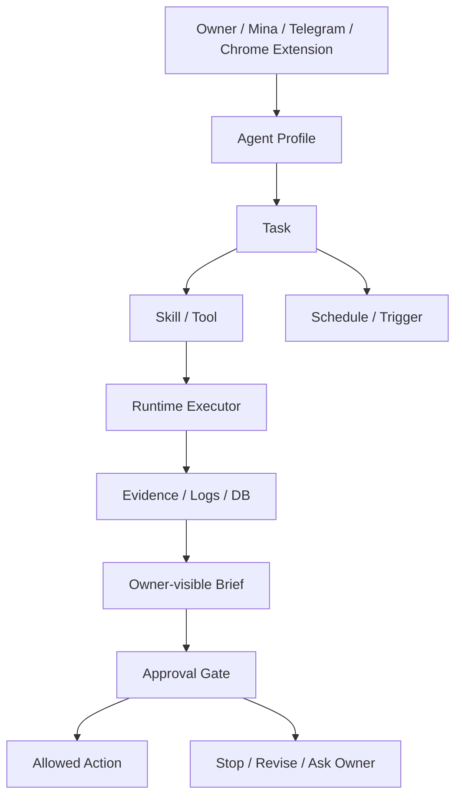

# Cross-Project Agent Runtime Roadmap

建立：2026-05-21
狀態：功能 backlog / MAPLAB + Investment OS 共用 agent runtime 方向

## 來源

本文件根據 Owner 2026-05-21 指示，吸收兩個外部趨勢作為功能參考：

- Hermes Desktop：把 CLI agent 變成可視化桌面操作介面，重點是 profiles、tools、memory、schedules、messaging gateways、logs、backup。
- Gemini 3.5 Flash / Gemini Spark：把 agent 從聊天框推向 Tasks / Skills / Schedules / 24x7 背景執行 / 重大動作前確認。

本文件不是要把兩個專案直接換成 Hermes Desktop 或 Gemini Spark。目標是抽出可用的產品設計，放回 MAPLAB 與 Investment OS 的既有治理、Chrome Extension、Telegram、dashboard、runtime DB。

## 最高原則

1. 不因新聞而改熱路徑。
2. 先做 runtime 可見、可驗證、可暫停的功能，不做黑盒自動化。
3. 所有 agent 行動都要有角色、任務、資料源、權限、輸出契約、approval gate。
4. MAPLAB 不讓 agent 直接對客戶承諾價格；Investment OS 不讓 agent 下單或建立未授權交易。
5. 先把常駐 agent 做成可監督的工作台，再考慮 24x7 背景自主。

## 新功能總覽

| 功能 | 參考來源 | MAPLAB 用法 | Investment OS 用法 | 優先級 |
| --- | --- | --- | --- | --- |
| Agent Profiles | Hermes Desktop profiles / Gemini Skills | A5/A6/A7/B1 一鍵召喚角色 | B1、風險大師、左側、右側 profile | P0 |
| Tasks / Skills / Schedules 三件套 | Gemini Spark | 報價追蹤、未回覆提醒、案件整理 | 盤後研究、風控提醒、籌碼/新聞 watcher | P0 |
| Approval Gate | Gemini Spark major-action check | 發送客戶訊息、改 Sheet、產正式報價前確認 | 建模擬單、發 Telegram 建議、改 dashboard 前確認 | P0 |
| Runtime Activity Panel | Hermes logs / tool progress | A6 到底走 Codex、Ollama、A5 還是 Sheet | 研究到底查了哪些來源、跑了哪些 scripts | P0 |
| Background Work Queue | Gemini Spark 24x7 | 客戶案件背景整理、缺資料提醒 | 右側掃描、Research Evidence、PM Brief | P1 |
| Multi-agent Subtasks | Antigravity subagents | A5 算價、A7 修語氣、A6 整理案件 | 風險/左側/右側分工審查同一標的 | P1 |
| Cost / Model Routing | Gemini/Hermes model management | Codex 額度不足時切 Ollama，且讓 Owner 看得懂 | Flash/GPT/Codex/Ollama 各自負責不同研究層 | P1 |
| Memory Editor | Hermes memory / Spark personal intelligence | Case Store、客戶偏好、Mina/Owner 工作習慣 | 投資人格、書單、盲點、加減碼規則 | P1 |
| Backup / Debug Dump | Hermes Desktop | A6/A5 報價錯誤可打包給下一個人 | 投資研究 runtime 錯誤可打包重現 | P2 |

## MAPLAB 新功能設計

### 1. A6 Agent Runtime Panel

目的：讓 Owner / Mina 不再猜 A6 bot 現在是不是真的能用。

第一版只需要顯示：

- 目前模型：Codex / Ollama / OpenClaw / A5 local。
- 目前模式：一般聊天 / SEO / 報價 / Case Store。
- 最近 10 次訊息：是否成功、走哪個路由、耗時、錯誤。
- Telegram 交付狀態：Owner / Mina 是否都收到。
- Approval gate：正式送客戶、寫 Sheet、產正式報價單前必須等 Owner/Mina 確認。

### 2. Case Store Tasks

把目前 `/linecases`、`/case`、`/casequote` 變成可排程與可追蹤任務：

- `daily_case_digest`：每天固定整理今日 LINE / Telegram 案件候選。
- `missing_info_watch`：找出缺日期、人數、地點、預算的案件。
- `quote_followup_watch`：報價產出後 N 小時未回覆，提醒 Owner/Mina。
- `quote_link_attach`：手動把候選 case 綁到正式 quote URL。

### 3. A5 / A6 / A7 Subagent Contract

拆成三個小 agent，不要讓一個 bot 全包：

- A6：讀案件、整理需求、問缺資料。
- A5：只算報價、菜單、毛利風險。
- A7：只修客戶回覆語氣與補問流程。

輸出順序：

1. A6 案件摘要。
2. A5 報價草稿 / 正式 quote endpoint。
3. A7 客戶可讀回覆。
4. Owner/Mina approval。

## Investment OS 新功能設計

### 1. B1 / 風險 / 左側 / 右側 Profile

把目前 B1 canonical 延伸成四個 profile：

- B1：投資人格與 prompt bridge。
- 風險大師：regime、現金水位、1R、曝險、保險。
- 左側經理人：終局、預期差、催化、失效條件、小部位。
- 右側經理人：市場是否同意、第一根、回測、主升段、加減碼。

這些 profile 不下單，不建立模擬單。它們只產出檢查結果、缺資料與下一步。

### 2. Spark-like Research Tasks

把研究拆成 Tasks / Skills / Schedules：

- `weekly_theme_watch`：追蹤 AI、機器人、低軌衛星、資料中心、能源、良性通縮等長期題材。
- `right_side_daily_scan`：盤後右側掃描，產出一碼/二碼/三碼/不動作。
- `news_to_eps_check`：新聞出現時，先拆 ASP / 出貨量 / 毛利率 / 產能 / 認列時間，不直接喊 EPS。
- `position_risk_brief`：持倉風控、追蹤停利、失效點、是否降槓桿。
- `blind_spot_guard`：檢查是否故事太快跑到終局、是否追高、是否回測過擬合。

### 3. PM Brief Activity Panel

第一屏只回答：

- 今天可不可以動？
- 哪裡不能信？
- 下一步是什麼？
- 哪些資料是 stale？
- 哪些結論只是模型推論？
- 哪些動作需要 Owner approval？

底層才放 raw evidence、links、DB table、model output。

## 共用功能：Agent Runtime OS

兩個專案可以共用同一個設計語言：



### 必備欄位

每個 Task 必須有：

- `task_id`
- `owner`
- `profile`
- `trigger`
- `allowed_tools`
- `forbidden_actions`
- `input_sources`
- `output_contract`
- `approval_required`
- `last_run_at`
- `last_result`
- `next_action`

## 優先實作順序

### P0：先讓常駐能力看得見

1. MAPLAB A6 Runtime Panel：顯示模型、路由、最後錯誤、Owner/Mina 交付狀態。
2. Investment OS PM Brief Activity Panel：顯示研究任務、資料 freshness、下一步。
3. Chrome Extension profile wording：讓 A/B 角色都能顯示 Tasks / Skills / Schedules / Approval。
4. Task schema：先用 Markdown / JSON，不先做大型 UI。

### P1：再加背景工作

1. A6 daily case digest。
2. A6 missing info watcher。
3. Investment OS weekly theme watch。
4. Investment OS blind spot guard。

### P2：最後再做桌面化

1. Agent Runtime Panel GUI。
2. Profile / memory editor。
3. Backup / debug dump。
4. 多專案 unified launcher。

## 不做事項

- 不把 Gemini Spark 當作已可用的本機依賴；目前仍以外部服務可用性為準。
- 不把 Google Workspace / Gmail / Drive 權限一次全開；每個 connector 都要單獨 approval。
- 不讓 MAPLAB agent 直接對客戶發送正式回覆。
- 不讓 Investment OS agent 下單、改券商、建立未授權模擬單。
- 不把 24x7 背景執行包裝成無需監督；所有重大行動前都要 approval gate。

## 接續 Prompt

```md
我是 A1 / B1 cross-project runtime architect。
repo: /Users/pagemacmini/maplab-ai-handbook

先讀：
1. CURRENT_STATUS.md
2. pitfalls.md
3. projects/cross-project-agent-runtime-roadmap.md
4. projects/line-quote-assistant.md
5. projects/b1-investment-os-owner-persona-canonical.md
6. projects/b1-investment-os-owner-profile.md

任務：把 Hermes Desktop 與 Gemini Spark 的可用產品概念，落地為 MAPLAB + Investment OS 的 Agent Runtime OS。先做可見、可驗證、可暫停的 Task/Profile/Schedule/Approval，不要直接改熱路徑。

下一步建議：
1. 先定義 Task schema。
2. 再做 MAPLAB A6 Runtime Panel。
3. 再做 Investment OS PM Brief Activity Panel。
4. 最後才考慮桌面 GUI / memory editor / backup dump。

禁止：不讀 secrets、不自動發客戶、不下單、不把新聞功能當作已上線能力。
```
