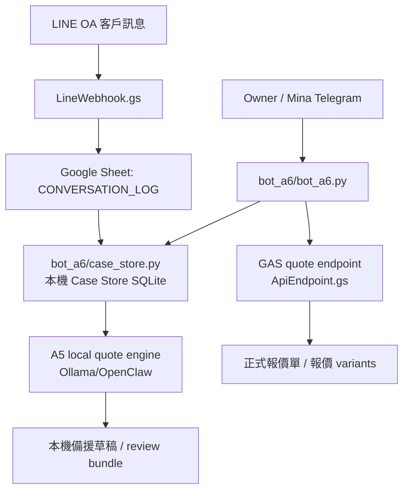

# LINE / Telegram / Case Store 報價助手路徑圖

最後更新：2026-05-19  
角色：A5 報價引擎 + A6 業務快反應 + A7 客服轉單

---

## 0. 接手者先看這裡

正式工作目錄是：

```text
/Users/pagemacmini/maplab-ai-handbook
```

不要在下面這個下載副本開發，它不是 git repo，只能當歷史參考：

```text
/Users/pagemacmini/Downloads/maplab-ai-handbook-main
```

本案目標不是直接讓 AI 接管客戶 LINE，而是讓 A6/A5 在 Telegram 裡可以讀到 LINE 進件脈絡，知道「這是哪一案」，再協助 Owner / Mina 出報價草稿。

---

## 1. 現有成果

前面夥伴已完成或留下的可用部分：

| 類別 | 位置 | 現況 |
|------|------|------|
| LINE inbound webhook | `scripts/apps-script/LineWebhook.gs` | 寫入 Sheet `CONVERSATION_LOG`，只記錄客戶傳入 LINE OA 的訊息 |
| 報價 GAS endpoint | `scripts/apps-script/ApiEndpoint.gs` + `scripts/apps-script/Code.gs` | A6 透過 HTTP endpoint 產正式報價，不要從 bot 點 Sheet UI |
| A6 Telegram bot | `bot_a6/bot_a6.py` | LaunchAgent 已在跑；支援 Owner + Mina 白名單、A5 報價、本機 Ollama 備援 |
| A5 local quote engine | `bot_a6/a5_quote_engine.py` | Codex 額度不足時可用本機 Ollama/OpenClaw 出草稿 |
| Case Store v0 | `bot_a6/case_store.py` | 只讀 `CONVERSATION_LOG`，建立本機 SQLite 案件索引 |
| 案件索引 DB | `data/case-store/a6_case_store.sqlite3` | runtime 產物，不 commit |
| 任務卡 | `handoff/tasks/T-A6-001.md` | A6 LINE 業務報價助手斷點 |
| 歷史決策 | `decisions.md` | 記錄 LINE webhook 只能單向、A6 不自行算報價、clasp project 不能推錯 |

---

## 2. 系統路徑圖



---

## 3. 真相分層

| 層級 | 真相源 | 用途 | 注意 |
|------|--------|------|------|
| 原始訊息 | Google Sheet `CONVERSATION_LOG` | LINE inbound raw evidence | 只看到客戶傳入，不含我方完整回覆 |
| 案件索引 | `data/case-store/a6_case_store.sqlite3` | 分群、摘要、缺資料、line_user_id → case_id | 本機 runtime 索引，可重建，不取代 Sheet |
| 報價計算 | A5 / GAS / Sheet 報價系統 | 成本、毛利、報價單 | A6 不自行算報價 |
| Telegram 協作 | `bot_a6/bot_a6.py` | Owner/Mina 查案、產草稿、觸發報價 | 面向業務，不面向客戶 |

---

## 4. LINE 目前能力與限制

現在看得到：

- LINE 客人傳進 OA 的文字訊息。
- `CONVERSATION_LOG` 欄位：`msg_id / case_id / timestamp / speaker / message / source / line_user_id / reply_to_msg_id`。
- 2026-05-19 已確認同日訊息仍有同步進來。

現在看不到：

- 我方業務在 LINE OA 裡回覆給客人的完整內容。
- LINE 對話自然對應到哪一張報價單。
- 客戶同一個 LINE 帳號跨多次活動的正式案件切分。

所以 Case Store v0 的設計是「候選案件索引」，不是法院判決書。它會用 `line_user_id + 時間群組 + 關鍵字` 建候選案件，讓 A6 先找得到，再由 Owner / Mina 決定是否採用。

---

## 5. A6 Telegram 指令

| 指令 | 作用 |
|------|------|
| `/linecases today` | 同步 `CONVERSATION_LOG`，列出今日 LINE 案件候選 |
| `/linecases recent` | 列出近期案件候選 |
| `/linecases Penny` | 搜尋客戶名、訊息、case_id、line_user_id |
| `/case Penny` | 顯示單一案件摘要與近期訊息 |
| `/casequote Penny` | 把 Case Store 脈絡交給 A5 本機備援產報價草稿 |
| `查 Penny` | 等同 `/case Penny` |

第一版 `/casequote` 走本機 A5 備援，不自動寫 Sheet，避免把候選案件直接變成正式報價單。正式報價仍走已驗證的 A5/GAS 報價 endpoint。

---

## 6. 接手測試最短路徑

```bash
cd /Users/pagemacmini/maplab-ai-handbook
python3 -m py_compile bot_a6/case_store.py bot_a6/bot_a6.py
python3 bot_a6/case_store.py today --rows 120 --limit 5
launchctl print gui/$(id -u)/com.maplab.a6bot | sed -n '1,80p'
```

Telegram 實測：

```text
/linecases today
/case Penny
/casequote Penny
```

如果 `case_store.py today` 失敗，先看錯誤訊息。常見原因是 Google OAuth token 不在 `~/.claude/mcp-keys/google-token.json`，或 token 沒有 Sheets readonly scope。

2026-05-19 實測注意：本機舊 Google OAuth token 回 `invalid_grant: Token has been expired or revoked.`；為了讓 A6 先能用現有資料測試，runtime 可讀 `data/case-store/conversation_log_seed.json` fallback。Telegram/CLI 會在 `source:` 顯示 `live_google_sheets` 或 `fallback:...`。若看到 fallback，代表不是即時 Sheet，要補 OAuth 後再視為 live。

---

## 7. 高風險禁止事項

- 不要把 `LineWebhook.gs` push 到報價 GAS 專案；`.claspignore` 目前刻意排除它，避免兩個 `doPost` 打架。
- LINE webhook 專案與報價系統 GAS 專案 scriptId 不同；`clasp push` 前必看 `.clasp.json`。
- 不要把 `data/case-store/*.sqlite3`、`.env`、log、conversation history commit。
- 不要嘗試用 LINE webhook 補抓我方回覆；LINE API 不支援。
- 不要讓 A6 自己決定價格；A6 只能整理脈絡、調用 A5。

---

## 8. 下階段

1. 把 `/case attach` 做出來，讓 Owner/Mina 可以手動把 LINE 候選案件綁到正式報價單。
2. 在正式報價成功後，把 quote URL 寫回 Case Store runtime metadata。
3. 若需要完整雙向對話，再走 LINE OA Manager CSV 匯出，不要改 webhook 硬抓不存在的 business reply。
