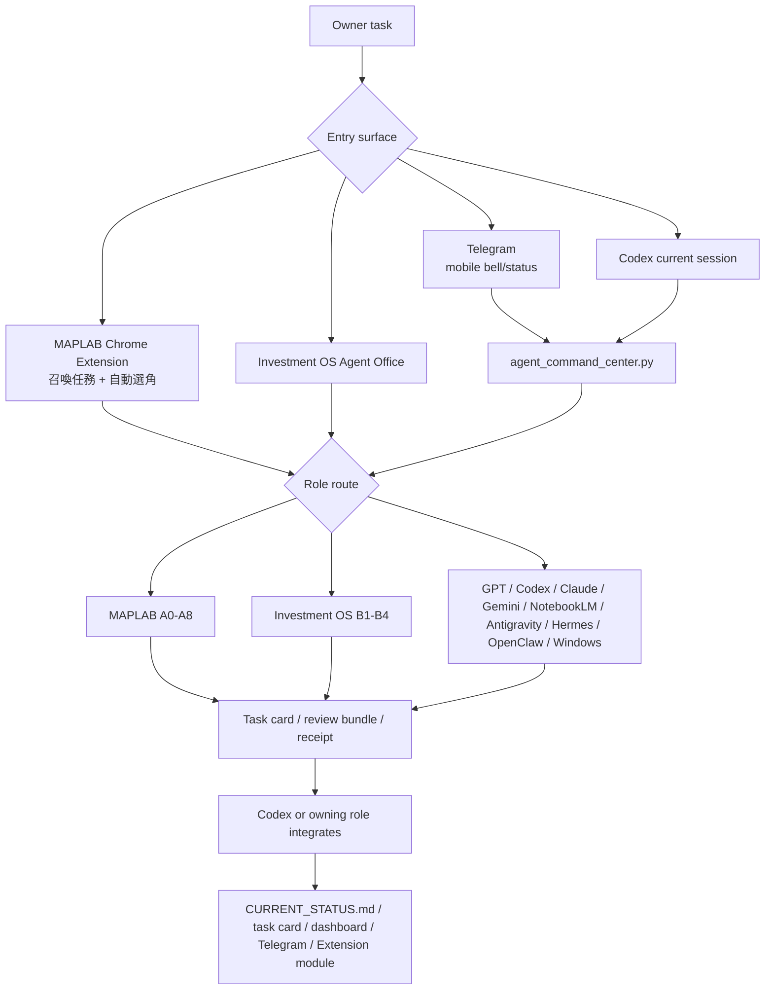
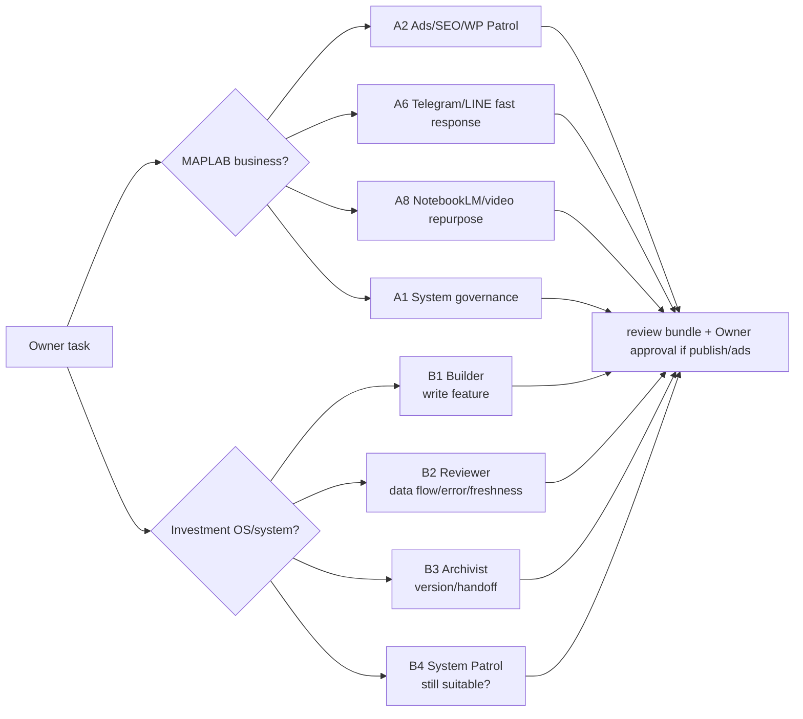
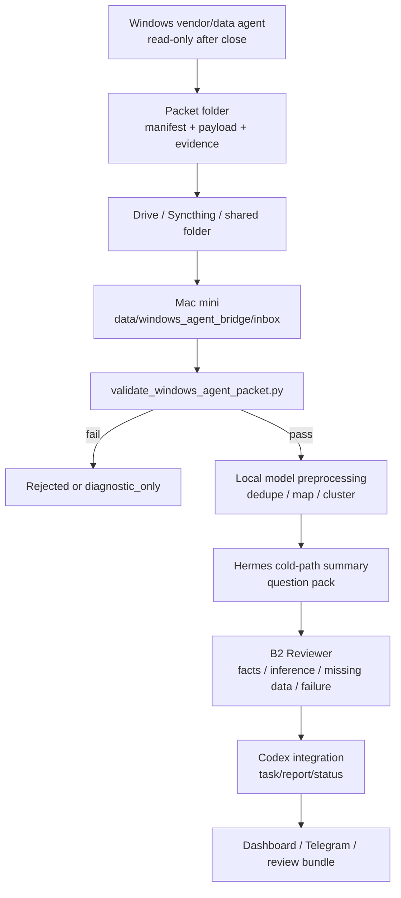

# MAPLAB Project Brain — SOP and Path Router

> Purpose: route A2-A8 agents and local models to exact SOPs, inputs, outputs, gates and evidence paths
> Generated from `config/system-map/maplab-directional-map.json`. Build base commit `540bf2f80f44`; manifest SHA `c1c88b1905f8cf1220bbd81eca657c4b62287a351ba04dc5048b8fb657b09383`.
> This is a curated, sanitized corpus. It is not a literal repository dump and not a live-state authority.
> Excluded: secrets, credentials, cookies, customer raw data, runtime logs, SQLite/DB dumps, investment data, media binaries and generated noise.

## Required answer contract

1. Start with exactly one status: `FOUND`, `NEEDS_LIVE_REFRESH`, or `NOT_IN_PACK`.
2. Return the exact repo path, why it applies, required reads, expected output/handoff, and the next bounded action.
3. Cite the embedded source path and SHA for every material claim.
4. Treat CURRENT_STATUS, Task Cards, runtime/UI readback, commits and receipts as separate truth layers.
5. Never infer approval, publishing, platform state or completion from a plan alone.
6. If the source is present in this pack, answer from it; do not claim the source is unhydrated merely because it is embedded inside this bundle.

## Authoritative A2-A8 workflow route cards

These route cards are hydrated directly from the canonical manifest. Use them for static SOP, input, output, handoff, gate and evidence questions. Only actual task status, approval state, runtime/UI state and completion receipts require live refresh.

### A2 — WordPress／SEO 案例工作流

- Purpose: 把已核准事實與素材做成可發布、可回讀的搜尋內容。
- Exact SOP paths:
  - `skills/wp-article-standard.md`
  - `skills/seo-session-checklist.md`

#### A2-01 — 內容機會

- Inputs: GSC/GA/Ads evidence, content inventory, Owner priority
- Actions: 找搜尋與案例 gap, 確認不與既有頁 cannibalize
- Outputs: content opportunity brief
- Acceptance: 來源、日期、搜尋意圖清楚
- Handoff: A2-02, A3
- Approval gate: none in static workflow; still verify current task/runtime state
- Evidence: review brief

#### A2-02 — 事實與素材查核

- Inputs: content opportunity brief, customer-approved facts, A4 asset index
- Actions: 品牌記憶檢查, live URL/REST 查核, 授權與隱私篩選
- Outputs: approved case brief, asset request
- Acceptance: verified/inference/missing 分層, 無未核准客戶名稱與私密資訊
- Handoff: A2-03, A4, A8-01
- Approval gate: none in static workflow; still verify current task/runtime state
- Evidence: source bridge, brand memory check

#### A2-03 — 文章草稿

- Inputs: approved case brief, keyword/intent, brand voice
- Actions: 撰寫案例與 CTA, 建立內連與 FAQ
- Outputs: article draft, SEO title/description draft
- Acceptance: 文案無 AI 慣用說服句, CTA 與公開事實正確
- Handoff: A2-04, A8-02
- Approval gate: none in static workflow; still verify current task/runtime state
- Evidence: draft bundle

#### A2-04 — 圖片／SEO／Schema

- Inputs: article draft, approved asset pack
- Actions: 插圖與 ALT, 設定 metadata, 產 FAQ/schema proposal
- Outputs: approval-ready article package
- Acceptance: 圖片對應場景, 無 inline script/style, 公開安全掃描通過
- Handoff: A2-05
- Approval gate: none in static workflow; still verify current task/runtime state
- Evidence: article QA report

#### A2-05 — Owner 核稿

- Inputs: approval-ready article package
- Actions: 呈現文章、圖片、CTA 與風險
- Outputs: approved/revise/reject decision
- Acceptance: Owner 決定可追溯
- Handoff: A2-06
- Approval gate: Owner content and publish approval
- Evidence: approval record

#### A2-06 — WordPress 草稿／發布

- Inputs: approved article package, approval record
- Actions: 建立草稿或發布, 前台與 REST 讀回
- Outputs: WordPress URL, publish receipt
- Acceptance: status/URL/media/CTA/metadata 實際讀回, 發布狀態符合核准
- Handoff: A2-07, A3, A8-04
- Approval gate: Publishing and changes to published pages require approval
- Evidence: WP REST/UI receipt

#### A2-07 — 成效回讀

- Inputs: live URL, publish receipt, GA/GSC/Ads metrics
- Actions: 比較排名、流量與轉換, 產下一輪內容／landing 建議
- Outputs: performance readback, next content action
- Acceptance: 數據標期間與來源, 建議分 verified/inference
- Handoff: A2-01, A3
- Approval gate: none in static workflow; still verify current task/runtime state
- Evidence: dated patrol receipt

### A3 — 社群／廣告成長工作流

- Purpose: 把 live 成效轉成可核准的投放、素材與 landing 改善。
- Exact SOP paths:
  - `skills/a3-social-ads-skills.md`

#### A3-01 — 平台成效讀取

- Inputs: Google/Meta account read-only state, 7/14/30-day window
- Actions: 讀花費、曝光、點擊、CTR、CPC、轉換、CPA/ROAS
- Outputs: performance snapshot
- Acceptance: 期間、帳戶、來源與缺口清楚
- Handoff: A3-02
- Approval gate: none in static workflow; still verify current task/runtime state
- Evidence: platform readback

#### A3-02 — 漏斗與素材判讀

- Inputs: performance snapshot, A2 landing status, A4 asset pack
- Actions: 找素材、受眾、landing、轉換落差
- Outputs: verified findings, reasonable inference
- Acceptance: 平台事實與推論分開
- Handoff: A3-03, A2, A4, A8
- Approval gate: none in static workflow; still verify current task/runtime state
- Evidence: analysis matrix

#### A3-03 — 調整提案

- Inputs: findings, business priority
- Actions: 提出保留、暫停、預算、受眾、素材與 landing 選項
- Outputs: approval-ready change plan
- Acceptance: 影響、風險、rollback、驗收方式齊全
- Handoff: A3-04
- Approval gate: Owner approves spend/status/targeting/creative changes
- Evidence: review request

#### A3-04 — 執行與回讀

- Inputs: approved change plan
- Actions: 執行核准變更, 平台 UI/API 反讀
- Outputs: change receipt, next measurement window
- Acceptance: 實際平台狀態與核准一致
- Handoff: A3-01, A2, A8
- Approval gate: Use only exact approved change
- Evidence: before/after receipt

### A4 — 影像資產整理工作流

- Purpose: 把原始素材轉成可搜尋、可授權、可追溯的素材包。
- Exact SOP paths:
  - `skills/a4-fact-first-asset-matching.md`
  - `skills/a4-photo-asset-skills.md`

#### A4-01 — 來源盤點

- Inputs: Drive folders, event/date metadata, case records
- Actions: 列檔、保留原始檔、排除既有分類資料夾
- Outputs: raw asset inventory
- Acceptance: 不移動或刪除既有原始庫
- Handoff: A4-02
- Approval gate: none in static workflow; still verify current task/runtime state
- Evidence: inventory manifest

#### A4-02 — 分類／去重／隱私

- Inputs: raw asset inventory
- Actions: 依場景、日期、格式分類, 去重, 標記人臉、logo、授權
- Outputs: classified asset set, exclusion list
- Acceptance: 授權與私隱狀態不被猜測
- Handoff: A4-03
- Approval gate: none in static workflow; still verify current task/runtime state
- Evidence: classification receipt

#### A4-03 — 命名／ALT／索引

- Inputs: classified asset set, case/keyword context
- Actions: 產 SEO 名、分類、關鍵字、ALT, 寫入 Sheet／本機索引
- Outputs: asset index records
- Acceptance: file_id/來源/公開用途可追溯
- Handoff: A4-04
- Approval gate: none in static workflow; still verify current task/runtime state
- Evidence: index readback

#### A4-04 — 素材包交接

- Inputs: asset index records, downstream request
- Actions: 按案例與用途選出素材, 附授權／隱私／格式狀態
- Outputs: approved asset pack
- Acceptance: 每個素材能追回原始來源與核准狀態
- Handoff: A2, A3, A6, A8
- Approval gate: Public use of uncertain faces/logos requires approval
- Evidence: asset pack manifest

### A5 — 報價真相與提案資料工作流

- Purpose: 把結構化需求套入 Items、成本、毛利與條款，產生可驗算的正式資料。
- Exact SOP paths:
  - `skills/a5-quotation-engine-skills.md`

#### A5-01 — 需求正規化

- Inputs: A7 structured intake, Owner/customer constraints
- Actions: 解析人數、預算、日期、地點、飲食與服務需求
- Outputs: validated quote intake
- Acceptance: 缺欄位明示、不猜數字
- Handoff: A5-02
- Approval gate: none in static workflow; still verify current task/runtime state
- Evidence: intake payload

#### A5-02 — 品項／成本／毛利

- Inputs: validated quote intake, Items, cost/margin rules
- Actions: 配品項, 計算成本、營收、毛利、服務與車馬費
- Outputs: quote calculation payload
- Acceptance: 公式可重算, 未知成本標 needsManualCost, 不發明售價
- Handoff: A5-03, A6
- Approval gate: none in static workflow; still verify current task/runtime state
- Evidence: calculation validation

#### A5-03 — Sheet／提案生成

- Inputs: quote calculation payload, QUOTE_DRAFT template
- Actions: 建立報價副本, 產 Slides/proposal data, 讀回關鍵範圍
- Outputs: quote Sheet URL, proposal package
- Acceptance: D2:F31/I7:J31 等關鍵欄位讀回, 母版未被覆蓋
- Handoff: A6, Owner
- Approval gate: none in static workflow; still verify current task/runtime state
- Evidence: Sheet readback receipt

### A6 — 業務快反應工作流

- Purpose: 用 A5 真相與 A4 素材快速形成可給 Owner 核對的報價與提案。
- Exact SOP paths:
  - `skills/a6-rapid-quote-sop.md`

#### A6-01 — 急件分流

- Inputs: A7 urgent intake, direct Owner request
- Actions: 判斷報價／一般問答／狀態查詢, 缺資料先列出
- Outputs: routed sales task
- Acceptance: 一般聊天不誤入報價, 急件需求完整
- Handoff: A5, A6-02
- Approval gate: none in static workflow; still verify current task/runtime state
- Evidence: dispatch record

#### A6-02 — 報價／提案組裝

- Inputs: A5 quote payload, A4 approved asset pack, customer-safe templates
- Actions: 組報價摘要, 組 Slides/提案, 檢查禁語與承諾
- Outputs: customer-ready draft
- Acceptance: 金額與 Sheet 一致, 不洩漏高毛利等內部語言
- Handoff: A6-03
- Approval gate: none in static workflow; still verify current task/runtime state
- Evidence: draft review

#### A6-03 — Owner 核准與送出

- Inputs: customer-ready draft, Sheet/proposal URLs
- Actions: Owner 核對, 依核准管道送客戶
- Outputs: approved customer message, delivery receipt
- Acceptance: 送出內容與核准版相同, 送達可讀回
- Handoff: A7, A2/A3 when converted
- Approval gate: Owner approves customer-facing quote
- Evidence: delivery/readback receipt

### A7 — 客服與對話轉單工作流

- Purpose: 把對話轉成可回覆、可報價、可學習的結構化需求。
- Exact SOP paths:
  - `skills/a7-customer-service-skills.md`

#### A7-01 — 對話收集

- Inputs: LINE inbound, conversation exports
- Actions: 寫入 CONVERSATION_LOG, 保留來源與時間
- Outputs: conversation record
- Acceptance: live inbound 與 seed/fallback 分開
- Handoff: A7-02
- Approval gate: none in static workflow; still verify current task/runtime state
- Evidence: Sheet tail readback

#### A7-02 — 意圖與需求結構化

- Inputs: conversation record, reply rules
- Actions: 分類 FAQ／詢價／急件／異常, 抽取報價欄位
- Outputs: structured intake, reply proposal
- Acceptance: 個資最小化, 缺欄位不腦補
- Handoff: A5, A6, A7-03
- Approval gate: none in static workflow; still verify current task/runtime state
- Evidence: classification record

#### A7-03 — 回覆與洞察回寫

- Inputs: reply proposal, quote/delivery result
- Actions: 送安全回覆, 把 FAQ、阻力與需求熱點回寫
- Outputs: reply receipt, FAQ/market insight
- Acceptance: 回覆可讀回, 洞察去識別化
- Handoff: A2, A3, A5, A6
- Approval gate: External customer reply follows channel policy
- Evidence: conversation + learning receipt

### A8 — 影音案例生產工作流

- Purpose: 把核准案例與合法素材轉成歌曲、影片版本與可驗證發布包。
- Exact SOP paths:
  - `skills/a8-video-pipeline-skills.md`
  - `skills/a8-produce-to-publish-sop.md`
  - `skills/maplab-hiphop-songwriter/SKILL.md`

#### A8-01 — 素材準備

- Inputs: approved case brief, A4 asset index, platform intent
- Actions: 從 Drive 找指定案例, 確認授權、隱私、方向與格式
- Outputs: asset pack, asset manifest
- Acceptance: 每個素材有來源與用途狀態, 不可用素材被排除
- Handoff: A8-02, A8-03
- Approval gate: none in static workflow; still verify current task/runtime state
- Evidence: asset manifest

#### A8-02 — 內容與歌曲

- Inputs: approved case brief, asset manifest, brand/music direction
- Actions: 讀 WP/內容 brief, 寫歌詞與 exact hook, 確定曲風, Owner 核稿後生成新音軌, 對實際下載音檔跑 prompt-free ASR 與真人聽辨, 曲風設定寫入可重用資料
- Outputs: approved lyrics, style profile, licensed audio track, generation record, audio selection receipt
- Acceptance: Owner 核稿, 商用授權狀態清楚, 品牌詞 exact-token, 實際唱詞與核准歌詞一致, 音軌可供剪輯
- Handoff: A8-03
- Approval gate: Owner lyrics approval before paid/external generation
- Evidence: lyrics approval, license/generation receipt, audio ASR/listening receipt

#### A8-03 — 影片製作與平台裁切

- Inputs: asset pack, audio-gate-passed track, approved lyrics, storyboard, platform specs
- Actions: raw originals 綁 hash, waveform 逐句校時, CapCut/核准 NLE 人工 timeline 或 evidence-complete one-pass, 字幕與行銷字分軌, explicit crop/fit, 一次有損視訊編碼, 1x/0.5x 全片與 target-device QA
- Outputs: timing map, editable project or one-pass lineage, master video, 9:16 video, 1:1 video, 16:9 video, cover assets, acceptance receipt
- Acceptance: a8_video_acceptance ok=true, raw provenance 完整, 歌詞 onset/tail 在容許值, 無 blur/盲裁, encode depth=1, 完整播放與 target-device PASS
- Handoff: A8-04, A2
- Approval gate: Only QA_PASS may enter OWNER_VIDEO_GATE
- Evidence: timing receipt, project/timeline receipt, encode lineage, full-playback receipt, hash-bound acceptance receipt

#### A8-04 — 發布資料與分發

- Inputs: OWNER_VIDEO_GATE hash-bound platform videos, A2 SEO metadata, license status, Owner publish decision
- Actions: 產標題、描述、標籤與平台 metadata, 只解析 acceptance receipt 綁定的影片, 依已認證 API／瀏覽器路徑建立草稿或發布, 逐平台讀回
- Outputs: publish package, platform URLs/IDs, distribution receipt
- Acceptance: 每平台狀態明確, 沒有自動上傳器就標 missing, 不可用私人草稿冒充公開發布, 平台檔案 hash 與 acceptance receipt 一致
- Handoff: A2-07, A3-01
- Approval gate: Owner approves public publishing
- Evidence: acceptance receipt, per-platform UI/API receipt

## Source: `skills/superpowers-guide.md`

- SHA-256: `8987b633b6f64545027e4744ec8ce3e8d85cf80127241dc79861dd5360407195`
- Classification: `internal_governance`
- Redactions: `0`

```markdown
# Superpowers Skills 導覽手冊 — MAPLAB AI Agent 版
版本：v2.6 | 建立：2026-03-14 | 更新：2026-07-07

> ⚠️ 內化對照：本手冊是「目錄」，obra/superpowers 的精華在「執法機制」（技能 TDD、1% 觸發規則、
> 完成禁語表、description 規範）。逐項對照與落地順序見 `docs/superpowers-internalization-map.md`（2026-07-07）。

> 完整互動版：https://www.notion.so/Superpowers-Skills-320ab0806d5c807c95c7d8d633a7e5c5
> 原始 Repo：https://github.com/obra/superpowers

---

## 🗺️ 任務類型 → 建議預讀技能書（開工前路由表）

> **自動判斷規則**：看到觸發關鍵字 → 自動載入對應技能書，不用手動查表。

| 觸發關鍵字 | 自動載入技能書 | 說明 |
|-----------|-------------|------|
| （所有任務自動載入） | **task-progress-guide** | 每步紀錄 + 子任務切割 + 接續 Prompt |
| 寫文章、發貼文、回客戶、報價、提案 | **brand-voice-guide** | 品牌語氣統一：禁用語、平台微調、受眾語氣 |
| 結束、收工、交接、下線 | experience-log | 記錄成功路徑 + 失敗教訓 |
| GitHub、commit、branch、PR、API | github-api-workflow-guide | API 流程 |
| 長文件、大量修改、token 快滿 | context-compression-guide | 防 prompt 過長 |
| 廣告、Google Ads、Meta、投放 | ai-model-guide + a3-social-ads-skills | AI 分工 + 廣告操作 |
| Colab、Python、batch、長時間 | colab-resilience-guide | 防死機 + checkpoint |
| Sheets、試算表、品項、資料 | sheets-data-cleaning-guide + sheets-tracking-guide | 清洗 + 追蹤 |
| 卡住、錯誤、失敗、bug | troubleshooting-hub | 先查急救表再行動 |
| 找不到 SOP、路徑、負責角色、交接產物 | capability-notebooklm-project-brain + `config/notebooklm/maplab-project-brain-router.json` | 本機索引找不到後，問 Project Brain；地端模型讀離線 SOP router |
| 斷線、接手、上次做到哪 | crash-recovery-guide | 進度驗證 + 補齊 |
| 第一次、新 agent、不知道從哪開始 | AGENT_STARTUP_PROTOCOL.md | 完整 9 步驟 |
| 照片、相簿、圖片分類、素材 | photo-pipeline-toolkit-guide + a4-photo-asset-skills | 全流程 + 品牌規範 |
| 真實案例找圖、報價單對圖、ASSET_LOG、2025素材、案例素材 | a4-fact-first-asset-matching | 先用日期+報價單+TimeTree+ASSET_LOG 建事實鏈，再做視覺 QA |
| GPS、座標、home、shop | gps-daily-subdivision-guide | Haversine 分類 |
| SEO、排名、關鍵字、GSC、GA | seo-session-checklist + seo-ranking-evaluation-guide | 排名判讀 + 優化 |
| GTM、Pixel、轉換、追蹤碼 | seo-session-checklist Phase 2 + gtm-conversion-setup | 追蹤設定 |
| WordPress、上傳圖片、featured image | gdrive-to-wordpress-upload-guide | 雲端圖片上傳 SOP |
| 報價、菜單、人數、預算 | a5-quotation-engine-skills | 菜單搭配 + 報價生成 |
| 競品菜單、雷同品項、成本*5、地端報價模型、createQuoteVariants | a6-local-quote-model-tuning | A6/A5 地端報價調教：Items guard + deterministic JSON fallback |
| Lottie、text-to-lottie、loading 動畫、icon 動效、splash 短動畫 | lottie-motion-json-guide | 產 Lottie JSON 草稿、驗證、預覽、交付，地端模型只當草稿生成器 |
| Mac-1、macOS 原生工具、Calendar、Mail、Safari、Finder、osascript、本機工具鏈、487 tools | mac-local-tool-routing | 評估 Mac 原生工具/地端模型擴充：先驗證來源，再走 allowlist + confirmation gates |
| Hermes、每日巡查、patrol reaction、定期管理、角色下一步、Codex follow-up | hermes-patrol-reaction-loop | 把每日 Telegram 巡查轉成 Hermes/Codex/A1/B1 可接手的 next-step packet 與記憶候選 |
| 急件、提案、簡報、客戶背景 | a6-sales-rapid-response-skills | 一鍵提案 + 客戶速查 |
| IG、FB、Threads、社群、貼文 | a3-social-ads-skills + brand-voice-guide | 多平台貼文 + 語氣 |
| 菜單卡、品牌素材、圖片規範 | a4-photo-asset-skills | 風格統一 + 數位菜單 |
| 客服、LINE、回覆、詢問 | a7-customer-service-skills + brand-voice-guide | FAQ + 語氣 |
| 策略、規劃、方向、大局 | strategic-review-guide | 5 問框架 |
| 驗證、確認、完成檢查 | verification-checklist-guide | 5 步驗證 |
| 媒體限制、100張、圖太多 | media-limit-workaround | 繞過限制策略 |
| 遠端桌面、Windows、跨機器、Colab、DESKTOP-PAGEHOME、Agent 監控 | remote-desktop-agent-bridge | 適用 A0：Chrome Remote Desktop 連接 Windows，監控 A4/A5 等跨機器 Agent |
| A0 行為、被動、回報、提醒、Owner Action | a0-proactive-dispatch-guide | 適用 A0（每次 session 必拿）：禁止被動回報，行動優先，驗證 Owner Action 狀態 |
| Extension、召喚、summon、Agent Commander、Side Panel、Chrome 側邊欄、角色通路、handoff 交接 | extension-agent-summon-guide | 適用 A0（主要）、所有角色（參考）：透過 Chrome Extension / file-backed dynamic role module 召喚 A0-A8；若不能開 UI，仍可用 `chrome-extension/task-modules/{role}.json` 組 handoff，不得把 UI 不可開當 blocker |
| 頁面檢查、WP 發布、SEO 檢查、Landing Page | page-checker | 適用 A2/A3：WP 頁面發布前 10 項強制檢查，含 AI 建議段 |
| Sheets 修改、覆蓋、Items、QUOTE_DRAFT | check-rules/sheets-data | 適用 A5：修改前必查 6 項，防止覆蓋 Owner 手動資料或改錯工作表 |
| 視覺、色彩、字體、品牌、設計、IG、社群、Landing Page、CSS | maplab-visual-spec | 適用 A2/A3/A6/A8：7色票+CSS變數、字體規範、影像處理、IG版面系統、設計元素、黃花規則、命名規則 |
| 斷點、接下來、下一步、預覽、session 結束 | next-three-report | 每次斷點必用：回報下三個任務的目標/方法/步驟 |
| 執行、開工、任務啟動、protocol、SOP | task-execution-protocol | 任務執行標準流程：啟動前確認 + 每步紀錄 + 完成驗證 |
| API key、OAuth、token、credentials、密碼、鑰匙、認證 | skills/credentials/（依服務選擇）| 每個外部服務一本技能書：鑰匙在哪、怎麼取用、可做什麼、禁止什麼 |

---

## 快速大綱

### 原版 Superpowers（from obra/superpowers）

| 需求 | Skill | 核心原則 |
|------|-------|---------|
| 需求模糊 | brainstorming | 一次一問，列 2-3 方案 |
| 要寫計畫 | writing-plans | 每步 2-5 分鐘，路徑/指令全寫死 |
| 要寫程式 | test-driven-development | 先寫失敗測試，紅→綠→重構 |
| 遇到 Bug | systematic-debugging | 四階段根因調查，3次修不好質疑架構 |
| 說完成前 | verification-before-completion | 有證據才能說完成 |
| Code Review | requesting/receiving-code-review | 審前清單、技術回應 |
| 多人分工 | subagent-driven-development | 雙階段審查 |
| 平行作業 | dispatching-parallel-agents | 並發 Subagent |
| 隔離環境 | using-git-worktrees | 新 branch + worktree |
| 任務收尾 | finishing-a-development-branch | 合併/PR/保留/丟棄 |
| 批次執行 | executing-plans | 分批，保留人工確認點 |
| 寫新 Skill | writing-skills | TDD 方式寫文件 |
| 第一次用 | using-superpowers | 入門 |

### MAPLAB 自建技能包

| 需求 | Skill | 核心原則 |
|------|-------|---------|
| **任務紀錄（必拿）** | **task-progress-guide** | **每步紀錄 + 接續 Prompt + 方向偏移** |
| Colab 防死機 | colab-resilience-guide | checkpoint + timeout + retry |
| Prompt 太長 | context-compression-guide | 三層防線：預防→監測→應急 |
| GitHub 雲端開發 | github-api-workflow-guide | 7步 API 工作流 + fetch 範本 |
| 完成驗證 | verification-checklist-guide | 5步驗證關卡 + MAPLAB 場景表 |
| 雲端除錯 | systematic-debugging-cloud-guide | 四階段 + Colab/API/Drive 場景 |
| 選 AI | ai-model-guide | Claude/Gemini/GPT 分工 |
| Sheets 清洗 | sheets-data-cleaning-guide | 公式+腳本+SOP 工具箱 |
| 相簿 Pipeline | photo-pipeline-toolkit-guide | Takeout→分類→去重→WebP |
| 卡住急救 | troubleshooting-hub | 症狀→解法→技能書路由表 |

---

## MAPLAB 自建 Skill 詳細

### task-progress-guide — 任務紀錄與接續（必拿）
- **何時用**：所有任務，不可跳過
- **核心**：Progress Log 每步紀錄 + 子任務切割 + Resume Prompt 接續 + 方向偏移回報
- **路徑**：skills/task-progress-guide.md

### colab-resilience-guide — Colab 防死機
- 何時用：Colab 長時間任務（>30 分鐘）
- 6 條規則：checkpoint | timeout | 進度輸出 | unzip -n | session SOP | 斷線 SOP
- 路徑：skills/colab-resilience-guide.md

### context-compression-guide — 防 Prompt Too Long
- 何時用：session 做了很多事、讀了很多文件
- 三層防線：預防（6規則）→ 監測（水位表）→ 應急（存檔SOP）
- 路徑：skills/context-compression-guide.md

### github-api-workflow-guide — GitHub API 開發流程
- 何時用：要在 GitHub 上建 branch / 寫程式 / PR / merge
- 7 步標準流程 + JS fetch 範本 + 踩坑紀錄
- 路徑：skills/github-api-workflow-guide.md

### verification-checklist-guide — 完成驗證
- 何時用：說「完成」「修好了」之前
- 5 步驗證關卡 + MAPLAB 8 大場景對照表
- 路徑：skills/verification-checklist-guide.md

### systematic-debugging-cloud-guide — 雲端除錯
- 何時用：遇到任何 bug，在亂猜之前
- 四階段 + Colab/GitHub API/Drive 15 個常見場景表
- 路徑：skills/systematic-debugging-cloud-guide.md

### ai-model-guide — AI 選用指南
- 何時用：不確定該用 Claude / Gemini / GPT
- 對照表 + 跨 AI 協作範例 + GPT 幻覺校正 SOP
- 路徑：skills/ai-model-guide.md

### sheets-data-cleaning-guide — Sheets 資料清洗工具箱
- 何時用：品項去重、品名清洗、欄位格式驗證、批次操作
- 公式工具箱（TRIM/REGEXREPLACE/COUNTIF）+ Apps Script 自動化 + 清洗 SOP
- MAPLAB 特定解法：OrderLines R6 重建、QUOTE_DRAFT 增強、DST 去重
- 路徑：skills/sheets-data-cleaning-guide.md

### photo-pipeline-toolkit-guide — 相簿整理全流程工具鏈
- 何時用：Google Photos Takeout 解壓→分類→去重→WebP→歸檔
- Takeout JSON metadata 合併、EXIF 讀寫、HEIC 支援
- 重複偵測（MD5 + perceptual hash）、Gemini Vision 分類、Colab checkpoint
- 路徑：skills/photo-pipeline-toolkit-guide.md

### a4-fact-first-asset-matching — 事實鏈找圖技能
- 何時用：A2/A3/A6 要找真實外燴案例照片、補 WordPress/SEO/廣告素材、對齊報價單與 ASSET_LOG
- 核心：Drive 拍攝日期 → 報價單日期 → TimeTree 外燴事件 → ASSET_LOG keywords/seo_name → 視覺 QA
- 關鍵規則：圖片辨識只做 QA，不是第一索引鍵；公開稿不得帶價格、電話、地址、本機路徑
- 路徑：skills/a4-fact-first-asset-matching.md

### troubleshooting-hub — 卡住急救手冊
- 何時用：執行中卡住，嘗試 1-2 次修不好
- 13 個常見症狀 → 解法 → 技能書路由表
- 找不到解法 → 回報格式 → A1 補充 → 全員受益
- 路徑：skills/troubleshooting-hub.md

- ### seo-session-checklist — A2/A3 每次 Session 標準檢查流程
- - 何時用：每次 A2/A3 agent 開工時必須執行
  - - Phase 1：SEO 健康檢查（Rank Math 六大指標 + 關鍵字排名 + 索引 + SEO 分數 + 內容盤點）
    - - Phase 2：廣告追蹤檢查（GTM + Meta Pixel + Google Ads + GA4 + 商家檔案）
      - - Phase 3：紀錄歸檔（更新 seo-ads-agent.md + 與上次對比 + Session Summary）
        - - 含 2026-03-24 基準線數據
          - - 路徑：skills/seo-session-checklist.md
           
            - ### seo-ranking-evaluation-guide — SEO 排名判讀與優化決策指南
            - - 何時用：評估 SEO 成效、決定優化方向、判斷排名好不好
              - - 排名區間定義（Top 3 / 4-10 / 11-20 / 21-50 / 51-100 / 100+）
                - - MAPLAB 目標參考值（短期 3 個月 / 中期 6 個月）
                  - - 指標判讀（Traffic / Impressions / CTR / Position）
                    - - SEO 分數解讀 + 索引健康度判讀
                      - - 優化優先順序決策框架（技術 > 快速見效 > 內容補強 > 長期經營）
                        - - MAPLAB 關鍵字策略地圖（核心 / 場景 / 長尾 / 防禦）
                          - - 路徑：skills/seo-ranking-evaluation-guide.md

---

gdrive-to-wordpress-upload-guide — Google Drive → WordPress 雲端圖片上傳

何時用：從 Google Drive 挑選照片上傳至 WordPress 媒體庫（不經手動下載/上傳）
核心：Drive viewer fetch → Canvas → Clipboard API → WordPress REST API upload
含 SEO 檔名/alt text 命名規範 + 圖片選擇規範 + 踩坑紀錄
路徑：skills/gdrive-to-wordpress-upload-guide.md

crash-recovery-guide — 當機復原與進度驗證

何時用：Session 中斷接手、GitHub 記錄與實際狀態不符、Summary 壓縮後可能遺漏
核心：進度驗證 4 步驟（Git commits → 外部系統驗證 → 比對 CURRENT_STATUS → 補齊落差）
checkpoint 機制：每完成外部系統操作立即 commit，防止進度丟失

### gps-daily-subdivision-guide — GPS 日常照片細分

- 何時用：日常照片需要細分 home/shop/other（S5.5/S6.5/S11.5-S13.5）
- - 核心：Takeout JSON geoData 提取 GPS → Haversine 距離計算 → 500m 閾值分類
  - - MAPLAB 座標：home（安中路）23.0475, 120.1841 / shop（和緯路）23.0125, 120.2025
    - - 含完整 Colab cell 程式碼 + 效能優化（batch list JSON）+ 踩坑紀錄
      - - 路徑：skills/gps-daily-subdivision-guide.md
路徑：skills/crash-recovery-guide.md

## 版本紀錄

| 版本 | 日期 | 說明 | 更新者 |
|------|------|------|--------|
| v1.0 | 2026-03-14 | 從 Notion 同步 | A1 |
| v1.1 | 2026-03-17 | 加入 colab-resilience-guide | A4 |
| v1.2 | 2026-03-17 | 加入 github-api-workflow / verification-checklist / systematic-debugging-cloud | A4 |
| v1.3 | 2026-03-17 | 加入 troubleshooting-hub | A1 |
| v1.4 | 2026-03-18 | 新增「任務類型 → 建議預讀技能書」路由表；修正 troubleshooting-hub 格式 | A1 |
| v2.5 | 2026-03-29 | 新增 credentials/ 路由（API key / OAuth / token 觸發詞） | A1 |
| v2.4 | 2026-03-29 | 新增 page-checker + check-rules/sheets-data + next-three-report + task-execution-protocol + maplab-visual-spec 路由 | A1 |
| v2.3 | 2026-03-28 | 新增 extension-agent-summon-guide 路由 | A0 |
| v2.2 | 2026-03-27 | 新增 a0-proactive-dispatch-guide 路由 | A0 |
| v2.1 | 2026-03-26 | 新增 gps-daily-subdivision-guide 路由 + 技能描述 | A4 |
| v2.0 | 2026-03-24 | 新增 crash-recovery-guide 路由 + 技能描述 | A2 |
| v1.9 | 2026-03-24 | 新增 gdrive-to-wordpress-upload-guide 路由 + 技能描述 | A2 |
| v1.8 | 2026-03-24 | 新增 seo-session-checklist + seo-ranking-evaluation-guide 路由 + 技能描述 | A2 |
| v1.6 | 2026-03-23 | 新增 task-progress-guide（必拿）路由 + 路由表新增「所有任務」必拿列 | A1 |
| v1.5 | 2026-03-18 | 新增 sheets-data-cleaning-guide + photo-pipeline-toolkit-guide 兩本技能書路由 | A1 |

```

## Source: `skills/task-progress-guide.md`

- SHA-256: `a0a8dce530f8b02cba8dba5cdd461d0c1e7a972373da867edebe06ec9b7b7eb5`
- Classification: `internal_governance`
- Redactions: `0`

````markdown
## §5 任務結束回寫（Experience Writeback）

### 為什麼需要

任務結束時是經驗最完整的時刻。如果不在這個時候記下「最短路徑」和「工具選擇」，這些經驗會隨著對話結束永遠消失。下一個 Agent 接到類似任務時，會從零開始摸索，重複踩坑。

### 必做清單（任務結束前）

1. **Handoff Checkpoint 的 Shortest Path 欄位**：寫下「如果重做，最少幾步？用什麼工具？」
2. **Handoff Checkpoint 的 Tool Choices 欄位**：寫下試過什麼、最終選什麼、為什麼
3. **檢查是否需要更新現有文件**：
   - 發現更好的做法 → 更新 projects/maplab-playbook.md 對應 SECTION
   - 發現新工具/新 API → 更新對應 skills/ 技能書
   - 踩了新坑 → 新增 skills/experience-log.md 條目

### 好的回寫範例

```
Shortest Path: 
1. Colab 用 google.colab.auth + Drive API v3（不要用 drive.mount）
2. Gemini 用 REST API requests.post（不要用 google.generativeai library）
3. Model 用 gemini-2.5-flash（2.0-flash 已下架）
4. 每 50 張寫 Sheet + 每 200 張存 checkpoint
→ 已更新 projects/maplab-playbook.md SECTION 3

Tool Choices:
- Vertex AI SDK → 404（模型名稱格式不同）
- google.generativeai → 400 + proxy 斷線問題
- ✅ REST API（requests.post）：更快（310/h vs 160/h）、更穩、不依賴 proxy
→ 已更新 skills/photo-pipeline-toolkit-guide.md 技術筆記
```

### 壞的回寫範例（不可接受）

```
Shortest Path: 按照文件做就好
Tool Choices: 用了 Gemini API
```

→ 這種寫法等於沒寫。下一個 Agent 看到還是不知道該用哪個 SDK、哪個 model、怎麼避免已知問題。

### 什麼時候可以跳過

只有一種情況：任務是純文件更新（如改 CHANGELOG、更新狀態），沒有技術選擇也沒有踩坑。此時 Shortest Path 寫「同現有流程，無新發現」即可。

# task-progress-guide.md — 任務紀錄與接續技能書（必拿）

**這是所有 Agent、所有任務都必須讀的技能書。不可跳過。**

> 核心目的：讓每個 Agent 養成「做一步記一步」的習慣，確保 session 斷線時進度不丟、接手者不迷路、Owner 隨時知道你在幹嘛。

---

## 1. 為什麼這本是必拿

系統反覆出現的問題：
- Agent 一口氣衝到底，中間出錯不回報，最後才發現方向錯
- Session 斷線後新 Agent 接手，不知道上一個做到哪，從頭讀起浪費時間
- Agent 選了做法 A 但行不通，自己默默換成 B，Owner 不知道
- 大任務沒拆分，做到一半 context 爆掉，前面的進度全部丟失

這本技能書解決以上所有問題。PROTOCOL 有精簡版規則，這裡是完整版（含範例和原則）。

---

## 2. 每步紀錄（Progress Log）

**時機**：每完成一個可獨立描述的步驟，立即紀錄。不是做完全部才寫。

**格式**：
```
Progress Log #[序號]
- Done: [用一句話描述剛完成什麼]
- Result: [成功 / 失敗 / 部分完成 — 附具體證據]
- Next: [下一步要做什麼]
- Blocker: [卡住什麼，沒有就寫「無」]
```

**範例 — 成功的情況**：
```
Progress Log #3
- Done: 從 TimeTree IndexedDB 提取外燴事件資料
- Result: 成功，746 筆事件，392 個日期（2022-03 ~ 2025-06）
- Next: 將 JSON 寫入 GitHub data/timetree_events_2022_2026.json
- Blocker: 跨 origin（timetreeapp.com → github.com）無法直接傳 46KB 資料
```

**範例 — 失敗的情況**：
```
Progress Log #5
- Done: 嘗試用 navigator.clipboard.writeText 跨 tab 傳資料
- Result: 失敗 — DOMException: Document is not focused（瀏覽器安全限制）
- Next: 改用 BroadcastChannel 或 window.name 嘗試
- Blocker: 無，有替代方案可試
```

**原則**：
- Result 要有證據：數字、檔名、commit hash、錯誤訊息都算
- 失敗時寫為什麼失敗，不能只寫「沒成功」
- Blocker 不是恥辱，是資訊。寫出來才能解決

---

## 3. 子任務切割

**時機**：任務預估超過 5 個步驟時，開始前先拆。

**方法**：
1. 列出所有需要做的事（不管順序）
2. 分組：哪些可以獨立完成、哪些有前後依賴
3. 排序：依賴鏈決定順序
4. 每個子任務寫完成條件：什麼情況下才算做完

**格式**：
```
子任務清單（等 Owner 確認順序）

□ 子任務 1：[名稱]
  完成條件：[具體可驗證的條件]
  預估步驟：[幾步]

□ 子任務 2：[名稱]
  依賴：子任務 1
  完成條件：[具體可驗證的條件]
  預估步驟：[幾步]
```

**範例**（A1 跨部門溝通 — TimeTree 事件增強）：
```
子任務清單（等 Owner 確認順序）

□ 子任務 1：從 TimeTree IndexedDB 提取事件資料
  完成條件：取得含客戶名的外燴事件 JSON，排除抓週
  預估步驟：3 步

□ 子任務 2：將資料寫入 GitHub
  依賴：子任務 1
  完成條件：data/timetree_events_2022_2026.json commit 成功
  預估步驟：5 步（跨 origin 傳資料有難度）

□ 子任務 3：更新 CURRENT_STATUS + 通知 A5
  依賴：子任務 2
  完成條件：CURRENT_STATUS 最新決策登記 + A5 資料位置說明
  預估步驟：2 步
```

**原則**：
- 拆完先給 Owner 看，不要自己決定順序就開始做
- 每個子任務完成後打勾並寫 Progress Log
- 執行中發現要新增子任務 → 補上去並通知 Owner

---

## 4. 自動讀取下階段

**時機**：完成一個子任務後。

**核心觀念**：完成子任務後不要停下來等 Owner 說「繼續」。自己看清單，找到下一個未完成的子任務，讀需要的檔案，直接繼續。

**流程**：
1. 輸出當前子任務的 Progress Log（標記 ✅）
2. 檢查子任務清單，找下一個 □ 未完成項目
3. 該子任務需要讀新檔案？讀。不確定讀哪些？問 Owner
4. 繼續執行

**範例**：
```
Progress Log #4
- Done: 子任務 2 — JSON 已 commit 至 GitHub（bdab84c）
- Result: 成功，46,055 chars，746 events
- Next: 自動進入子任務 3 — 更新 CURRENT_STATUS + 通知 A5
- Blocker: 無

→ 子任務清單更新：
✅ 子任務 1：IndexedDB 提取
✅ 子任務 2：GitHub commit
□ 子任務 3：CURRENT_STATUS + A5 通知 ← 現在做這個

→ 讀取 CURRENT_STATUS.md 最新內容...繼續執行
```

**何時停下來問 Owner**：
- 遇到 Blocker 無法自己解決
- 方向偏移（§5）
- 子任務清單以外的新發現需要 Owner 決策
- 不確定下一步要讀哪些檔案

---

## 5. 接續 Prompt 生成（Resume Prompt）

**時機**：session 即將結束、或你判斷 context 快滿時。

**目的**：讓新 session 貼這段 prompt 就能無縫接手，不需要從頭讀所有文件。

**格式**：
```
Resume Prompt（貼入新 session 即可接續）
---
角色：[Agent 編號 + 名稱]
任務：[Task ID + 名稱]
已完成：
  ✅ [子任務 1]
  ✅ [子任務 2]
  □ [子任務 3] ← 從這裡接手
下一步：[具體要做什麼]
必讀檔案：[路徑清單]
注意事項：[踩過的坑、Owner 的決策、要避開的做法]
---
```

**範例**：
```
Resume Prompt（貼入新 session 即可接續）
---
角色：A1 Handbook Agent
任務：臨時 — TimeTree 事件資料增強 v2.0
已完成：
  ✅ 從 IndexedDB 提取 746 筆外燴事件
  ✅ JSON commit 至 data/timetree_events_2022_2026.json（bdab84c）
  □ 更新 CURRENT_STATUS 最新決策 ← 從這裡接手
下一步：編輯 CURRENT_STATUS.md 加入 TimeTree v2.0 記錄，然後通知 A5
必讀檔案：
  - CURRENT_STATUS.md（要編輯）
  - projects/maplab-master-data.md（A5 技術文件，確認通知格式）
注意事項：
  - 跨 origin 傳資料用 window.name 解決，clipboard/BroadcastChannel 都不行
  - 抓週事件已排除，Owner 明確要求
  - 不需要金額資料，Owner 明確說不用
---
```

**原則**：
- 必讀檔案寫具體路徑，不要寫「相關文件」
- 注意事項寫具體決策和失敗經驗，不要寫「Owner 有一些指示」
- 這段 prompt 是給零上下文的新 session 看的，要能自足

---

## 6. 方向偏移處理

**時機**：執行中發現原本選的做法行不通。

**錯誤做法**：自己默默換方案繼續做。
**正確做法**：停下來，回報 Owner，等指示。

**格式**：
```
方向偏移通知
- 原本做法：[A/B/C + 簡述]
- 遇到的問題：[為什麼行不通，附具體證據]
- 已嘗試：[試了什麼修復，結果如何]
- 可能的替代方案：
  A) [做法] — 優點 / 盲點
  B) [做法] — 優點 / 盲點
- 需要 Owner 決定：[具體問題]
```

**範例**：
```
方向偏移通知
- 原本做法：A — 用 clipboard API 跨 tab 傳 46KB JSON
- 遇到的問題：DOMException: Document is not focused。瀏覽器不允許非焦點 tab 寫入剪貼簿
- 已嘗試：
  1. navigator.clipboard.writeText → 失敗（同上）
  2. BroadcastChannel → 失敗（不同 origin）
  3. fetch POST 到 GitHub API → 失敗（private repo 無 auth token）
- 可能的替代方案：
  A) window.name — 優點：跨 origin 持久化 / 盲點：有瀏覽器大小限制，不確定 46KB 能不能放
  B) 下載成檔案再上傳 — 優點：一定成功 / 盲點：需要 Owner 手動操作，不符合「自己處理」的要求
  C) 分段用 tool output 傳 — 優點：不需要特殊技巧 / 盲點：output 限制 ~8K chars，46KB 要分 6 段，可能遺失
- 需要 Owner 決定：要試 A（window.name）嗎？如果失敗會改試 C
```

**原則**：
- 替代方案一樣要列盲點，不要因為急著解決就隱藏風險
- 「已嘗試」很重要 — 告訴 Owner 你不是一碰壁就放棄，也不是盲目重試

---

## 7. 臨時任務的紀錄

不在 TASK_QUEUE 裡的臨時任務，一樣遵守以上所有規則。差別只在收尾時：
- 不需要建 Task Card
- 完成後在 CURRENT_STATUS.md「最新決策」登記
- 如果規模大，建議 Owner 補建 TASK_QUEUE 條目

---

## 速查表

| 什麼時候 | 做什麼 | 詳見 |
|---------|--------|------|
| 完成一個步驟 | 寫 Progress Log | §2 |
| 任務開始前（>5 步） | 拆子任務清單 | §3 |
| 完成一個子任務 | 自動讀取下階段，繼續執行 | §4 |
| Session 快結束 / context 快滿 | 生成 Resume Prompt | §5 |
| 做法行不通 | 停下回報方向偏移 | §6 |
| 臨時任務完成 | 登記 CURRENT_STATUS | §7 |

---

*版本：v1.2 | 建立：2026-03-23 | 維護者：A1 Handbook Agent*
*v1.1 變更：每個章節補真實範例（TimeTree 任務）；新增 §4 自動讀取下階段；Progress Log 補失敗情況範例；速查表更新*
*v1.0：初始版本 — 從 AGENT_STARTUP_PROTOCOL v1.4 的執行中規則獨立成技能書*

````

## Source: `skills/troubleshooting-hub.md`

- SHA-256: `25069e3f9f68de89305f258f28e1af847a8527411faaab7261e04349e6a476a7`
- Classification: `internal_governance`
- Redactions: `0`

````markdown
# Troubleshooting Hub — Agent 卡住時先看這裡

版本：v1.0 | 建立：2026-03-17 | 維護者：A1 Handbook Agent

---

## 使用時機

執行任務時遇到問題 → 嘗試 1-2 次修不好 → **來這裡查**。

不要浪費 context 亂試。查表 → 找到技能書 → 照著做。

---

## 快速診斷表

| 症狀 | 可能原因 | 解法摘要 | 參考文件 |
|------|--------|---------|--------|
| Colab session 斷線 / 超時 | 長任務未設 checkpoint | checkpoint + timeout + retry | `colab-resilience-guide.md` |
| Prompt too long | context 爆炸 | 階段存檔 + 壓縮 + 換 session | `context-compression-guide.md` |
| GitHub API 403 / 409 / 422 | token 權限 / SHA 過期 | 重新 GET SHA，檢查 branch | `github-api-workflow-guide.md` |
| 不確定該用哪個 AI | 任務特性不同 | 查 Claude/GPT/Gemini 對照表 | `ai-model-guide.md` |
| Bug 修 3 次修不好 | 根因判斷錯誤 | 停下來，走四階段除錯法 | `systematic-debugging-cloud-guide.md` |
| 說「完成」但沒證據 | 缺驗證步驟 | 5 步驗證關卡 | `verification-checklist-guide.md` |
| Google Sheets 追蹤混亂 | 缺乏欄位結構 | 標準追蹤表範本 | `sheets-tracking-guide.md` |
| 不可逆操作導致資料遺失 | 未確認依賴鏈 | 刪除前列依賴 → 驗證 → 才刪 | `lessons-learned.md` INCIDENT-001 |
| 不知道上次做到哪 | 沒讀交接文件 | 讀 handoff + BOARD | `HANDOFF_TEMPLATE.md` + `CURRENT_EXECUTION_BOARD.md` |
| 不知道自己該做什麼 | 沒走啟動協議 | 重走 8 步驟 | `AGENT_STARTUP_PROTOCOL.md` |
| Colab 長任務輸出灌爆 context | 沒用 quiet mode | `-q` 靜音 + 只印摘要 | `context-compression-guide.md` 規則 5 |
| btoa 中文亂碼 | 編碼問題 | `btoa(unescape(encodeURIComponent(text)))` | `github-api-workflow-guide.md` 踩坑表 |
| 任務做到一半要如何做大局分析 | 缺策略思維 | 商業指標 → 差距 → 優先排序 | `strategic-review-guide.md` |

---

## 找不到解法？

**不要自己亂試。** 按以下步驟回報：

### 回報格式

```
## 新問題回報
- 症狀：（一句話描述你卡在什麼）
- 嘗試過：（試了什麼、結果如何）
- 結果：（錯誤訊息 / 非預期行為）
- 建議分類：Colab / API / 資料 / 流程 / 權限 / 其他
```

### 回報流程

1. 用上述格式記錄問題
2. 回報給 A1 或 owner
3. A1 將解法補充到本文件的診斷表
4. 下次所有 Agent 都能查到 → 系統持續進化

---

## 使用規則

1. **先查再問** — 執行中卡住，先 Ctrl+F 搜這份文件
2. **不重複踩坑** — 每次新問題解決後，A1 必須更新本表
3. **只做路由** — 本文件不重複寫解法，解法在各 skills/*.md 裡
4. **低門檻** — 搜關鍵字就能找到對應技能書

---

## 版本紀錄

| 版本 | 日期 | 變更摘要 | 更新者 |
|------|------|---------|--------|
| v1.0 | 2026-03-17 | 初始建立：13 個常見症狀診斷表 + 回報流程 + 使用規則 | A1 Handbook Agent |

````

## Source: `skills/verification-checklist-guide.md`

- SHA-256: `f819a1875dfb479ab442575f7ec261a8a8da858e6d7e15c5d250b8350732a4ed`
- Classification: `internal_governance`
- Redactions: `0`

```markdown
# Verification Checklist Guide — 完成驗證技能包
版本：v1.0 | 2026-03-17 | A4 Pipeline Agent

改編自 superpowers verification-before-completion。

---

## 鐵律

沒有跑驗證就不能說完成。
「應該」「大概」「我有信心」= 停下來先跑驗證。

---

## 驗證關卡（5 步）

1. 辨識：什麼動作能證明？
2. 執行：跑那個動作
3. 讀取：看完整輸出
4. 確認：輸出支持宣稱？
5. 報告：帶證據說結果

---

## MAPLAB 驗證場景

| 宣稱 | 怎麼驗 | 不夠的驗證 |
|------|--------|-----------|
| commit 成功 | response.content.name 有值 | 「PUT 了應該成功」 |
| PR merge | merged === true | 「按了 merge」 |
| Colab cell 完成 | 底部有 === DONE === | 「Cell 停了」 |
| 解壓完成 | 最後行有 total files 數字 | 「跑很久應該好了」 |
| 檔案刪除 | 「已將 N 項移至垃圾桶」 | 「按了刪除」 |
| Drive 資料夾建好 | navigate 到 URL 看到內容 | 「點了新增」 |
| .py 語法正確 | Colab import 無錯 | 「看起來對」 |

---

## 禁用語（出現 = 停下來驗證）

- 「應該可以了」
- 「大概沒問題」
- 「看起來對了」
- 「我有信心」
- 「似乎成功」
- 「Done!」「Perfect!」（無證據）

---

## 多步驟驗證

5 步任務 → 每步各自驗證，不能只驗最後一步。

---

## 失敗處理

1. 如實報告（不掩蓋）
2. 記錄到 project_state.md Errors Log
3. 連續 3 次失敗 → 質疑方法本身

---

## 踩坑紀錄

| 宣稱 | 實際 | 教訓 |
|------|------|------|
| Cell 跑完了 | Colab 已斷線 | 滾到底部確認最新輸出 |
| Mount 成功 | ValueError: mount failed | 讀完整 error（這個是正常的）|
| 8 ZIP 都刪了 | 只刪了選中的 | 確認 N = 預期數 |

| v1.0 | 2026-03-17 | 初始版本 | A4 |
```

## Source: `skills/agent-output-convention.md`

- SHA-256: `6592a5cac7bf3a004ad5c2ad66ce92e19d187df5ba11ff62b871c8fbdf636c71`
- Classification: `internal_governance`
- Redactions: `0`

````markdown
# skills/agent-output-convention.md — Agent 固定存檔規範

> **狀態：正式（Owner 核准 2026-07-24；本機 main commit）。**
> 建立日 2026-07-24。來源 review bundle：`handoff/review-bundles/2026-07-24-agent-output-convention/`。

## 目的

根治「各 agent 到處亂存檔」——產出散落在 `~/.claude/state/`、`~/.claude/tools/`、
40+ 個 Cowork session 各自的 `outputs/`、`/tmp` 等，造成重工與「找不到」。
本規範建立**單一固定輸出根目錄**，所有 agent 一致遵守。

## 固定根目錄（外接硬碟）

```
/Volumes/MacExternal/MAPLAB_WORKSPACE/
├── outputs/<YYYY-MM-DD>_<任務短名>/   ← 交辦任務產出只准放這裡
├── state/                            ← 跨 session 狀態檔（取代 ~/.claude/state）
├── tools/                            ← 可重用腳本（取代 ~/.claude/tools）
└── index/                           ← 素材/資產單一真相索引與關聯圖
```

## 三條硬規則

1. **交辦任務產出** → `outputs/<YYYY-MM-DD>_<任務短名>/`。先開子資料夾再產檔。
2. **跨 session 狀態** → `state/`。不再寫 `~/.claude/state/`。
3. **可重用腳本** → `tools/`；**素材/資產索引** → `index/`。

## 禁止

- 禁止散存到 `~`（home）、`/tmp`、桌面、各 session 的 `outputs/`。
- 檔名須帶語意，禁止 `temp`／`test1`／`未命名`。

## 開工硬檢查（治本，非只寫散文）

每個 agent 開工時，於 `AGENT_STARTUP_PROTOCOL.md` Step 6 Startup Check
必填一欄 `輸出根目錄`，值必須指向 `MAPLAB_WORKSPACE`；缺欄或指向他處即視為未通過開工檢查。
詳見 review bundle 內 `AGENT_STARTUP_PROTOCOL.insert.md`。

## 邊界

- 本規範只管 agent 輸出／交辦資料夾。
- **不碰 Google Drive 同步設定**（另一條並行任務處理中）。
- 與 MacExternal 既有資料夾並存不覆蓋：`MAPLAB_BACKUP/`、`maplab-data/`（LINE 個資）、
  `MAPLAB_素材_依TA_20260724/`。

## 相關

- 規範源＋搬移紀錄：`/Volumes/MacExternal/MAPLAB_WORKSPACE/README_存檔規範.md`、`MANIFEST_搬移紀錄.md`
- 教訓依據：`pitfalls.md`「規則存在於散文等於不存在」→ 故本規範配一條開工硬檢查。

````

## Source: `skills/wp-article-standard.md`

- SHA-256: `19b61daf2f71b132d75f7fc412f4619266ac28287698f236b67e642ee492114c`
- Classification: `internal_governance`
- Redactions: `1`

````markdown
# WordPress 文章標準 + 安全編輯 SOP（A2 / Codex 共用）

版本：v1.0 | 建立：2026-06-15 | 維護：A2
> 目的：讓 A2、Codex、OpenClaw 任何 agent 改 maplabkitchen.com 文章時，格式 / 語氣 / SEO / 圖片 / 暗號完全一致，並用同一套可驗證、可回復的安全流程。搭配讀：`skills/brand-voice-guide.md`、`skills/maplab-visual-spec.md`、`skills/gdrive-to-wordpress-upload-guide.md`、`pitfalls.md`。

---

## 0. 🍁 真文章暗號（強制）

- **Owner 親寫 / 人工確認過的文章**，`post_content` 開頭埋：`<!-- 🍁 MAPLAB-AUTHENTIC v1 -->`
- 這是 HTML 註解：**讀者看不到、原始碼可 grep**。用來區隔「人工真文章」與「agent 批量產出」。
- 規則：**agent 不可自行給文章蓋 🍁**。只有 Owner 確認「這篇是我的 / 已人工審過」才標。
- 偵測：`grep -l 'MAPLAB-AUTHENTIC'`。批量產出的文章一律無此標。

## 1. 統一文章結構（由上而下）

1. `<!-- 🍁 MAPLAB-AUTHENTIC v1 -->`（若為真文章）
2. H1 = WP 標題（地區＋場景＋外燴，例：台南品牌活動外燴｜…）
3. 開頭引言（1–2 段，說場景不硬賣）
4. 主體：案例 / 教學 / FAQ（長文各主段落可有 `anchor`/`id`）
5. CTA（聯絡我們 / LINE 詢問）
6. 內部連結區（hub→spoke，延伸閱讀）

> **TOC 只在讀者真的需要時使用**：教學／指南等長文可依內容加入自然的章節導覽；短案例文不強塞 TOC。Owner 2026-08-25 明確指出「快速導覽／快速索引」若只是產線自言自語，不能出現在公開稿。公開文章應直接進入場景或讀者問題，不能為了模板完整而讓客人看到工程語言。

### 1.1 公開稿與內部包必須分檔

- `wp_draft.md` 只放可以直接貼給客人看的文章；不能含狀態、素材分級、隱私排除、日期判定、檔案路徑、圖片佔位或 AI／產線說明。
- SEO title、meta description、slug、內鏈驗證、media ID、素材判定與查證紀錄放 `wp_internal_notes.md` 或同等內部檔案。
- 案例日期預設不進公開正文；只有日期本身對讀者有長期價值且 Owner 明確同意時才可使用。
- 上稿前跑 `python3 tools/ai_workbook/a8_public_copy_gate.py <public-copy> --forbid-dates`；未通過不得建立 WordPress 草稿。

## 1.5 SEO 草稿交稿必填欄位（2026-07-03 缺陷棘輪新增）

> **生成階段就要填完，不能省。** 欄位空白 = 草稿不合格，不得進 `docs/seo-publish-checklist.md` 閘門。

| 欄位 | 要求 | 說明 |
|---|---|---|
| **核准版字數** | 整數（含空格前後正文總字元數） | `seo_publish_gate.py` A-1 用來計算 ratio |
| **核准版前 500 字 SHA256（前 16 碼）** | 16 位 hex 字串 | 生成者在交稿 front-matter 填入，閘門比對 |
| **已解析內鏈表** | `slug → live URL / 待確認 / 404禁連` 逐行列出 | 所有 `INTERNAL_LINK_RECHECK_REQUIRED` 在交稿時就要解析狀態，不允許以「生成後再查」為由留白 |
| **精選圖 WP media ID** | 整數，或明確填 `待補（Owner 指定後補）` | 發布時 `featured_media ≠ 0` 是 C-1 的閘門條件；若此時無法提供，Owner 必須明確知道 |
| **真實 LINE URL** | 完整 href（非 `/【待填】`） | CTA `href` 必須在草稿交稿時填入；不知道就問 Owner，不能留佔位 |

**實作方式（選擇一種）：**
- 在草稿 `.md` 檔頭加 YAML front-matter：
  ```yaml
  ---
  approved_char_count: 3220
  approved_fp_500: "a1b2c3d4e5f60001"
  internal_links:
    corporate-catering-tainan: "https://www.maplabkitchen.com/corporate-catering-tainan/"
    tainan-corporate-catering-cost: "待確認（REST 尚未驗證）"
    line-official: "https://lin.ee/xxxxx"
  featured_media_id: 924
  ---
  ```
- 或在交稿 message 開頭用標準化表格列出，方便獨立閘門跑者核對。

---

## 2. 品牌語氣（硬規則，違反即不合格）

- 禁說服式對比句型：**「不是…而是…」「不僅…更…」「不需要…而是…」「雖然不…但…」**（`brand-voice-guide.md` 第4點）。正向描述空間、節奏、感受。
- 禁誇張促銷語。
- **嚴禁把內部指令印進文案**：例如「可補在…情境」「適合作為…案例」「這類照片可作…輔助」。直接寫給終端客戶看的最終文案。
- 偵測 AI 腔：`grep -E '不是.{0,12}而是|不僅.{0,12}更|不需要.{0,12}而是|雖然不.{0,8}但'`

## 3. 圖片規範

- 全部 `webp`；命名 `maplab-{場景}-{描述}.webp`；alt = `台南{場景}外燴—{食物特寫/現場紀錄}`。
- **沒有照片的文章至少補 1 張**（featured + 內文）。
- **不可用別人的照片**：只能用 Owner 實拍池（見 §6）。發現非自有食物照立即換掉。
- 找圖先用事實鏈，不要只看畫面（`pitfalls.md` 2026-05-12）：
  `python3 tools/ai_workbook/cli.py asset-case-match --year 2025 --limit 120`
- 公開內容**不得含**價格、內部日期、`file://`、本機路徑（`pitfalls.md` 2026-05-11）。

## 4. 「agent 批量廢文 / 崩壞尾巴」辨識與清除

**真正的崩壞訊號（要清）：**
- `段落 N：…` 這種編輯用標籤殘留在 H3
- 紅字 `[圖片未能載入: xxx.webp]` 之類佔位文字
- 同一段 H3/圖/段落**重複 2 次以上**
- 未解析的 raw `<svg viewBox …>` 佔位

**不是廢文（別誤刪）：**
- `歷年案例精選` H2 本身是**合法區塊**，只要它底下是真案例（有真實活動名＋真圖）就保留。
- 只有當它底下塞的是 `段落 N` / 重複佔位時才是廢文。

## 4.5 Elementor vs 經典 Gutenberg（編輯前**必查**，否則白做）

本站是**混合**的：經典 Gutenberg 文章可用 WP REST 改 `post_content`；**Elementor 文章的 post_content 改了不會渲染**（前台從 `_elementor_data` 渲染，`pitfalls.md` 2026-05-11）。編輯前先分類：

```bash
curl -s -K "$CFG" ".../wp/v2/posts/{id}?context=edit&_fields=id,meta" \
 | python3 -c "import sys,json;print(json.load(sys.stdin)['meta'].get('_elementor_edit_mode','classic'))"
# 回 'builder' = Elementor（REST 改不動，走 Elementor UI / Owner Chrome）
# 否則 = 經典（REST 可改）
```

**2026-06-15 全站分類結果（58 篇）**
- **Elementor（12，REST 不可改正文）**：1205, 698, 450, 403, 345, 332, 322, 261, 253, 247, 238, 219
- **經典（46，REST 可改）**：其餘全部，含 pillar 683、945(已修)、全部 2026-03 矩陣頁
- Elementor 文章的 TOC/內文/補圖要走 wp-admin Elementor 編輯器或 Owner Chrome；REST 只能改它的 Rank Math meta / featured image。

## 5. 安全編輯 SOP（WP REST，已驗證可用 — 僅限經典文章）

> Cloudways 上 **Basic Auth 對標準 posts 端點可用**（2026-06-15 實測 200）。憑證在 Notion 保管室 `320ab0806d5c80e0be95f298399d2c44`，**只可短暫取用、絕不寫進 repo/log/memory/review/最終回覆**。

```bash
# 1. 建立 curl 設定（mode 600，放 /tmp，用完刪）
umask 077; CFG=/tmp/.maplab_wp.cfg
B64=$(printf '%s' 'EMAIL:APP_PASSWORD' | base64)
printf 'header = "Authorization value redacted %s"\n' "$B64" > "$CFG"; unset B64

# 2. 讀 raw（context=edit 才有 block markup）
curl -s -K "$CFG" ".../wp/v2/posts/{id}?context=edit&_fields=content"

# 3. 在本機改好 content（保留 Gutenberg <!-- wp:* --> 區塊結構）

# 4. 寫回（不傳 status = 維持原狀態；不發布、不刪除）
curl -s -K "$CFG" -X POST ".../wp/v2/posts/{id}" \
  -H "Content-Type: application/json" --data @payload.json

# 5. 用完刪憑證
rm -f "$CFG" payload.json
```

**三層驗證（強制，`pitfalls.md` 2026-05-11 Elementor 坑）：**
1. `content.raw`（authed）：改動正確、🍁 在、廢文已清
2. `content.rendered`（public REST）：前台會渲染的內容
3. **實際前台 HTML + Chrome tab 實跑**：`get_page_text` 看閱讀邏輯；Elementor 渲染的頁 raw 改了可能不顯示 → 以前台為準
- 若前台仍是舊的 → WP Rocket 快取，需清快取。

**邊界：** status 一律不設 `publish`（編輯既有發布文維持原狀態即可）；**禁 DELETE**；禁改 Rank Math 付費 / Ads / GTM / Pixel。分類刪併等不可逆動作只出建議，Owner 拍板。

## 6. 圖片素材池（冷啟動就要知道）

> **配圖完整指引見 `skills/maplab-photo-sourcing.md`（必讀）。** 重點：先用桌面已整理素材，別憑檔名猜盜圖，一定要視覺核對。
- **文章/案例圖（首選，已 webp+SEO 命名+本機）**：`~/Desktop/案例分享wordpress用_webp/`（30 張真實案例）
- **單一菜色圖（首選，依 item_id）**：`~/Desktop/item 圖片夾/`（52 張）↔ `data/items_master.json`（102 品項）
- 補充：`~/Desktop/外燴照片（擺設）/`(119)、`~/Desktop/2025案例/`(147)
- 最後手段：A4 場景索引 `data/photo_alt_index.db`（lb99104/mina 雲端 MAPLAB_ASSETS，~28K，**有重複/壞檔，需 API + 驗證**）
- ⚠️ 698 等 Owner 手做頁禁改圖；別用「英文檔名=stock」判斷自有與否。

## 7. 收尾（每次必做）

- Progress Log / Handoff Checkpoint（`AGENT_STARTUP_PROTOCOL.md`）
- 改檔對應清單：**哪個案例/內容 → 放進哪個 URL**（不可用「都改好了」統稱，`A2_recall` 踩雷）
- 經驗回寫 `skills/experience-log.md`；更新 `CURRENT_STATUS.md`

````

## Source: `skills/seo-session-checklist.md`

- SHA-256: `794e3a4c87c594191b98dde847fe8d7d177a9c530861a5c1a3a766b782abff2d`
- Classification: `internal_governance`
- Redactions: `0`

````markdown
# seo-session-checklist.md — A2/A3 每次 Session 標準流程
> 版本：v1.0 | 建立：2026-03-24 | 維護者：A2/A3
> 何時用：每次 A2/A3 agent 開工時必須執行，不可跳過

---

## 目的

建立 SEO & Ads 部門的標準作業紀錄，確保每次 session 都有數據基準線、問題被追蹤、進度被歸檔。

---

## Phase 1：SEO 健康檢查（每次必做）

### 1.1 Google Search Console 成效檢查（30 天）

到 Google Search Console > 成效，記錄：

```
【GSC 成效快照 — YYYY-MM-DD】
總點擊次數 (Clicks):        ___（▲/▼ ___）
總曝光次數 (Impressions):   ___（▲/▼ ___）
平均點閱率 (CTR):           ___%（▲/▼ ___）
平均排名 (Average Position): ___（▲/▼ ___）
```

### 1.2 關鍵字排名分佈

到 Keywords tab，記錄：

```
【關鍵字排名分佈 — YYYY-MM-DD】
Top 3:     ___（▲/▼ ___）
4-10 名:   ___（▲/▼ ___）
10-50 名:  ___（▲/▼ ___）
51-100 名: ___（▲/▼ ___）
```

### 1.3 索引狀態

到 Index Status tab，記錄：

```
【索引狀態 — YYYY-MM-DD】
已索引:       ___ 頁（___%）
找到未索引:   ___ 頁（___%）
重新導向:     ___ 頁（___%）
無法辨識:     ___ 頁（___%）
Excluded:     ___
```

### 1.4 核對廣告與 SEO 矩陣

> ⚠️ 2026-07-07 修正：本節原本引用 `ads_seo_matrix_settings.md`，這個檔案從未被建立過，是懸空參照。實際的廣告×SEO矩陣資料在下面三份文件，直接查這些，不要再找不存在的檔案：

檢查以下三份文件是否對齊：
- `docs/ad-funnel-battle-plan.md`（廣告漏斗策略、8情境對照表、B3試跑計畫）
- `docs/ad-buildout-plan.md`（Meta 受眾/素材/佈局執行細節）
- `docs/seo-keyword-map.md`（SEO 關鍵字地圖，含各群組 Pillar/Child 對齊狀態）

```
【矩陣對齊狀態 — YYYY-MM-DD】
Live URL 是否皆能正確開啟: ✅/❌
Google Ads 關鍵字是否與文章相符: ✅/❌
Meta Ads 受眾設定是否與 TA 一致: ✅/❌
```

### 1.5 內容盤點

到 Posts / Pages 列表快速確認：

```
【內容盤點 — YYYY-MM-DD】
文章數: ___
頁面數: ___
分類數: ___
新增文章（本週）: ___
```

---

## Phase 2：廣告 & 追蹤檢查（每次必做）

### 2.1 GTM 狀態

到 GTM > 工作區，記錄：

```
【GTM 狀態 — YYYY-MM-DD】
容器 ID:     GTM-T2Z52GP
目前版本:    v___（發佈日期: ___）
工作區變更數: ___
Tags 總數:   ___（暫停: ___）
Triggers 總數: ___
```

### 2.2 轉換追蹤驗證

確認以下追蹤是否正常運作：

```
【轉換追蹤狀態 — YYYY-MM-DD】
Meta Pixel (228166994905799):
  - PageView:     ✅/❌
  - Contact (LINE): ✅/❌
  - Phone Click:   ✅/❌

Google Ads (AW-821843155):
  - LINE 轉換:     ✅/❌
  - 電話轉換:      ✅/❌

GA4 (G-GCK6LKMZ25):
  - article_read_90s: ✅/❌
  - cta_visibility:   ✅/❌
  - scroll_depth_50:  ✅/❌
```

### 2.3 Google 商家檔案

到 Google 商家管理 > MAPLAB Kitchen，記錄：

```
【Google 商家 — YYYY-MM-DD】
客戶互動:  ___ 次
評論數:    ___ 則（___ 星）
產品上架:  ___ 個
```

---

## Phase 3：紀錄歸檔（每次必做）

### 3.1 更新 seo-ads-agent.md

將 Phase 1 + Phase 2 的數據寫入 `projects/seo-ads-agent.md` 的對應章節。

### 3.2 與上次對比

與上次 session 記錄對比，標注：
- 📈 明顯進步的指標（為什麼？做了什麼？）
- 📉 退步的指標（原因？需要行動嗎？）
- ➡️ 持平的指標

### 3.3 產出本次 Session Summary

```
【A2/A3 Session Summary — YYYY-MM-DD】
檢查完成: Phase 1 ✅ / Phase 2 ✅
關鍵發現:
  1. ___
  2. ___
  3. ___
本次行動:
  1. ___
  2. ___
下次建議:
  1. ___
  2. ___
```

---

## 基準線（2026-03-24 首次建立）

```
【基準線 Baseline — 2026-03-24】

SEO Performance（30天）:
  Search Traffic:    333（▲+16）
  Total Impressions: 3.27K（▲+628）
  Total Keywords:    297（▲+103）
  Total Clicks:      76（▼-12）
  CTR:               2.32%（▼-1）
  Average Position:  11.87（▲+2.62）

關鍵字排名:
  Top 3:     21（▲+11）
  4-10 名:   16（▲+9）
  10-50 名:  9（0）
  51-100 名: 2（▼-3）

索引狀態:
  已索引: 32（70%）| 找到未索引: 6（13%）| 重導向: 5（11%）| 無法辨識: 2（4%）

SEO 分數: Good 2 / Fair 54 / Poor 6 / No Data 5

內容: 57 文章 / 8 頁面 / 9 分類

GTM: v19 | Tags 15（暫停 3）| Triggers 7
Meta Pixel: Contact Active ✅ | PageView Active ✅
Google 商家: 700 互動 / 433 評論 4.1★ / 4 產品
```

---

---

## SEO 文案禁用詞清單（食安 + 法規）

> 來源：2026-04-07 Owner 紅線指令（T-A2-002）
> A2/A3 generate 任何文案前必須比對本清單

### ⛔ 絕對禁用

| 禁用詞 | 禁用原因 |
|--------|---------|
| 無麩質 / Gluten-free / 無小麥 / 低敏 | 乳糜瀉醫療等級飲食需求，廚房環境無法保證無交叉污染 → 食安通報、業務過失訴訟風險 |
| ESG / ESG 認證 / ESG 標準 / ESG 框架 | 有法規強制力的專有名詞，企業採購部門會要求第三方認證，MAPLAB 目前無相關認證 |
| SDG / 永續發展目標 / 第三方永續認證 | 同上，有國際法規意涵 |
| 認證 / 標準 / 合規（單獨使用於環保脈絡時） | 含法律意涵，易引發採購部門硬性合規查核 |

### ✅ 可以用的替代詞

| 替代詞 | 適用情境 |
|--------|---------|
| 素食友善 / 健康飲食偏好 | 一般飲食描述（非醫療級） |
| 綠色行動 / 減碳理念 | 環保概念，無法規意涵 |
| 永續理念 / 環保餐點 | 輕量化環保表達 |
| 綠色廚房 / 綠色概念 | 品牌環保形象，軟性 |
| 環保外燴 / 低碳餐點 | 社群/廣告文案用 |

### 替換規則

- `無麩質 XXX` → 直接改為品項名稱（如「手工麵包」），不留任何飲食限制暗示
- `ESG 永續餐` → `綠色餐點` 或 `環保外燴`
- `ESG 認證 / ESG 標準` → 整段刪除（認證一詞不可換詞保留）

---

## 版本紀錄

| 版本 | 日期 | 說明 | 更新者 |
|------|------|------|--------|
| v1.0 | 2026-03-24 | 建立 A2/A3 每次 Session 標準檢查流程 + 首次基準線 | A2 |
| v1.1 | 2026-04-07 | 新增 SEO 文案禁用詞清單（食安 + 法規紅線，Owner 指令） | A2 |
| v1.2 | 2026-06-02 | 退訂 Rank Math，SOP 改依賴 GSC 與 Matrix Sheet，新增 Patch Notes 規範 | A2 |

````

## Source: `skills/a3-social-ads-skills.md`

- SHA-256: `a8e17d3db7e8b735c411f4fc1f8536d40e3844afda85e3b94cd2dc84c91dd7a0`
- Classification: `internal_governance`
- Redactions: `0`

```markdown
# A3 社群與廣告成長部 — 核心技能書

版本：v1.0 | 建立：2026-03-26 | 維護：A1 Claude Code

> 80/20 原則：只寫最影響曝光和轉換的 2 個技能 + 最容易卡住的點

---

## 技能 1：一篇活動 → 多平台貼文

**場景**：一場外燴活動結束 → 產出 IG + FB + LINE 貼文

**做法**：
1. 從 A4 素材庫選 3-5 張活動照片
2. 寫活動摘要（50 字以內）
3. 依平台調整格式：
   - IG：正方形圖 + 短文 + 20 個 hashtag + CTA（限動連結）
   - FB：橫圖 + 中長文 + 3-5 個 hashtag + CTA（私訊報價）
   - LINE OA：一張主圖 + 一段推播文 + 一個按鈕（連到報價表單）
4. 排程建議：活動後 24-48h 內發最佳

**容易卡住的點**：
- 照片標準：無人臉、無外部 logo、食物/場景優先（跟 A2 一樣）
- IG hashtag 研究：用 A2 的關鍵字池，不要自己亂想
- LINE 推播有每月免費額度限制，不要每天發
- 品牌語氣：專業但親切，不要太商業推銷感

**AI 分工**（參考 ai-model-guide.md）：
- 文案撰寫 → GPT（行銷文案強）
- 數據分析 → Gemini（Google 生態系）
- 技術設定（GTM/Pixel）→ Claude

**必讀**：projects/seo-ads-agent.md、skills/ai-model-guide.md

---

## 技能 2：廣告成效追蹤與優化

**場景**：Meta 廣告跑了一週 → 判斷要繼續、調整、還是停

**做法**：
1. 拉 Meta Ads 數據：CPM、CTR、Reach、花費
2. 對照基準值判斷：
   - CPM < $150 → 正常
   - CTR > 1% → 良好
   - CTR < 0.5% → 素材或受眾有問題
3. 判斷行動：
   - 成效好 → 加預算、擴大受眾
   - 成效差 → 換素材 or 縮小受眾 or 停
4. 記錄到 seo-session-checklist（Phase 2 區塊）

**容易卡住的點**：
- 廣告至少跑 3-5 天才有意義的數據，不要第一天就急著改
- 「慶生周歲派對」是品牌認知階段（冷受眾），目標是曝光不是轉換，不要用 ROAS 衡量
- 受眾設定見 handoff/tasks/T-A3-002.md（已記錄完整興趣清單）
- Meta Ads Manager 操作用人類手動，A3 負責分析和建議

**必讀**：handoff/tasks/T-A3-002.md、projects/maplab-ads-monitor.md

---

## 不需要做的

- ❌ 客戶畫像分析（資料量還不夠，先累積 6 個月再說）
- ❌ Google Ads 自動化（目前主力在 Meta，Google Ads 還沒開始投）
- ❌ 複雜的漏斗分析（先把基本的 CPM/CTR 看好就夠）

```

## Source: `skills/a4-fact-first-asset-matching.md`

- SHA-256: `998b7e9f8705e5107d4258e856d78052ae71ad479cfc5272bda9505662ad8331`
- Classification: `internal_governance`
- Redactions: `0`

````markdown
# A4 事實鏈找圖技能 — Fact-first Asset Matching

版本：v1.0 | 建立：2026-05-12 | 維護：A1/Codex

## 什麼時候用

看到以下需求就先用這本，不要直接憑圖片印象挑圖：

- 找 MAPLAB 真實案例照片
- 補 WordPress / SEO / 廣告素材
- 對齊 IG、報價單、Google Drive、ASSET_LOG
- Owner 要求「讓事實說話」
- 需要確認某張圖是哪一場活動
- 2025 / 2026 外燴素材要分到企業、開幕、會議、週歲、婚禮等場景

## 核心原則

圖片辨識只能當 QA，不是第一索引鍵。

正確順序：

```text
Drive 圖片拍攝日期
→ 報價單日期
→ TimeTree 外燴事件
→ ASSET_LOG year/category/keywords/seo_name
→ Drive source file
→ 視覺 QA
→ public / internal 分層
```

不要從 IG 網格截圖或 AI 生成圖開始。先確認「這張圖屬於哪一場真實活動」。

## 標準流程

1. 先讀事實源：
   - `docs/a4/source-of-truth.md`
   - `docs/a4/drive-map.md`
   - `docs/a4/asset-finding-path.md`
   - `pitfalls.md`

2. 跑 2025 事實鏈匹配：

   ```bash
   python3 tools/ai_workbook/cli.py asset-case-match --year 2025 --limit 120
   ```

   若要查特定日期：

   ```bash
   python3 tools/ai_workbook/cli.py asset-case-match --year 2025 --limit 25 --date 2025-02-19
   ```

3. 只把 `confidence >= 90` 的候選拿來做案例素材。

4. 視覺 QA：
   - 確認餐桌、場景、光線、構圖可用
   - 避免人臉、兒童、非 MAPLAB logo、模糊低解析
   - 不要把可辨識電話、地址、私人資訊放進公開稿

5. 分層輸出：
   - internal QA 可保留日期、報價單、row id、Drive link、本機路徑
   - public draft 不得出現內部日期、價格、聯絡資訊、地址、本機 `file://` 路徑

## 輸出格式

每組可用案例至少要留下：

```text
case_name_public_safe:
scenario:
seo_targets:
evidence:
  - photo_date:
  - quote_sheet:
  - timetree_event:
  - asset_log_rows:
  - drive_file_ids:
assets:
  - seo_name:
  - alt_text:
  - drive_url:
  - suggested_destination:
public_notes:
internal_notes:
next_action:
```

## 驗收標準

一組案例能進 A2/A3 素材庫，必須同時滿足：

- 有 Drive metadata 拍攝日期
- 同日期找到報價單 `.gsheet`
- 同日期有 TimeTree 外燴事件，或報價單本身足以說明活動
- ASSET_LOG 是 `category=外燴` 且有 `keywords/seo_name/alt_text`
- 圖片通過視覺 QA
- public copy 已去除價格、電話、地址、內部日期與本機路徑

## 已驗證成功案例

第一組 seed case：

- 日期：`2025-02-19`
- 場景：B2B 公司茶點 / 開春聚餐
- 報價單：`2025 2 19 900 15人.gsheet`
- public-safe case name：`亞綸科技開春聚餐茶點外燴`
- ASSET_LOG rows：`27133`, `27135`
- 對應 SEO：`台南企業外燴`、`台南會議茶點外燴`、`台南公司茶會`
- 證據包：`workbook/outputs/2026-05-12/T-A4-2025-asset-link-proof/confirmed_combo.md`

## 常見錯誤

- 只看圖片覺得像企業活動，就寫成企業案例。
- 只靠 AI 圖片辨識文字，沒對報價單。
- 把報價單上的價格、人數、電話、地址寫進公開稿。
- 把生成圖或裁切失敗圖放進 publish-ready 素材包。
- 把舊 A6 / OpenClaw raw bundle 當 active evidence。

## 相關工具與文件

- CLI：`tools/ai_workbook/asset_case_matcher.py`
- 入口：`python3 tools/ai_workbook/cli.py asset-case-match`
- 文件：`docs/a4/asset-finding-path.md`
- 事實源：`docs/a4/source-of-truth.md`
- Drive map：`docs/a4/drive-map.md`
- 踩坑：`pitfalls.md`

````

## Source: `skills/a4-photo-asset-skills.md`

- SHA-256: `0fce02d9b74f5133ed9d46d4a0a588eccd2068db285cf56cdde21d5eec733dda`
- Classification: `internal_governance`
- Redactions: `0`

````markdown
# A4 影像資產整理部 — 核心技能書

版本：v1.0 | 建立：2026-03-26 | 維護：A1 Claude Code

> 80/20 原則：只寫最影響素材可用性的 2 個技能 + 最容易卡住的點
> 注意：A4 已有豐富技能書（photo-pipeline-toolkit-guide 等），此文件聚焦新增的實用技能

---

## 技能 1：品牌素材風格統一

**場景**：任何角色（A2/A3/A6）要用圖片時，確保符合 MAPLAB 品牌規範

**MAPLAB 品牌圖片規範**：
- ✅ 使用：食物特寫、場景佈置、無人場景、品牌 Logo 牆
- ❌ 禁止：人臉（含兒童）、非 MAPLAB logo、酒類廣告圖、模糊/低解析度
- 命名格式：`maplab-{場景關鍵字}-{內容描述}.png`
- Alt text（2026-06-30 統一）：`台南{場景}外燴—{現場具體描述}`（舊式 `MAPLAB Kitchen {場景}｜{描述}` 已作廢；品牌名移檔名/caption；標準見 `recalls/A2_recall.md` §D）
- 圖片尺寸建議：
  - WordPress 精選圖：1200×630px
  - IG 貼文：1080×1080px
  - FB 貼文：1200×630px
  - 提案簡報：1920×1080px

**做法**：
1. 從 Google Drive 相簿或已分類素材庫選圖
2. 檢查是否符合上述規範
3. 必要時裁切/調整尺寸
4. SEO 命名 + alt text

**容易卡住的點**：
- Google Drive 相簿量大（6 萬+），用 Gemini 分類結果（C/T/D）篩選
- 已分類結果：C=4,593（可用）、T=254（待確認）、D=55,737（不用）
- 上傳到 WordPress 用 Clipboard API 跨 Tab 法（見 gdrive-to-wordpress-upload-guide.md）

**必讀**：skills/photo-pipeline-toolkit-guide.md、skills/a4-fact-first-asset-matching.md、skills/gdrive-to-wordpress-upload-guide.md

---

## 技能 1.5：事實鏈找圖

**場景**：A2/A3/A6 要用真實外燴案例照片，尤其是要對應報價單、SEO 頁、廣告素材或案例段落。

**規則**：
1. 先用 `a4-fact-first-asset-matching.md` 建立日期、報價單、TimeTree、ASSET_LOG、Drive source file 的證據鏈。
2. 圖片辨識只能當最後 QA，不可當第一索引鍵。
3. 任何 public draft 不得帶價格、電話、地址、內部日期或本機路徑。

**CLI**：
```bash
python3 tools/ai_workbook/cli.py asset-case-match --year 2025 --limit 120
```

---

## 技能 2：數位菜單卡製作

**場景**：客戶詢問菜單 → 產出漂亮的數位菜單卡

**做法**：
1. 從 A5 的 Items 表拉品項名稱 + 描述
2. 從素材庫選對應餐點照片
3. 依活動類型組合：
   - 週歲派對菜單（甜點比重高）
   - 婚禮外燴菜單（全餐式）
   - 企業茶會菜單（輕食為主）
   - 餐盒菜單（個人份）
4. 排版成可分享的圖片或 PDF
5. 自動標註：份量依人數調整（50 人 vs 200 人的量不同）

**容易卡住的點**：
- 品項名稱要用客戶看得懂的中文，不是內部編碼
- 照片要跟實際出餐一致，不要用網路素材
- 價格不放在菜單卡上（菜單卡是引起興趣用的，報價單另外給）

**依賴**：A5 品項資料 + 素材庫照片

---

### Gemini Flash 整合（2026-04-18 新增）

A4 pipeline 擴充，同一次 API call 產出多個結果：

| 輸出 | 用途 | 目的地 |
|------|------|--------|
| 分類 category/keywords | 照片管理 | ASSET_LOG |
| alt_text | SEO | WordPress 圖片 alt 欄位 |
| caption | 讀者描述 | WordPress 圖片下方 |
| quality_score (1-5) | Slide 選圖 | ASSET_LOG → A5 報價 |
| crop_suggestion | 排版 | Slide 裁切方向 |
| story_caption | InnerFlowLab | 文章配圖描述 |

優先順序：
1. alt text 生成（最快見效，改幾行 Colab 就能跑）
2. 品質評分（Slide 母版選圖自動化）
3. 旅遊照片分組 + caption（等 InnerFlowLab 啟動）

---

## 不需要做的

- ❌ 食譜卡（外燴不對外公開食譜）
- ❌ AI 自動生成食物照片（用真實照片，假圖會失去信任）
- ❌ 影片處理（交給 A8）

````

## Source: `skills/a5-quotation-engine-skills.md`

- SHA-256: `cd3ead7a6c39ed2573afcbda72c7aea27ceffda0a2c15b27959d7f3d073ae727`
- Classification: `internal_governance`
- Redactions: `0`

```markdown
# A5 報價與提案引擎部 — 核心技能書

版本：v1.0 | 建立：2026-03-26 | 維護：A1 Claude Code

> 80/20 原則：只寫最影響接單的 3 個技能 + 最容易卡住的點

---

## 技能 1：菜單自動搭配

**場景**：客戶說「30人、預算 3 萬、週歲派對」→ 推薦 2-3 套菜單方案含報價

**做法**：
1. 讀 MAPLAB_外燴系統_v0.1 的 Items 表（108 品項，4 類別）（舊名 MAPLAB_MasterData_Sheets）
2. 依活動類型篩選適合品項（週歲 → 排除酒類、加甜點比重）
3. 依預算和人數計算份量和品項數
4. 輸出 2-3 套方案：經濟版 / 標準版 / 豪華版

**容易卡住的點**：
- Items.D 欄 default_price 還沒填完 → 沒有價格就無法算報價，先問 Owner
- 品項編碼規則：APP=前菜、DST=甜點、MAIN=主菜、BEV=飲品，連號不跳號
- 份量換算：外燴不是餐廳，要考慮 buffet 式取餐量（通常比餐廳多 20-30%）

**必讀**：projects/maplab-master-data.md、handoff/field-naming-rules.md

---

## 技能 2：報價單快速生成

**場景**：客戶確認方案後 → 5 分鐘內產出正式報價單

### 強制流程：先用 Sheet 試算，不准只在聊天手算

任何 A5/A6/Codex 報價任務，只要使用者要「報價」「試算」「毛利」或「報價單連結」，完成標準都不是聊天裡給數字，而是：

1. 先讀過往規則：`skills/pitfalls/SKILL.md` 的 QUOTE_DRAFT 保護、`skills/a6-rapid-quote-sop.md` SECTION 7、`handoff/feedback/2026-04-02-quote-draft-v3-layout.md`、`docs/business-requirements/quote-sheet-print-range.md`。
2. 複製整份 `MAPLAB_外燴系統_v0.1`，或使用既有 GAS `createQuote` 產出的完整報價副本；不得在母版 `QUOTE_DRAFT` 直接測試。
3. 只在副本填寫可寫欄位：客戶資訊 D/F 欄、品項 D 欄、數量 F 欄、費用與總額欄。不得覆蓋母版或副本中的 Items 主表。
4. 品項必須優先使用現有下拉/Items `standard_name`，不要自創菜名或用模型想像品項。使用者指定「基本版」時，從既有常用品項/下拉清單選。
5. 讓 Sheet 公式或副本內 VLOOKUP 從 `Items!C:E` 計算成本，回讀試算結果後才回覆：菜單、總金額、訂單成本、毛利率、Sheet URL。
6. 對客戶文字不得揭露成本或毛利；成本/毛利只放內部回報。

### 學徒 agent 訓練 gate（OpenClaw / Hermes / local model）

若把 A5/A6 報價任務交給下游 agent，不能接受它自判 `PASS`。主管 agent 必須用以下 gate 校正：

1. payload 必須是 `action=createQuoteVariants`，且 `variants` 內是一個方案物件，方案物件底下才有 `menu` 陣列；不得把每個品項直接塞成 `variants[]`。
2. 使用者要求 10 道時，`menu` 必須剛好 10 列；不得用泛稱或模型翻譯名取代 Items 既有品名。
3. 必須使用既有 MAPLAB 品名與成本，不自創「意大利面 / 白飯 / 蛋糕 / 果汁」這類泛稱。
4. 若是 2026-06-18 15 人高毛利基本版正餐案例，標準驗收數字為：10 道、總金額 `NT$15,700`、訂單成本 `NT$3,140`、毛利率 `80.0%`、急件 50% 訂金 `NT$7,850`。
5. 不得在客戶版回覆揭露成本與毛利；急件只能說需預收 50% 訂金，且只能承諾餐檯桌面與用餐區佈置。
6. bot-facing 修改必須有 Chrome Telegram Web 實測；Sheet 產單必須回讀 `報價單!D2:F31` 與 `報價單!I7:J31`。

2026-06-20 訓練結論：OpenClaw main 與 Hermes 目前不得認證為 A5/A6 報價學徒。可暫用的學徒路徑只有直接 Ollama `qwen2.5:14b`，而且必須同時滿足：strict JSON prompt、客戶文案 `temperature=0`、固定核准模板、主管 deterministic grader。模型不得自由改寫「預收 50% 訂金」或桌面佈置承諾；若改成「一定比例訂金」、出現 `高毛利`、`成本`、`毛利`、`桌椅`、`背板`、`氣球`，一律 FAIL。

**做法**：
1. 從菜單方案帶入品項 + 單價 + 數量
2. 加入固定費用：外送費、場佈費、人力費（依距離和規模級距）
3. 輸出格式：Google Sheets QUOTE_DRAFT 模板
4. 客戶版（只有品項和總價）+ 內部版（含成本和毛利）

**容易卡住的點**：
- QUOTE_DRAFT 欄位定義見 handoff/tasks/T-A5-002.md
- 外送費級距還沒建立 → 先用固定值，之後再做級距表
- 不要自己發明定價，所有價格都從 Items 表拉

**必讀**：projects/slides-quotation-system.md

---

## 技能 3：本週活動簡報

**場景**：每週一產出本週工作概覽

**做法**：
1. 讀 TimeTree 資料（data/timetree_events_2022_2026.json）篩選本週日期
2. 列出：本週活動名稱 + 客戶 + 人數 + 場地
3. 標記：備料截止日、外送時間、特殊需求
4. 列出：待跟進報價（QUOTE_DRAFT 狀態為 pending 的）

**容易卡住的點**：
- TimeTree JSON 裡的客戶名是中文，注意編碼
- 活動可能臨時取消或改期，以最新 TimeTree 資料為準
- 不要列已完成的活動（已結案的在「已結案_Completed Orders」資料夾）

**必讀**：data/timetree_events_2022_2026.json

---

## 不需要做的（對這間公司規模不必要）

- ❌ 供應商管理系統（一頁廠商名錄就夠）
- ❌ 發票自動整理（規模還不需要）
- ❌ 庫存管理（外燴是按活動採購，不囤庫存）
- ❌ 複雜的成本分析模型（先用簡單的品項成本 × 數量）

```

## Source: `skills/a6-rapid-quote-sop.md`

- SHA-256: `d59036dda2310132e507e590dcd6e6747a41137e61da7f2dd9b4e6673b319fb0`
- Classification: `internal_governance`
- Redactions: `0`

````markdown
# A6 Rapid Quote SOP — 業務報價助手操作流程
版本：v1.0 | 建立：2026-03-29 | 維護者：A0 + A1

---

## SECTION 0 — 角色定位

A6 是業務的報價助手，不是決策者。
A6 調用 A5 產出報價草稿，業務做最終確認。
A6 不自己算成本，不修改 Items 主表，不直接發給客戶。

---

## SECTION 1 — 觸發方式

### 1.1 LINE OA（主要入口）

業務在 LINE OA 對話窗輸入需求，格式不限：

**標準格式（最快處理）：**
```
新報價：[活動類型] [人數] [地點] [預算]
```
範例：
```
新報價：週歲 30人 台南東區 預算2萬
新報價：企業開幕 80人 高雄市區 預算5萬 需統編
新報價：婚禮 60人 嘉義 預算4萬 鹹食多一點
```

**自由格式（也能處理）：**
```
客戶王小明想辦寶寶週歲，大概30人，有甜點和鹹食，預算兩萬左右，地點在台南東區
```

### 1.2 Telegram（內部測試）

同樣格式，在 Telegram 群組發送。

### 1.3 Google Sheet 直接填（備用）

業務直接在 SALES_INTAKE 分頁填入一行。

---

## SECTION 2 — A6 處理流程

### Step 1：接收 → 寫入 SALES_INTAKE

對話接口收到訊息後：
1. 自動產生 case_id（CASE-YYYYMMDD-NNN）
2. 解析訊息：提取 event_type / pax / budget / location
3. 寫入 SALES_INTAKE 一行
4. 回覆業務：「收到！正在準備報價⋯」

### Step 2：需求完整性檢查

**必要欄位（缺一不可，影響毛利率）：**
- 活動類型（event_type）
- 人數（pax）

**重要但非必要（影響報價精準度）：**
- 預算（budget）
- 活動日期（event_date）
- 甜鹹偏好

**可後補欄位（不影響毛利率）：**
- 地點（location）→ 先填「待確認」，車馬費 $0 暫不算，不阻擋報價

**判斷邏輯：**
- 2 個必要欄位都有 → 進入報價
- 缺必要欄位 → 產出補問清單
- 地點不明 → 自動填待確認，繼續報價

### Step 3：補問（如需要）

透過 LINE 推送補問，格式：
```
📋 報價需要補充以下資訊：
1. 活動人數大約多少？
2. 活動地點在哪裡？（台南市內/高雄/其他縣市）
3. 有無樓層限制？（2F 以上無電梯需加搬運費）
```

業務回覆後，更新 SALES_INTAKE，重新進入 Step 2。

### Step 4：調用 A5 產出報價

**品項組合邏輯（依活動類型）：**

| 活動類型 | 甜點(DST) | 鹹食(APP) | 主食(MAIN) | 飲品(BEV) | 品項數 |
|---------|-----------|-----------|-----------|-----------|--------|
| 週歲/性別揭曉 | 50% | 35% | 5% | 10% | 6-8 品 |
| 婚禮 | 30% | 40% | 15% | 15% | 8-12 品 |
| 企業/開幕/尾牙 | 25% | 45% | 15% | 15% | 8-12 品 |
| 新居入厝 | 40% | 40% | 10% | 10% | 6-8 品 |

**品項數量與人數：**
- 20 人以下 → 4-5 品
- 20-50 人 → 6-8 品
- 50 人以上 → 8-12 品

**預算配適：**
- 有預算 → 從 Items 選品項組合，控制在預算 ±10% 內
- 無預算 → 按活動類型給標準方案（週歲 $15K-20K / 婚禮 $30K-50K / 企業 $20K-40K）

**費用計算（調用 QUOTE_DRAFT 邏輯）：**
- 餐點成本 = Σ(品項 × 數量 × default_cost)
- 服務費 = 可選（QUOTE_DRAFT D25 下拉）
- 車馬費 = 台南市內免費 / 超過 30 分鐘按 max(km×$6, 分鐘×$50) / 高雄 $3K-$4K
- 長桌 = $400/張（依場地需求）
- 搬運費 = 2F 無電梯 $1,000（有人協助 $500）

### Step 5：條款自動帶入

- client_name 含公司名 or 需統編 → 企業版條款
- 其他 → 個人版條款
- 來源：data/quote-terms-reference.md

### Step 6：熱客判斷

檢查 T-A5-003 觸發條件：
- 金額 ≥ $20,000 → Level 1 招待
- 金額 ≥ $30,000 且回購客 → Level 2 招待
- B2B 企業客 → Level 1 招待

### Step 7：輸出報價草稿

寫入 QUOTE_WORKBENCH，包含：
- 品項清單 + 數量 + 單位成本
- 費用小計（餐點 / 服務費 / 車馬費 / 長桌）
- 總金額
- 對應條款（個人版 or 企業版）
- 熱客招待（如觸發）

### Step 8：通知業務

透過 LINE 推送：
```
✅ 報價草稿已準備好
案件：CASE-20260415-001
活動：週歲派對 / 30人 / 台南東區
品項：6 品（甜點3 + 鹹食2 + 飲品1）
總金額：$18,500
📎 報價連結：[Sheet URL]

⚠️ 請確認品項和金額後再發給客戶
```

---

## SECTION 3 — A6 不做的事

| 禁止 | 原因 |
|------|------|
| 自己計算成本 | 統一由 A5 QUOTE_DRAFT 計算 |
| 修改 Items 主表 | 只有 A1/Owner 可以改 |
| 直接發報價給客戶 | 業務是最終決策者 |
| 修改條款文字 | 用現成的，不要自己編 |
| 回答客戶問題 | 客戶問題由 A7 處理 |

---

## SECTION 4 — 補問清單模板

以下為 A6 補問時的完整問題庫，根據缺少的資訊選取：

**必問（影響毛利率，缺一不可）：**
- 什麼類型的活動？（週歲/婚禮/企業/展覽館/其他）
- 活動人數大約多少？
- 甜鹹比例有偏好嗎？（甜點多/鹹食多/平均）
- 預算大概在哪個區間？

**可後補（不影響毛利率，先填待確認）：**
- 活動地點在哪裡？（台南市內/高雄/其他縣市）→ 先填待確認，車馬費 $0

**選問（影響報價品質）：**
- 活動日期？（確認檔期）
- 有沒有忌口或過敏？
- 場地有樓層嗎？（2F 以上無電梯需搬運費）
- 需要租長桌嗎？（自備 or 租借 $400/張）
- 需要統編/發票嗎？（判斷企業版條款）
- 有沒有去過 MAPLAB？（判斷回購客 → 熱客招待）

---

## SECTION 5 — 高頻場景 Quick Reference

### 週歲派對（出現率 41%）
```
標準方案：6 品 / 20-30 人
甜點：手工焦糖烤布丁 + 卡士達香緹泡芙 + 奶油餅乾
鹹食：明太子可頌 + 法式黑松露野菇烤薄餅
飲品：盛夏柳橙 5L 桶裝
預算區間：$15,000 - $22,000
條款：個人版
```

### 企業開幕（出現率 8%）
```
標準方案：8-10 品 / 50-80 人
甜點：義式提拉米蘇 + 法式玫瑰檸檬小塔
鹹食：明太子可頌 + 法式黑松露烤薄餅 + 義式經典拿波里肉醬麵
飲品：盛夏柳橙 + 阿薩姆紅茶 各 6L
主食：古都秘醬洋蔥香煎豬里肌
預算區間：$25,000 - $50,000
條款：企業版（需統編）
```

### 婚禮（出現率 5%）
```
標準方案：10-12 品 / 60-100 人
甜點比例降低，鹹食+主食拉高
飲品：3-4 桶（含可樂）
預算區間：$35,000 - $80,000
條款：視情況（個人版 or 企業版）
```

### 展覽館/發表會（Corporate Launch / Exhibition）
```
標準方案：8-10 品 / 80-150 人
條款：企業版（需統編）
skeleton：
  鹹食：明太子可頌 + 義大利嫩煎香料豚肉球 + 日式香料和風唐揚雞 + 澳式雞球迷你鬆餅
  甜點：葡式酥皮蛋塔 + 卡士達香緹手工小泡芙
  飲品：阿薩姆紅茶 + 盛夏柳橙（各 6-8 壺）
預算區間：$20,000 - $60,000
車馬費：依地點（展覽館常在高雄/台中 → $3K-$8K，需確認）
注意：展覽館多無貨梯，需確認搬運條件 → 可能加搬運費
```

---

## SECTION 6 — 版本紀錄

| 版本 | 日期 | 說明 | 更新者 |
|------|------|------|--------|
| v1.0 | 2026-03-29 | 初版 SOP（觸發→處理→輸出全流程） | A0 Cowork |
| v1.1 | 2026-04-03 | 新增 SECTION 7：QUOTE_DRAFT 實際操作步驟 + 常用品項成本速查 | A1 |
| v1.2 | 2026-04-17 | Step2 location 移至可後補欄位；車馬費公式統一為 max(km×$6, 分鐘×$50)；補問清單雙軌邏輯；新增展覽館 skeleton | A1 |

---

## SECTION 7 — QUOTE_DRAFT 實際操作步驟（MCP Sheets）

> **這是 A6 產出報價的實際執行步驟。每次報價都要走這個流程，輸出連結才算完成。**

### 7.1 試算表資訊

- **試算表 ID**：`1fn_woqYI_RY9ggGHVidB5SMygAzwe4CL_SOPLhe91Jg`
- **品項來源分頁**：`Items`（E欄 = default_cost）
- **報價填寫分頁**：`QUOTE_DRAFT`
- **報價單連結格式**：`https://docs.google.com/spreadsheets/d/1fn_woqYI_RY9ggGHVidB5SMygAzwe4CL_SOPLhe91Jg/edit#gid=QUOTE_DRAFT的gid`

### 7.2 填寫步驟（每次都要做）

**Step A：先清空 QUOTE_DRAFT 上次的品項（D7:F19）**
```
用 batch_update_cells 把 D7:F19 清空
```

**Step B：填入客戶基本資訊**

> ⚠️ 2026-04-08 依 live sheet 直接驗證更新。舊版（E2/I2/E3/I3/E4/E5）完全過期，I 欄根本不在列印範圍 C1:F55 內。完整列印範圍規範見 `docs/business-requirements/quote-sheet-print-range.md`。
>
> QUOTE_DRAFT 上半部的排版是「雙標籤-雙值配對」：**C 欄和 E 欄都是標籤欄，D 欄和 F 欄才是值欄**。填值一律寫 D/F，不要碰 C/E。

| 儲存格 | 填入內容 | 對應標籤 |
|--------|---------|---------|
| D2 | 客戶名稱（公司客戶填「公司名+聯絡人」） | C2「客戶」 |
| F2 | 活動日期（YYYY/MM/DD） | E2「date」 |
| D3 | 活動地址 | C3「地址」 |
| F3 | 活動時間（HH:MM 或 HH:MM-HH:MM） | E3「時間」 |
| D4 | 活動型態（週歲/企業/婚禮等） | C4「活動型態」 |
| F4 | 規劃人數 | E4「規劃人數」 |
| D5 | 活動名稱（case_id 或客戶描述） | C5「活動名稱」 |
| F5 | 餐點總件數（業務評估：1人3~4樣） | E5「餐點總件數」 |

**Step C：填入品項（D欄名稱、F欄數量）**
- D欄（D7:D19）：填品項 `standard_name`（必須完全符合 Items 主表）
- F欄（F7:F19）：填數量（整數）
- G欄 / H欄：**自動計算，不要填**（公式自動 VLOOKUP 成本 + 算小計）

**Step D：填入費用設定**
| 儲存格 | 說明 | 填法 |
|--------|------|------|
| D26 | 服務費 | `是` 或 `否`（下拉） |
| E28 | 長桌費 | 金額（不需要填 0） |
| E30 | 車馬費 | 金額（台南市內免費填 0） |
| E33 | **報價總額** | **業務確認後才填，這是毛利率計算的關鍵** |

**Step E：讀取計算結果確認**
讀 E25（餐點成本）、H33（訂單成本）、H34（毛利率）

**Step F：輸出連結給業務**
```
✅ 報價草稿已完成
案件：{case_id}
活動：{活動類型} / {人數}人 / {地點}
品項：{品項數}品（甜點{n} + 鹹食{n} + 飲品{n}）
餐點成本：${E25}（僅食材，不含人工）
建議報價：${建議E33}
預估毛利率：{H34}
📎 報價連結：{Sheets URL}

⚠️ 請業務確認品項和金額後再更新 E33，確認後再發給客戶
```

---

### 7.3 常用品項成本速查（已從 Items 主表確認）

#### 飲品 BEV（單位：壺，每壺 8L）
> ⚠️ Items 主表顯示 80/桶，QUOTE_DRAFT 範例用 40/壺。**待 Owner 確認正確基準。**
> 暫用 QUOTE_DRAFT 範例基準：**40元/壺（8L）**

| 品項 | item_id | 成本/壺 | 建議用量（60人） |
|------|---------|--------|----------------|
| 阿薩姆紅茶 | BEV007 | 40 | 5壺 |
| 盛夏柳橙 | BEV004 | 40 | 5壺 |
| 檸檬紅茶 | BEV006 | 40 | 4壺 |
| 冷泡冰釀烏龍茶 | BEV005 | 40 | 4壺 |
| 冷泡黃金蕎麥 | BEV001 | 40 | 4壺 |
| 熱研磨美式咖啡 | BEV003 | 40 | 3壺 |

#### 甜點 DST（常用）
| 品項 | item_id | 成本/個 | 60人建議份數 |
|------|---------|--------|------------|
| 葡式酥皮蛋塔 | DST012 | 18 | 36-60個 |
| 卡士達香緹手工小泡芙 | DST014 | 20 | 36-60個 |
| 甘納許可可手工小泡芙 | DST015 | 20 | 36-60個 |
| 布朗尼切小正方/36 | DST009 | 16 | 24-36片 |
| 布朗尼切小正方/25 | DST008 | 16 | 24-36片 |
| 手工焦糖烤布丁 | DST018 | 23 | 36-60份 |
| 法式焦糖烤布丁 | DST032 | 45 | 24-36個 |
| 義式提拉米蘇 | DST013 | 20 | 36-60個 |
| 法式玫瑰檸檬小塔 | DST021 | 30 | 24-36個 |
| 法式玫瑰覆盆子小塔 | DST029 | 35 | 24-36個 |
| 宇治抹茶卡士達草莓小甜塔 | APP033 | 55 | 24-36個 |
| 季節水果鮮奶酪派對杯 | DST020 | 30 | 36-60杯 |
| 杏仁和菓子 | DST006 | 15 | 36-60個 |
| 奶油餅乾 | DST034 | 100 | 1包/40片 |
| 迷你瑪德蓮 | DST003 | 13 | 36-60個 |

#### 鹹食 APP（常用）
| 品項 | item_id | 成本/個 | 60人建議份數 |
|------|---------|--------|------------|
| 明太子可頌 | APP004 | 15 | 45-60個 |
| 義大利嫩煎香料豚肉球 | APP002 | 15 | 45-60個 |
| 起酥皮捲腸 | APP001 | 10 | 45-60份 |
| 法式熱火腿乳酪三明治 | APP003 | 15 | 45-60個 |
| 日式香料和風唐揚雞 | APP013 | 20 | 36-60份 |
| 澳式雞球迷你鬆餅 | APP014 | 20 | 36-60份 |
| 義式羅勒青醬雞肉乳酪三明治 | APP010 | 20 | 36-60份 |
| 日式蜂蜜芥末燻雞烤墨西哥薄餅 | APP011 | 20 | 36-60份 |
| 普羅旺斯香料烤澳洲白玉薯塊 | APP008 | 20 | 36-60份 |
| 托斯卡尼番茄羅勒普切塔 | APP018 | 30 | 30-48份 |
| 煙燻鮭魚魚子醬開放式三明治 | APP022 | 35 | 24-36份 |
| 帕爾瑪生火腿焦糖蘋果捲 | APP031 | 40 | 24-36份 |

---

### 7.4 Tea Time 快速套餐（演講/學術場合）

> 適用：室內、有電梯、Tea Time 補給型、台南市內

**60人 / $10,000 版（精簡款，毛利率約 69%）**

| 品項 | 數量 | 成本 |
|------|-----:|-----:|
| 明太子可頌（APP004） | 45個 | 675 |
| 義大利嫩煎香料豚肉球（APP002） | 45個 | 675 |
| 葡式酥皮蛋塔（DST012） | 36個 | 648 |
| 卡士達香緹手工小泡芙（DST014） | 36個 | 720 |
| 阿薩姆紅茶（BEV007） | 5壺 | 200 |
| 盛夏柳橙（BEV004） | 5壺 | 200 |
| **食材成本** | | **3,118** |
| 服務費 | 否 | — |
| 車馬費（台南市內） | 0 | — |
| **E33 建議報價** | | **10,000** |
| **H34 系統毛利率** | | **68.8%** |

> 系統毛利率只含食材成本，不含人工/場佈。業務自行判斷是否可接。

**60人 / $18,000 版（質感款，毛利率約 72%）**

| 品項 | 數量 | 成本 |
|------|-----:|-----:|
| 明太子可頌（APP004） | 60個 | 900 |
| 義大利嫩煎香料豚肉球（APP002） | 60個 | 900 |
| 煙燻鮭魚魚子醬開放式三明治（APP022） | 36份 | 1,260 |
| 手工焦糖烤布丁（DST018） | 60份 | 1,380 |
| 卡士達香緹手工小泡芙（DST014） | 60個 | 1,200 |
| 法式玫瑰檸檬小塔（DST021） | 36個 | 1,080 |
| 阿薩姆紅茶（BEV007） | 6壺 | 240 |
| 盛夏柳橙（BEV004） | 4壺 | 160 |
| **食材成本** | | **7,120** |
| 服務費 | 否 | — |
| **E33 建議報價** | | **18,000** |
| **H34 系統毛利率** | | **60.4%** |

---

### 7.5 待 Owner 確認的問題

1. **飲品計費基準**：Items 主表顯示 80/桶，QUOTE_DRAFT 範例用 40/壺，哪個是正確基準？
2. **人工/場佈成本**是否要進 QUOTE_DRAFT 系統（目前系統只算食材成本）？
3. **E33 誰來填**：是 A6 根據預算自動填，還是業務手動確認後才填？

---

> ⚠️ **2026-04-07 撤銷**：SECTION 8（GAS doPost HTTP 觸發）和 SECTION 9（菜單型錄 Slide 生成）已全段移除。
> 原因：菜單型錄是幻覺需求，doPost 路由被加到 LINE 對話 GAS 專案（錯誤專案）。
> 正確 Slide 邏輯在報價系統 GAS 專案的 `generateProposal_v2.gs`
> （Script ID: 1JIiPW_OUwNzB4VHS4k0KHi7LYDdPlFgHWejotsY4KE3KdLTc3EB-0vpc）

---

## SECTION 10 — Code.gs Cell Reference 踩坑紀錄（v3.3）

### 測試日期
2026-04-04

### 問題來源
Owner 從 Chrome 截圖確認 QUOTE_DRAFT 實際版面，發現 Code.gs v3.2 多處 cell reference 錯誤。

### 踩坑清單 & 修正

| 項目 | v3.2（錯） | v3.3（正確） | 說明 |
|------|-----------|------------|------|
| 時間欄 | F3 | **E3** | Chrome 截圖：E3=14:30，F3 是其他用途 |
| 鹹食範圍 | D8:D13（6格） | **D8:D10（3格）** | Row 11 = B欄分類標題行，不是品項格 |
| 甜點範圍 | D15:D19（5格） | **D12:D14（3格）** | Row 12-14 才是甜點 D 欄 |
| 飲品範圍 | D21:D22 | **D15:D16** | 飲品在 Row 15-16，Row 21-22 是費用區 |
| 條款標題 | 寫入 C39 | **不寫（template B33 已有）** | B33=【合約條款】由 template 提供 |
| 條款內容 | C40 | **B34** | 內容從 B34 開始 |
| showRows 起始行 | 39 | **33** | 條款區從 Row 33 開始 |
| 清除驗證範圍 | D8:D22 | **D8:D19** | D20+ 是費用區，不應該動 |

### 實際 QUOTE_DRAFT 版面 Cell Map（v3.3 確認版）

```
客戶資訊區（Row 2-5）：
  D2 = 客戶名（或 公司｜聯絡人）
  E2 = 活動日期
  D3 = 地址
  E3 = 時段（時間）         ← v3.2 誤寫 F3
  D4 = 活動型態
  F4 = 規劃人數
  D5 = 活動名稱
  F5 = 餐點總件數

菜單區（Row 6-19）：
  Row 6: D6=「菜單menu」標題
  Row 7: B7=鹹食分類標題, G7=數量標題, I7=單位成本標題
  Row 8-10: D8:D10 = 鹹食品項（3格）   ← v3.2 誤設 8:13
  Row 11: B11=甜點分類標題
  Row 12-14: D12:D14 = 甜點品項（3格） ← v3.2 誤設 15:19
  Row 15: B15=5L桶裝飲品, D15=飲品1    ← v3.2 誤設 21:22
  Row 16: D16=飲品2
  Row 17: 空/隱藏
  Row 18-19: D18:D19 = 禮盒品項（不由程式寫入，清除驗證即可）

費用區（Row 20-30）：
  C20=項目, E20=金額, F20=備註
  D21=餐點, C22=10%服務費, D22=否（下拉保留）
  D23=加購餐點, D24=租借長桌, D25=加購一次性餐具
  D26=車馬費, D27=2F搬運費
  C28=額外成本, I28=0
  D29=總金額, E29=公式（總金額）
  H29=訂單成本（標籤）, H30=毛利率（標籤）, I30=毛利率%公式

系統欄（K 欄，列印範圍外）：
  K1=Case ID, K2=建立時間
  K3=報價狀態（下拉）, K4=匯款狀態（下拉）, K5=版本

條款區（Row 33-35+）：
  B33=【合約條款】（template 已有，不覆寫）
  B34=條款內容（to C 消費者版 / to B 企業版）
```

### 品項篩選寫入範圍
- `writeItemsToQuote_` 寫入：
  - 鹹食：D8:D10（APPETIZER_ROWS start:8, end:10）
  - 甜點：D12:D14（DESSERT_ROWS start:12, end:14）
- 飲品（D15:D16）不由品項篩選寫入，維持 template 原有下拉

### syncQuoteStatus_ 讀取位置
- 報價狀態：K3（報價中/成交/未成交結案）
- 匯款狀態：K4（未匯/已收訂金/已收全額）
- K 欄在列印範圍外，Owner 從正常視圖看不到需往右捲動

---

*本技能書由 A6 在執行報價任務時讀取。品項組合邏輯基於 932 份歷史報價統計。*
*條款來源：data/quote-terms-reference.md | 品項來源：Items 主表 E 欄 default_cost*

````

## Source: `skills/a7-customer-service-skills.md`

- SHA-256: `d2681c3739ebc9d68755b12c9ef5e90be3ed86e8b2fed8ea1dcf2424f7fcf8f7`
- Classification: `internal_governance`
- Redactions: `0`

```markdown
# A7 客服與對話轉單部 — 核心技能書
版本：v2.0 | 建立：2026-03-26 | 更新：2026-03-29 | 維護：A7

> Phase 2 更新：從 20 筆真實 LINE 對話 CSV 驗證重寫。框架版（v1.0）已淘汰。
> > 模板完整版見：data/a7-reply-templates.md
> >
> > ---
> >
> > ## 技能 1：對話意圖辨識 + 模板快查
> >
> > **場景**：客戶訊息進來 → 判斷對話模式 → 找對應模板
> >
> > ### LINE Bot 現有能力（已自動化 ~70%）
> > 客戶選 #1–#9 選單 → bot 自動送出表單收集：日期 / 人數 / 活動類型 / 場地 / 預算。
> > A7 負責 bot 處理不了的後續 30%。
> >
> > ### 8 種對話模式速查
> >
> > | 模式 | 名稱 | 頻率 | A7 動作 |
> > |---|---|---|---|
> > | A | 選單→表單→人工接手 | 45% | 查表單完整性 → 補問 or 送 A5 |
> > | B | 跳過選單自由文字 | 25% | Q1/Q2 手動收集 → 補問 |
> > | C | 外帶詢問 | 10% | Q3 外帶流程（獨立，不走外燴補問） |
> > | D | 低於門檻 | 5% | Q9 婉拒 + 導向外帶 |
> > | E | 服務範圍外 | 10% | Q5 地區婉拒 |
> > | F | B2B 長期合作 | 10% | Q10 + 轉 Owner 洽談 |
> > | G | 報價後預算談判 | 15% | Q8 跟進 + 請 A5 重組菜單 |
> > | H | 回頭客回訪 | 5% | Q10 回頭客 + 查 TimeTree |
> >
> > ### 模板對應表（快查）
> >
> > | 客戶說的 | 模式 | 用哪個模板 | 下一步 |
> > |---|---|---|---|
> > | 表單填完，欄位齊全 | A | 摘要確認模板 | 送 A5 報價 |
> > | 表單填完，有空白欄位 | A | Q1 補問 | 補齊後送 A5 |
> > | 直接打字問報價/價格 | B | Q2 引導模板 | 收集 4 必填 |
> > | 直接打字無具體需求 | B | Q1 補問 | 釐清類型 |
> > | 問外帶/禮盒 | C | Q3 外帶模板 | 外帶三問 |
> > | 人數 < 20 / 金額低消 | D | Q9 婉拒模板 | 導向外帶 |
> > | 問彰化以北 / 不服務地區 | E | Q5 地區婉拒 | 結束 |
> > | 企業/品牌長期合作 | F | Q10 B2B 模板 | 轉 Owner |
> > | 報價已送，客戶未回 7 天 | G | Q8 7天跟進 | 等回覆 |
> > | 客戶嫌貴要調整 | G | Q8 預算調整 | 請 A5 重組 |
> > | 曾合作再詢問 | H | Q10 回頭客 | 查 TimeTree |
> >
> > ---
> >
> > ## 技能 2：對話模式辨識規則
> >
> > **模式 A（表單流）— 判斷完整性**
> > - 必填 4 項：日期 / 人數 / 活動類型 / 場地
> > - - 加上聯絡方式 = 5 項齊全 → 🟠 送 A5
> >   - - 缺任何必填 → 🟡 Q1 補問（一次最多問 3 題）
> >     - - 活動 7 天內 → 🔴 跳過補問，直接轉 A6
> >      
> >       - **模式 B（自由文字）— 意圖辨識關鍵字**
> >       - - 含「報價/多少錢/費用/預算」→ Q2 引導
> >         - - 含「婚禮/生日/尾牙/派對/外燴」→ Q1 補問，從活動類型開始
> >           - - 含「外帶/禮盒/自取」→ Q3 外帶流程
> >             - - 無明確意圖 → 重送 #1–#9 選單引導
> >              
> >               - **急件判斷（所有模式適用）**
> >               - 活動日期距今 ≤ 7 天 → 🔴 標記急件 → 跳過所有補問 → 直接轉 A6
> >              
> >               - ---
> >
> > ## 技能 3：跨部門銜接 SOP
> >
> > | 時機 | 動作 | 送往 | 需要帶什麼 |
> > |---|---|---|---|
> > | 5 項資訊齊全，客戶確認摘要 | 建立需求摘要單 | → A5 報價部 | 日期/人數/類型/場地/預算/聯絡方式 |
> > | 活動 7 天內急件 | 跳過補問，直接轉交 | → A6 急件部隊 | 現有資訊全部帶過去 |
> > | 同類問題頻率 > 20% | 回報問題熱點 | → A2/A3 內容優化 | 問題類型 + 出現次數 |
> > | 客戶投訴 / 超出服務範圍 | 轉交完整對話紀錄 | → Owner | 對話截圖 + 摘要 |
> > | 回頭客識別 | 調出歷史紀錄 | → A6 查 TimeTree | 客戶姓名 / LINE ID |
> > | B2B / 長期合作詢問 | 初步了解需求後轉交 | → Owner 洽談 | 公司名 / 需求場次 / 聯絡方式 |
> >
> > ---
> >
> > ## 客戶分類標籤（快速標記）
> >
> > | 標籤 | 定義 | 優先級 | 下一動作 |
> > |---|---|---|---|
> > | 🔴 急件 | 活動 7 天內 | 最高 | 轉 A6 |
> > | 🟠 報價中 | 需求齊全待報價 | 高 | 送 A5 |
> > | 🟡 補問中 | 資訊不足 | 中 | Q1 補問，48h 跟進 |
> > | 🟢 一般諮詢 | 非報價問題 | 一般 | FAQ 回覆 |
> > | 🔵 已報價待回覆 | 報價已送出 | 中 | Day 7 Q8 跟進 |
> > | ⚪ 未成交 | 明確不做 | 低 | 歸檔 |
> > | 🟣 回頭客 | 曾合作再詢 | 高 | Q10 + 查 TimeTree |
> > | ⚫ 轉真人 | 投訴/特殊/VIP | 最高 | 轉 Owner |
> > | 🟤 低於門檻 | 人數或金額不達標 | 低 | Q9 婉拒 + 導向外帶 |
> >
> > ---
> >
> > ## 品牌語氣原則（對外必守）
> >
> > | 應該 ✅ | 避免 ❌ |
> > |---|---|
> > | 「感謝您的訊息，確認幾個細節...」 | 「親愛的寶貝客戶！超開心！」 |
> > | 「根據您的活動規模，建議...」 | 「應該可以」「大概」「可能」 |
> > | 具體說明含什麼、不含什麼 | 空泛承諾 |
> > | 溫暖但有邊界 | 過度熱情、失去專業感 |
> >
> > - Q7 試吃：Owner 政策（2026-07-06）— 不提供試吃，AI 可直接回覆固定模板
> > - - Q10 取消/改期：Owner 政策（2026-07-06）— 颱風等不可抗力可改期不收費；客戶單方取消酌收備料與材料費，AI 可回覆政策說明，實際金額轉 Mina/Owner 確認
> >   - - 價格：客服階段不報具體數字，一律引導報價流程
> >    
> >     - ---
> >
> > ## 不需要做的
> >
> > - ❌ 全自動回覆（外燴高單價，客戶期待有人感）
> > - - ❌ 聊天機器人（模板輔助 Mina，不取代 Mina）
> >   - - ❌ 多語言支援（目前客群 99% 中文）
> >    
> >     - ---
> >
> > ## 必讀文件
> >
> > - `projects/ai-reply-system.md`（系統架構 + 對話流程圖）
> > - - `handoff/tasks/T-A7-001.md`（Q1–Q10 完整模板 v2.0）
> >   - - `data/a7-reply-templates.md`（Mina 操作用模板庫）
> >    
> >     - ---
> >
> > ## 版本紀錄
> >
> > | 版本 | 日期 | 說明 | 更新者 |
> > |---|---|---|---|
> > | v1.0 | 2026-03-26 | 初版框架（假設場景） | A7 Claude Opus 4.6 |
> > | v2.0 | 2026-03-29 | Phase 2 重寫：真實 CSV 驗證 + 8 種對話模式 + 跨部門銜接 SOP + Q7/Q10 業務人工決策 | A7 |

```

## Source: `skills/a8-video-pipeline-skills.md`

- SHA-256: `cd081986fdfcd8787f48669ccf3507be9c231ce22d812dc3e8839aba4ecff478`
- Classification: `internal_governance`
- Redactions: `0`

````markdown
# A8 影音內容產線技能書（Video Pipeline Skills）

> 負責角色：A8 影音內容產線
> 建立：2026-04-19 | 版本：v2.6（2026-08-26）

---

## 0. 這本技能書解決什麼

A8 的工作不是「想到影片題目」，而是把 MAPLAB 現有資料夾、案例文章、照片與短影片，變成可審核、可上傳、可分發、可回收成下一版素材規則的影音產線。

> Final SSOT：正式音訊、人工歌詞校時、原檔畫質、完整播放與 upload gate 一律以 `skills/a8-produce-to-publish-sop.md` v2.0+ 為準。本技能書的 dry-run／review renderer 不能自行升格為 final。

本技能書適用於：

- Owner 給一個 IG / TikTok / YouTube Shorts 參考，要求研究底層流程。
- A8 需要從 Google Drive / repo review bundle / A4 素材資料夾取案例。
- A8 要把一組照片或文章變成 YouTube Shorts、TikTok、IG Reels、Pinterest 封面。
- A8 要先 dry-run，再把正式上傳交給 Owner / A1 approval。

### 上游交接邊界

A8 不兼任 WordPress 作者或歌詞作者。A2 先交付 customer-ready 活動介紹；Songwriter 再交付 Owner 選定的音訊母帶與 15 秒 hook 建議；A8 才開始剪輯。上游若仍混有 SEO 工程語、素材分級或未選曲狀態，退回對應 session 修正，不把那些內容帶進字幕；歌曲本身若含日期，必須在 songwriter handoff 標明並於發布前另行確認，不能拿 WordPress 的無日期規範偷偷改寫音檔。

對音樂案例固定交兩種成品：

- 長版：16:9，全曲，歌詞字幕或節奏字幕；素材少時可用核准靜幀的慢速 zoom-out 與細微構圖變化。
- 短版：9:16，精準 15.0 秒，只取一段辨識度最高的 hook；不能把兩至三分鐘完整歌直接當 Short。

---

## 1. Cold Start

1. 讀 `CURRENT_STATUS.md`。
2. 讀本次 task card，例如 `handoff/tasks/T-A8-001-folder-to-video-distribution.md`。
3. 讀 `recalls/A8_recall.md`、`skills/maplab-visual-spec.md`、`skills/brand-voice-guide.md`。
4. 若任務是短影音，讀本次 bundle 裡的 motion style / reference matrix；沒有就先建立，不得直接套泛用模板。
5. 確認素材來源與 public-safe case label；資料夾原名若含客戶、專案、內部日期，先標為 internal evidence，不直接上字幕或封面。
6. 輸出 Startup Check：角色、素材來源、預計輸出、哪些動作需要 approval。

---

## 2. 標準流程：資料夾案例到多平台短影音

### Step 1：Intake

建立 review bundle：

```text
workbook/reviews/JOB-A8-{SLUG}-{YYYYMMDD}/
```

必備檔案：

- `research_notes.md`：參考 Reel / 競品 / 工具研究。
- `source_manifest.md`：來源資料夾、可用照片、不可公開資訊、public-safe label。
- `storyboard.md`：3-5 個鏡頭、每鏡頭畫面、字幕、旁白、CTA。
- `platform_metadata.md`：YouTube / TikTok / IG / Pinterest 的標題、描述、hashtag、封面說明。
- `validation_report.md`：dry-run、規格、缺口、approval 狀態。

### Step 2：素材判讀

對每個資料夾先分三類：

| 類型 | 可用方式 |
|---|---|
| A 級：食物、桌面、場景乾淨，無臉/無私人資料 | 可直接進 dry-run 與 AI 工具 |
| B 級：畫面可用但需裁切、遮字、避開 logo/臉 | 只進 draft，不可直接上傳 |
| C 級：含私人會議資料、清楚人臉、QR code、電話、合約、簡報 | 不用於 public output |

Public-safe label 例：

```text
Internal: 0612大台南會展中心-工研院在宅醫療科技推動計畫跨部會工作小組會議
Public-safe: 大臺南會展中心企業會議茶點
```

### Step 3：腳本與 AI 工具分工

參考 Reel 的底層邏輯是「一個工具化工作流 + 一個可被複製的結果」，不是照抄內容或 hashtag。

A8 要把 MAPLAB 版本寫成：

```text
資料夾真實案例 → 3 秒 hook → 3-5 個畫面 → 一句服務觀察 → CTA → 多平台 metadata
```

工具分工：

| 工具 | A8 用途 | 產出 |
|---|---|---|
| Gemini / GPT | 拆腳本、字幕、平台 metadata、封面文案 | `storyboard.md` / `platform_metadata.md` |
| CapCut / 核准 NLE | 正式人工 timeline、waveform 校時、字幕、組片 | editable project + timeline receipt + mp4 |
| Canva | 正式封面、開場／結尾字卡、overlay 素材；不能單獨證明歌詞同步 | design receipt + cover/overlay export |
| Google Vids | 可做協作草稿；能否當 final 取決於是否能留下等效 timeline/encode evidence | draft 或 evidence-complete export |
| Higgsfield / 其他 AI video tool | 只在需要生成動態鏡頭或 AI motion 時使用 | 生成片段，必須保留 prompt 與來源 |
| NotebookLM | 長文或英文內容轉 podcast；中文 MAPLAB 案例非優先 | podcast outline / audio |
| ffmpeg dry-run | 本機快速驗證比例、素材順序、基本影片可出 | proof mp4 + cover |
| 地端模型（qwen/gemma） | 低成本備援：資料夾初判、storyboard 草稿、platform metadata、privacy checklist | draft only，需 validator / 人工審核 |

### Step 3.5：地端模型備援邊界

地端模型可以當 A8 的 L1 備援，不是完整替代。

可交給地端模型：

- 讀 `dry_run_manifest.json`、`source_manifest.md`、檔名清單，產 storyboard 草稿。
- 產 YouTube Shorts / TikTok / Pinterest metadata 草稿。
- 產 privacy / brand risk checklist。
- 產 publish approval card 草稿。
- 比對素材是否缺 `public-safe label`、final export、platform receipt。

不可交給地端模型直接決定：

- 判定照片內容一定有某物。模型沒有實際看圖時，只能引用檔名與 manifest，不得幻想「咖啡蒸氣」「人物互動」等未驗證畫面。
- 產生最終字幕、最終封面文字、正式品牌文案後直接發布。
- 上傳 YouTube / TikTok / IG / Pinterest。
- 把私人客戶素材送到外部 AI 工具。

地端模型 fallback prompt 最少要包含：

```text
你是 MAPLAB A8 地端備援模型。只根據提供的 manifest / source notes / file names 產 draft，不得補不存在的畫面。
輸出 JSON：fallback_verdict, storyboard, platform_copy, risks, needs_cloud_tool。
若資訊不足，寫 needs_review，不要猜。
```

Fallback 判準：

- `qwen2.5:14b`：優先用於中文企劃、分鏡、metadata 草稿。
- `gemma4:latest`：可做第二意見或短 checklist。
- `qwen2.5-coder:7b`：只用於腳本/JSON/schema/tooling，不作品牌文案主腦。
- 地端輸出要經 deterministic cleanup：移除 ANSI/control code、檢查 JSON、檢查是否出現未在素材/manifest 中的畫面主張。
- 只產 JSON 不算 A8 影片備援完成；完成標準是 JSON valid + 本機工具渲染出 MP4 + ffprobe/QA frame 驗證。
- 禁用內部流程語：`取餐要順`、`取餐`、`順暢`、`分開`、`詳盡`、`方便交流`、`促進交流`、`確保`、`動線穩`、`節奏更穩`、`節奏穩健`。

### Step 3.6：地端備援 runner

A8 地端模型訓練先採用「短 prompt contract + 多輪 validator 修正」，不是權重 fine-tune。每次跑地端備援都要落檔，讓失敗樣式回收成下一版 prompt / validator。

```bash
python3 tools/ai_workbook/a8_local_model_fallback.py \
  --manifest workbook/reviews/JOB-A8-FOLDER-TO-SHORTS-20260617/review_draft_v4/review_draft_manifest.json \
  --metadata workbook/reviews/JOB-A8-FOLDER-TO-SHORTS-20260617/review_draft_v4/review_draft_platform_metadata.json \
  --motion-spec workbook/reviews/JOB-A8-FOLDER-TO-SHORTS-20260617/a8_motion_style_upgrade.md \
  --out-dir workbook/reviews/JOB-A8-FOLDER-TO-SHORTS-20260617/local_model_fallback_v6 \
  --model qwen2.5:14b \
  --timeout 240
```

產出：

- `prompt.md`：送給地端模型的最小任務契約。
- `raw_output.txt` / `clean_output.txt`：保留原始與清理後輸出。
- `parsed_output.json`：可讀 JSON 草稿。
- `validation.json`：validator 結果。
- `run_report.md`：A8 / Owner 可檢查的回報。

Validator 最低門檻：

- JSON 必須可解析。
- 必須包含 `fallback_verdict`, `storyboard`, `platform_copy`, `risks`, `needs_cloud_tool`, `validator_notes`。
- `platform_copy` 不能空白，且必須包含 category CTA 原文。
- 禁止輸出本機路徑、內部案名、私有專案字串。
- 禁止宣稱未由 manifest / scene line / image QA 支持的畫面內容。
- `needs_cloud_tool` 必須維持 `true`，避免地端模型誤判自己能完成最終影片與發布。

2026-06-17 ICC Tainan 實跑結果：

- Model: `qwen2.5:14b`
- Output: `workbook/reviews/JOB-A8-FOLDER-TO-SHORTS-20260617/local_model_fallback_v6/parsed_output.json`
- Validator: `valid=true`, `errors=[]`, `warnings=[]`

地端通過代表「可接給 A8 當草稿」，不代表可直接發布。

### Step 3.7：地端模型到 MP4 的完整鏈路

地端備援不是「模型自己會做影片」。正確定義是：

```text
Ollama/qwen2.5:14b 產分鏡與平台草稿
→ validator 擋 off-brand / internal / privacy / missing fields
→ Python runner 把分鏡交給本機渲染器
→ Swift/AppKit 產字幕畫面
→ ffmpeg 串成 1080x1920 H.264 MP4
→ ffprobe + QA frames 驗證
```

可重跑命令：

```bash
python3 tools/ai_workbook/a8_local_model_video_pipeline.py \
  --manifest workbook/reviews/JOB-A8-FOLDER-TO-SHORTS-20260617/review_draft_v4/review_draft_manifest.json \
  --metadata workbook/reviews/JOB-A8-FOLDER-TO-SHORTS-20260617/review_draft_v4/review_draft_platform_metadata.json \
  --motion-spec workbook/reviews/JOB-A8-FOLDER-TO-SHORTS-20260617/a8_motion_style_upgrade.md \
  --out-dir workbook/reviews/JOB-A8-FOLDER-TO-SHORTS-20260617/local_model_video_v5 \
  --model qwen2.5:14b \
  --timeout 300
```

2026-06-17 accepted local MP4:

- Video: `workbook/reviews/JOB-A8-FOLDER-TO-SHORTS-20260617/local_model_video_v5/a8-short-local-model-video.mp4`
- Cover: `workbook/reviews/JOB-A8-FOLDER-TO-SHORTS-20260617/local_model_video_v5/a8-short-local-model-cover.jpg`
- Report: `workbook/reviews/JOB-A8-FOLDER-TO-SHORTS-20260617/local_model_video_v5/pipeline_report.md`
- Scene lines: `茶點動線清楚` / `交流節奏不被打斷` / `飲品甜點分區` / `桌面留白乾淨` / `台南企業茶會`
- ffprobe: H.264, 1080x1920, 30fps, 13.2s.

失敗樣式要回收：

| Run | Result | Lesson |
|---|---|---|
| v1 | MP4 rendered, copy too process-like | `取餐要順` 類語氣要進 validator。 |
| v2 | validator failed | 空 platform title 不能進影片。 |
| v3 | validator failed | `分開` / `取餐` 類詞仍會回流。 |
| v4 | validator failed | prompt seed 自己含 `動線穩`，要先 brand-clean input。 |
| v5 | passed | brand-clean input + stricter validator + MP4 render complete. |

### Step 3.8：Hermes / OpenClaw / 地端工具分工

不要把「有 Hermes/OpenClaw」等同「A8 影片工具已接好」。每次要看實測狀態。

2026-06-17 實測：

| Worker | Current status | A8 role |
|---|---|---|
| Direct Ollama `qwen2.5:14b` | 可用；v5 已產分鏡並驅動 MP4 render | L1 local draft brain。 |
| Python/Swift/ffmpeg tool layer | 可用；產 H.264 1080x1920 MP4 | A8 local rendering engine。 |
| Hermes | CLI exists; gateway stopped; sessions 0; messaging not configured | cold-path reaction / prompt worker，不進 A8 hot path。 |
| OpenClaw browser | browser doctor OK; openclaw profile running; tabs visible | browser/operator/readback，可做 YouTube Studio、Telegram Web、NotebookLM 這類 UI readback。 |
| OpenClaw agent | agent turn ran but returned `NO_REPLY` for A8 v5 QA | 暫不作 A8 copy/video QA 主力；先用 deterministic validation。 |

若要讓 Hermes/OpenClaw 參與 A8：

- Hermes：先用它讀 `pipeline_report.md` 產 reaction card，不要讓它直接控制渲染或發布。
- OpenClaw：優先用 browser profile 做平台頁面 readback、上傳前 UI 檢查、receipt 擷取；發布仍需 Owner/A1 approval。
- 真正渲染仍以 repo 內 deterministic runner 為準，才可重跑、驗證、commit。

### Step 4：本機 dry-run

先跑本機 dry-run，證明素材資料夾能產出 9:16 影片包：

```bash
python3 tools/ai_workbook/a8_short_video_dry_run.py \
  --asset-dir workbook/reviews/JOB-A2A3A4-APPROVAL-READY-20260615-ICCTAINAN/wordpress_assets_icctn_001 \
  --out-dir workbook/reviews/JOB-A8-FOLDER-TO-SHORTS-20260617/dry_run \
  --title '大臺南會展中心茶點' \
  --subtitle '會議休息時間的穩定餐桌配置' \
  --case-label '大臺南會展中心企業會議茶點' \
  --limit 5 \
  --seconds 2.5
```

成功標準：

- `a8-short-dry-run.mp4`：1080x1920、H.264、60 秒以內。
- `a8-short-cover.jpg`：可給 Pinterest / YouTube / TikTok cover draft。
- `platform_metadata.md/json`：平台文案已產。
- `dry_run_manifest.json`：列出來源素材、輸出路徑與限制。

已知限制：

- 這台 ffmpeg 沒有 `drawtext` filter。dry-run 不壓字幕；字幕與封面文字交給 Google Vids / Canva / CapCut / Pinterest cover 階段。
- dry-run 不是最終品牌片，只是讓 A8 確認素材順序、比例與平台包能跑通。

### Step 4.5：本機審核版（字幕 + 浮水印）

若本機 `ffmpeg` 沒有 `drawtext`，不能停在 image-only dry-run。改跑審核版產生器：

```bash
python3 tools/ai_workbook/a8_enhanced_video_draft.py \
  --asset-dir workbook/reviews/JOB-A2A3A4-APPROVAL-READY-20260615-ICCTAINAN/wordpress_assets_icctn_001 \
  --out-dir workbook/reviews/JOB-A8-FOLDER-TO-SHORTS-20260617/review_draft \
  --title '大臺南會展中心茶點' \
  --category corporate_tea \
  --opening-title 'MAPLAB Kitchen' \
  --opening-subtitle '台南企業會議茶點' \
  --case-label '大臺南會展中心企業會議茶點' \
  --limit 5 \
  --seconds 2.4
```

產出：

- `a8-short-review-draft.mp4`：1080x1920、固定開場、字幕、柔和轉場、`MAPLAB Kitchen` 浮水印。
- `a8-short-review-cover.jpg`：封面草稿。
- `review_draft_manifest.json`：來源、字幕、輸出規格。
- `review_draft_platform_metadata.md/json`：平台文案草稿。

限制：

- 本機審核版不加未授權配樂。正式發布前用 YouTube / TikTok / CapCut / Canva 的授權音樂庫。
- 這仍是 review draft，不是 final publish asset；需 mobile preview、品牌 QA、privacy check。
- 左下角分鏡 counter 預設不顯示；只有內部 QA 用 `--show-counter` 才能開。
- CTA 由 `--category` 預設；只有特殊活動才用 `--ending-line` 覆蓋。

CTA 類別預設：

| category | 預設 CTA |
|---|---|
| `corporate_tea` | `台南企業活動、茶會規劃｜官方 LINE 洽詢檔期 @maplab` |
| `opening` | `台南開幕茶會、品牌活動｜官方 LINE 洽詢檔期 @maplab` |
| `brand_event` | `台南品牌活動、發表會規劃｜官方 LINE 洽詢檔期 @maplab` |
| `wedding` | `台南婚禮茶會、婚禮外燴｜官方 LINE 洽詢檔期 @maplab` |
| `birthday` | `台南慶生派對、週歲茶點｜官方 LINE 洽詢檔期 @maplab` |
| `graduation` | `台南畢業典禮、親子活動茶點｜官方 LINE 洽詢檔期 @maplab` |
| `private_party` | `台南派對餐敘、私宅外燴｜官方 LINE 洽詢檔期 @maplab` |
| `art_wine` | `台南藝文活動、品酒茶會｜官方 LINE 洽詢檔期 @maplab` |
| `custom_box` | `台南客製餐盒、外帶點心｜官方 LINE 洽詢檔期 @maplab` |
| `general` | `台南外燴設計、活動茶點｜官方 LINE 洽詢檔期 @maplab` |

平台文案 invariant：category 必須同時決定 CTA、YouTube title/description、TikTok caption/hashtags 與 Pinterest board。產出後 grep 不得含其他 seed case 的場地或活動詞；`graduation` 至少驗證不含「大臺南會展中心／企業會議／動線穩」。

素材 privacy invariant：A/B/C 分級完成後，正式 review draft 必須用 `--asset-file` 逐一白名單指定 A 級素材；不能只靠 `--asset-dir` 的排序假設排除 C 級檔案。

### Step 4.6：MAPLAB IG Soft v1 視覺規格

A8 不准只做「能輸出影片」。短影音審核版必須先對標 MAPLAB 既有 IG Reels 與 A2 品牌語氣，形成可重複的 motion template。

內部對標先看：

- Owner 提供的 MAPLAB IG profile / Reels grid 截圖。
- Chrome read-only 可取得時，讀 `https://www.instagram.com/maplabkitchen/reels/` 的可見 Reels link、觀看數、caption / duration metadata。
- 參考高表現樣本時，只抽樣風格邏輯，不複製素材或客戶內容。

MAPLAB IG Soft v1：

| 區段 | 標準 |
|---|---|
| 開場 | 1.4-1.8 秒，暖米色覆膜，`MAPLAB Kitchen`、case/service line、細金線、`SINCE 2016`。 |
| 場景 | 全版圖片，低干擾字幕，每幕 6-14 字，文字不遮食物主體。 |
| 轉場 | 預設 `xfade=fade` 0.35 秒；可測 `smoothleft` / `dissolve`，不得用浮誇特效。 |
| 濾鏡 | 暖、柔、低對比；亮度微升、對比微降、飽和微升、輕銳化。 |
| 浮水印 | `MAPLAB Kitchen` 低調右下；不得大到搶主體。 |
| 結尾 | 暖米色 CTA；依 `--category` 帶出固定文案，企業茶會預設為 `台南企業活動、茶會規劃｜官方 LINE 洽詢檔期 @maplab`。 |
| 禁止 | public draft 不得出現 `01/05`、檔名、內部日期、debug label。 |

工具升級判準：

- 本機 ffmpeg + Swift/AppKit：review draft 與固定模板優先。
- Canva / CapCut / Google Vids：正式配樂、封面與人工美感 polish。
- Remotion：當 MAPLAB IG Soft 被接受後，再升級為 data-driven React video template。
- Motion Canvas：只在需要解說型 motion graphics / voice-over 同步時使用。
- MoviePy：Python prototyping 可用，但目前不取代 ffmpeg pipeline。

### Step 5：正式組片

正式版本預設用 CapCut／核准 NLE；Canva 負責封面與品牌 overlay。若不用 NLE，只能採 `ffmpeg_one_pass` 等效路徑，且仍需完整 timing／lineage／playback receipt：

1. 母帶先過 prompt-free ASR＋真人完整聽辨；品牌詞 exact-token 不過就停止，不准先剪。
2. 建 9:16／16:9 專案，直接綁 raw originals 與 SHA-256，不匯入 review draft 或 H.264 proxy 當 final source。
3. 在 waveform 上逐句建立核准歌詞 `text/start_ms/end_ms`；禁止固定等分場景。hook 首字前保留 0.2–0.5 秒，不能從字中間開始。
4. 歌詞字幕與行銷 overlay 分軌；30fps onset 誤差 ≤100ms、tail ≤200ms。
5. 直式素材進長版採 split-screen 或實色品牌側欄；禁模糊側欄。照片 full-fit 或人工 subject-safe crop；禁盲目中心裁切。
6. NLE 保存 editable project／timeline 截圖；Canva 保存 design ID／export hash。FFmpeg 例外路徑保存單一 filtergraph，且只允許一次有損視訊編碼。
7. 匯出後對同一 hash 以 1×、0.5× 完整播放並做 target-device 實看，再跑 `a8_video_acceptance.py`；只有 `QA_PASS` 才能交 Owner 審片。

正式版必要元素：

- 核准歌詞字幕：逐句對齊實際人聲；行銷短句另軌且不能冒充歌詞。
- 授權配樂：低音量、不要搶過畫面；優先平台授權音樂庫。
- 浮水印：每幕保留 `MAPLAB Kitchen` 或正式 logo，位置低調。
- 封面：小尺寸仍可讀，主題需含地區 + 場景。
- 證據：raw hashes、timing map、editable timeline／filtergraph、encode lineage、full-playback readback、output hash。

MAPLAB 短影音腳本模板：

```text
Hook：台南企業會議茶點，重點不只是好看。
Scene 1：先看桌面動線，來賓不用排隊太久。
Scene 2：點心做成好拿取的尺寸，交流不中斷。
Scene 3：飲品與甜點分區，休息時間比較穩。
CTA：如果你的活動在台南會展或品牌場域，可以先把日期、人數、場地區域傳給我們。
```

---

## 3. 多平台分發規則

| 平台 | A8 產出 | 發布邊界 |
|---|---|---|
| YouTube Shorts | 9:16 mp4、標題、描述、#Shorts、封面 | 上傳/排程需 Owner/A1 approval |
| TikTok | 同一支 9:16 mp4、短 caption、hashtag | 上傳/發布需 Owner/A1 approval |
| IG Reels | 同一支 9:16 mp4、封面、caption | 可交 A3；發布需 approval |
| Pinterest | 封面圖、pin title、description、board | pin 建立需 approval |
| Threads / FB | 截圖 + 金句 + link | 交 A3 排程 |

發布前必須產一張 approval card：

```markdown
## A8 Publish Approval Card

- Source folder:
- Public-safe case label:
- Video file:
- Cover file:
- Platforms:
- Captions / metadata:
- Risks checked:
  - [ ] no private meeting material
  - [ ] no clear faces without approval
  - [ ] no internal date / quote / local path
  - [ ] no overpromising or price-first language
- Owner options:
  1. Approve all uploads
  2. Approve YouTube only
  3. Approve draft assets, no upload
  4. Return for edits
```

---

## 4. 品質 Gate

Shorts / TikTok / Reels：

- 9:16, 1080x1920。
- 60 秒以內；第一輪 MAPLAB 案例建議 12-30 秒。
- 前 3 秒有具體 hook。
- 有固定 MAPLAB 開場與結尾，除非 task 明確要求關閉。
- 場景之間有柔和轉場，不得只有硬切加字幕。
- public draft 不顯示分鏡 counter / debug label。
- 沒有價格、內部日期、私人會議資料、QR code、電話、合約、臉部特寫。
- 字幕可讀，不遮食物主體。
- 字幕與內文遵守 A2 品牌語氣：自然、溫暖、具體、場景先行，不硬賣。
- 封面在小尺寸仍看得出主題。

Pinterest：

- 封面圖可獨立理解，不靠影片聲音。
- Pin title 包含地區 + 場景：例如 `台南企業外燴茶點｜大臺南會展中心案例`。
- Board 優先用場景分類，不用雜亂 catch-all。

---

## 5. 交接與回收

A8 每次完成都要回寫：

- `validation_report.md`：產出、規格、阻塞、approval 狀態。
- `platform_receipts.md`：若已發布，記錄 URL、平台、時間、帳號、標題。
- `source_manifest.md`：補上哪些素材最後被選用 / 排除原因。
- 若 AI tool 產生失敗、字幕不穩、封面不可用，補 `pitfalls.md` 或 `skills/experience-log.md` 候選。

不得把「上傳成功」當作唯一完成標準。A8 完成標準是：

```text
素材來源可追溯 + actual-audio 通過 + 人工 timing 鎖定 + 正式 timeline 可重開 + 一次有損輸出 + 全片播放通過 + 發布需有 receipt + 失敗原因可回收
```

````

## Source: `skills/a8-produce-to-publish-sop.md`

- SHA-256: `cc4aa8ed1abd1f6e90791856aa6a9951e1ca680ccb3e0fe64d465f1a95fbe89a`
- Classification: `internal_governance`
- Redactions: `0`

````markdown
# A8 產片 → 上片 標準流程（Produce-to-Publish SOP）

> 負責角色：A8 影音內容產線 ｜ 建立：2026-08-02 ｜ 版本：v2.0（2026-08-26）
> 對齊：`skills/brand-voice-guide.md`（語氣）、`skills/maplab-visual-spec.md`（視覺/色卡）、`skills/a8-video-pipeline-skills.md`（產線細節）、`skills/a8-local-motion-integration.md`（運鏡）
> 規範文件（雲端）：【正式規範】A2/A4 內容產線格式＋規範 v1、【基準】品牌語氣＋色調

---

## 0. 這本 SOP 解決什麼

把「一個活動專案的原始照片／影片＋核准音訊 → 人工校時的長／短片 → 完整播放驗收 → 上到平台草稿 → 待 Owner 核准公開」做成**可重複、可驗證、可回收**的一條流程。字幕、標題、描述一律套品牌語氣＋固定色卡；上片先到**私人/草稿**，公開一律等 Owner。

本文件是 A8 最終成品的 canonical SOP。`a8-video-pipeline-skills.md` 裡的 local dry-run／review draft 只用來驗證素材、比例與模板，不能取代本文件的正式 timeline、音訊、畫質與 QA gate。

### 0.1 三段接力，不在同一份稿裡混工種

1. **A2 WordPress / SEO** 先完成 customer-ready 公開稿；SEO 欄位與素材判定分開留在內部包。
2. **Songwriter** 只讀核准的活動介紹與音樂 brief，依 `skills/maplab-hiphop-songwriter/SKILL.md` 先交歌詞與 15 秒 hook 給 Owner 核稿；這一輪停在 `OWNER_LYRICS_GATE`。
3. **音樂生成** 只接 Owner 已核准的歌詞；生成後由 Owner 選定音訊版本。
4. **A8** 只接選定音訊與核准素材，負責長片、短片、字幕、封面與平台包。

每段可以在不同 session 執行，但只能依序交接。WordPress 文章不描述寫歌或剪片流程；歌詞不描述 SEO 或素材治理；影片 metadata 不承接內部工作語言。未取得 Owner 歌詞核准時，不得把「文章已好」解讀成可生歌或可啟動 A8。

規格（單一真相來源 = `tools/ai_workbook/a8_platform_formats.py` 的 `PLATFORM_FORMATS`；出處見 `docs/platform_formats_sources.md`）：
- **垂直短片**（YT Shorts / IG Reels / TikTok / FB Reels）：**9:16、1080×1920、H.264 MP4**；邦尼兔案例與同型音樂宣傳片預設 **15.0s**，延長需 Owner 明確核准。
- **YouTube 長版**：**16:9、1920×1080**，全曲；縮圖 **1280×720**。
- 若完整歌曲超過 Shorts 長度，保留為長版母帶，另選精準 15 秒 hook。素材不足時使用核准靜幀、歌詞字幕與慢速 zoom-out／輕微平移建立節奏，不用私人或不合格畫面補數量。
- 多平台一次匯出＋自動生縮圖：`a8_platform_formats.py export <music> <prefix> <clips...> --platforms youtube|vertical|all`（相同規格只 render 一次；各平台安全區見 `specs`）。

### 0.2 公開欄位先做「客人眼睛」掃描

- 活動日期只有在客人搜尋、報名或檔期判斷真的需要時才公開；一般案例頁、歌詞、字幕、標題、Pin 與描述預設不露日期。
- `草稿、審核、內部、快速導覽、使用素材、生成、轉檔、A2/A8、下一步` 等流程語言只留 receipt，不出現在公開文章或平台欄位。
- WordPress 案例至少配置三種資訊角色：完整桌景、餐點／菜單細節、空間或配置情境。相同照片的不同裁切不能冒充三種角色。
- 圖片檔名與 alt 採 `maplab-{場景}-{描述}`／`台南{場景}外燴—{可見內容}`；alt 只描述畫面，不堆關鍵字。
- 公開前對文章、歌詞、字幕、標題、描述和 Pin 文案一起掃描日期與內部詞，不能只檢查其中一份。

### 0.3 中英混唱先過 exact-token 發音 gate

- 只截含英文片語的 12–20 秒測試，不先生成整首；兩個候選使用相同歌詞、相同曲風方向，只比較咬字。
- 以官方下載音檔在本機 ASR 辨識，不送外部 endpoint、不把預期歌詞當 initial prompt。英文片語必須 exact match；例如 `cream` 被辨識為 `queen` 就淘汰。
- 發音 gate 只選出可沿用的 diction prompt，不代表完整歌詞、曲風、母帶或發布已核准。

### 0.4 正式母帶也要過 actual-audio gate

- 正式候選必須對**實際下載音檔**跑不帶 initial prompt 的 ASR，並由真人完整聽辨；`邦尼兔`、`MAPLAB` 等品牌詞逐一 exact-token 記錄。任何一項聽錯、吞字或含糊就回音樂生成，不准靠字幕掩蓋。
- ASR／人工聽辨出的逐句內容還必須與 receipt 綁定的 Owner 核准歌詞完全一致；唱到另一版（例如具名 hook 對上公開安全版文字）也要退件，不能只把字幕換成核准版。
- 15 秒 hook 不得從字中間切入；第一個唱詞前保留 0.2–0.5 秒。hook 的來源母帶 SHA-256、in/out 與聽辨結果寫進 acceptance receipt。
- 音訊沒過 gate 時，不得進正式剪輯。為除錯而產生的片必須在檔名與 receipt 標 `INTERNAL_DIAGNOSTIC_NOT_PUBLISHABLE`，不能送 Owner 當發布候選。

---

## 1. 標準流程表（每步：輸入 → 動作 → 工具/腳本 → 產出 → QA）

| # | 步驟 | 輸入 | 動作 | 工具 / 腳本 | 產出 | QA |
|---|------|------|------|-------------|------|----|
| 1 | 取素材 | Drive 專案子夾 fileId | 下載精選照片到本機 | Drive API（`~/.claude/mcp-keys` token；refresh 見 §6）| `pilot-{name}/raw/*` | 檔案數對、非私密畫面 |
| 2 | 轉正 | raw 照片（含 HEIC）| 依 EXIF 轉正，不盲轉 | `tools/ai_workbook/a8_auto_orient.py`；HEIC 用 `sips -s format jpeg` | `oriented/*.jpg` | orient=6 轉正、orient=1 不動 |
| 3 | A4 出圖 | oriented | 轉 webp + 2:3 直式 pin | `cwebp -q 80`；`ffmpeg` scale/crop 1000×1500 | `webp/*.webp`、`*_pin.jpg` | 尺寸/色調對；命名 `maplab-{場景}-{描述}` |
| 4 | 音訊 gate | 核准歌詞 + 實際下載母帶 | ASR＋真人完整聽辨；鎖定 hook | prompt-free ASR + 人工聽辨 | audio receipt + hash + hook in/out | 品牌詞 exact-token；不從字中間切 |
| 5 | 歌詞校時 | 選定音訊 + 核准歌詞 | 依 waveform 逐句標 in/out；切點吸附句界／beat | CapCut／核准 NLE；或等效人工 timeline | SRT/JSON + timeline receipt | onset ≤100ms；tail ≤200ms；歌詞／行銷字分軌 |
| 6 | Review draft | 原始素材 allowlist + timing map | 本機試排素材、比例與模板 | `a8_enhanced_video_draft.py`（review-only）| review MP4 + cover | 不得標 final；不得送上傳 |
| 7 | 正式剪輯 | raw originals + timing map | CapCut／核准 NLE 人工精修；或 raw 直入的一次性 FFmpeg filtergraph | CapCut／核准 NLE；`ffmpeg_one_pass` 例外路徑 | 長／短片 + 可編輯專案／lineage | 無模糊側欄、盲裁、proxy、重複有損編碼 |
| 8 | 完整 QA | 正式輸出 | 1×、0.5× 完整播放＋target-device 目視 | 播放器 + contact sheet + `a8_video_acceptance.py` | `QA_PASS` receipt | 逐句同步、清晰度、隱私、全片完整 |
| 9 | 存檔 | webp/pin/mp4 + receipt | 回存專案 Drive `/publish/` | Drive API multipart upload | Drive `/publish/*` | 檔案可開、命名與 hash 對 |
| 10 | 上片草稿 | `OWNER_VIDEO_GATE` 的 hash-locked mp4 / pin | YouTube 私人草稿、Pinterest 發布前草稿 + 填欄位 | Chrome → Studio / Pinterest | 私人影片、待發布 Pin | 欄位、連結、alt、圖片尺寸齊 |
| 11 | 核准 | 草稿連結＋欄位摘要 | Owner 一次確認各對外動作 | Studio / Pinterest / WP | approval 決定 | 送出前 Owner 明確同意 |
| 12 | 發布回讀 | 已核准草稿 | 逐平台發布後打開公開頁回讀 | Chrome | 公開連結與截圖 | 標題、描述、圖片、CTA、可見度正確 |
| 13 | 狀態回報 | 平台矩陣＋已回讀連結 | 有阻塞先備妥「缺件通知」；全數完成後再備妥「完成通知」 | Telegram Web | Owner 知道缺什麼或可點擊成果 | 發送前取得 Owner action-time approval；發送後重讀訊息氣泡與連結 |

### 1.1 多平台發布矩陣與 Telegram 通知語意

- 標準矩陣：YouTube 長版、YouTube Shorts、TikTok、Instagram Reels、Facebook Reels、Pinterest Pin；Owner 可按個案縮減，但不得默默漏平台。
- `BLOCKED`／`NEEDS_OWNER_ACTION` 不是靜默條件。缺登入、選檔、平台連結或核准時，應先準備並發送缺件通知，逐項寫清平台、缺件、Owner 最短動作與已完成成果。
- 「完成通知」只在本案核准的平台都有可回讀連結後發送；不能拿「尚未完成」當成完全不通知的理由。
- Telegram 發送屬代表 Owner 的外部通訊，按下送出前須取得當下確認。若尚未取得確認，receipt 必須標為 `MESSAGE_READY_NOT_SENT`，不可寫成已通知。

---

## 2. 正式剪輯工具與固定色卡

### 2.1 工具角色，不再把 review 當 final

| 工具 | 正式角色 | 必留證據 |
|---|---|---|
| `a8_enhanced_video_draft.py` | 素材／比例／模板 review-only；永遠停在 `RENDERED_UNVERIFIED` 之前 | draft manifest；檔名含 `review` |
| CapCut／核准 NLE | 預設正式剪輯：waveform 校時、逐句字幕、切點、轉場、聲畫完整播放 | 可編輯 project、timeline 截圖／匯出、export hash |
| Canva | 封面、開場／結尾品牌字卡、overlay 素材；可進 NLE，但不能單憑一張 Canva export 證明歌詞校時 | design link／ID、export hash、被引用的 timeline receipt |
| `ffmpeg_one_pass` | 無外部 NLE 時的等效正式路徑；原檔直接進單一 filtergraph，只能一次有損視訊編碼 | 完整 command/filtergraph、raw hashes、timing map、encode lineage |

CapCut／Canva 是正式 workflow 的工具選項，不是成功的自動證明。沒有 editable timeline、逐句時間碼、完整播放與 hash receipt，無論用了哪個品牌工具都不能升到 final。

Review renderer 可用 `--visual-preset maplab_ig_soft` 並明寫 `--aspect 9:16` 或 `--aspect 16:9`。它的實作只供試排：

- **運鏡**：ffmpeg `zoompan`（dolly_in / dolly_out / pan_left/right / static），每幕 2.4–2.8s。
- **字幕/浮水印**：**Swift/AppKit 在透明畫布繪字**（不靠 ffmpeg drawtext，避免精簡版 ffmpeg 無 drawtext），再 ffmpeg `overlay` 疊上；右下 `MAPLAB Kitchen` 浮水印。
- **濾鏡**：`maplab_ig_soft`＝暖、柔、低對比、亮度微升、飽和微升、輕銳化。
- **轉場**：`xfade=fade` 0.35s。開場暖米覆膜 1.4–1.8s（MAPLAB Kitchen＋service line＋細金線）。結尾暖米 CTA（依 `--category`）。
- **長短分工**：YouTube 長版原生 16:9，以全曲與完整敘事為主；Short 原生 9:16，同型音樂案例固定 15 秒，hook 起迄時間寫進 receipt。禁止把直式片套模糊邊框冒充長版。

**7 色票（HEX）**（來源 `maplab-visual-spec.md`，寫進表以便對色）：

| 色名 | HEX | 用途 |
|------|-----|------|
| 奶油白 | `#FAF7F2` | 開場/結尾覆膜、留白 |
| 暖米 | `#EDE5D8` | 卡片底、CTA 底 |
| 深橄欖 | `#3A3A2E` | 主字 |
| 棕褐 | `#7A5C3E` | 強調/CTA 字 |
| 鼠尾草 | `#8FA68E` | 輔助 |
| 裸粉 | `#D9C4B8` | 週歲/婚禮場景色 |
| 炭黑 | `#2C2C2C` | 細線 |

**場景配色**：週歲/抓周＝裸粉+奶油白｜婚禮＝裸粉+暖米｜企業/開幕＝深橄欖+暖米。禁：螢光色、純黑大面積、單畫面>3 主色。

**category → CTA / 場景色 對照**：opening（開幕）、corporate_tea（企業茶會）、wedding（婚禮）、birthday（週歲/抓周）、graduation（畢業典禮/親子成長）、brand_event、private_party、art_wine、custom_box、general。CTA 與平台 metadata 必須由同一 category profile 帶出（例：graduation＝「台南畢業典禮、親子活動茶點｜官方 LINE 洽詢檔期 @maplab」），不得沿用 seed case 的場地、客戶或活動類型。

---

## 2.5 影片優先原則 ＋ 真片段剪輯（重要）

**原則：有影片素材就優先用真片段剪輯，不要只把相片轉影片。**
- 案例夾若有 `.mov / .mp4` → 用真片段剪成短片。
- 只有沒有影片時，才退回相片 zoompan（Ken Burns）。
- 流程：A2/A3/A4 個案「內容確認」後才發 A8 建片；每案標明哪些有影片檔（附時間碼更佳）。

**Review 工具現況**：`tools/ai_workbook/a8_enhanced_video_draft.py` **已支援影片輸入**（`VIDEO_EXTS={.mov,.mp4}`），但只可做試排：
- 影片段：自動 crop 置中 9:16 → scale 1080×1920 → **取每支開頭 N 秒（`--seconds`）** → 疊 Swift IG Soft 字幕 → `maplab_ig_soft` 濾鏡 → xfade 串接；音軌去除（發布前配授權樂）。
- 相片段：zoompan 運鏡。**同一支片可混用影片＋相片**（把 MOV 與精選 webp 放同一 asset-dir）。
- 用法：`--asset-dir` 指到「含 MOV 的資料夾」即可（先前 pilot 只餵相片，之後改餵 MOV/混合）。

**挑片段 in/out（正式解法）**：
- 限制：工具目前只取「每支**開頭** N 秒」，不能自動挑中段最佳片段。
- review 可先做無損／stream-copy 預剪來試排；正式輸出不得把預剪 H.264 proxy 再重編。正式 timeline 必須保存 raw original path/hash 與每個 shot 的 in/out，直接由 NLE 或一次性 FFmpeg 從原檔解碼。
- 素材先過 A8 A/B/C 分級（A 直用、B 需裁/遮臉/遮 logo、C 私密不可用）。

**缺口（待評估建）**：尚無「自動偵測最佳片段 in/out」工具；目前靠人工/個案標時間碼。可評估建 `a8_clip_trim.py`（讀時間碼清單 → 批次預剪 → 餵 enhanced draft）。**等 b285b719 選出 3 案（標明哪些有影片檔）再依此準備剪輯流程。**

---

### 2.5.1 成品視覺 QA 與素材覆蓋 gate

每支待審片都必須同時留下以下六種證據，缺一就只能寫 `RENDERED_UNVERIFIED`：

1. **原始素材盤點**：照片／影片總數、格式與來源；不能只看已被 WP 壓縮的衍生圖。
2. **allowlist manifest**：實際進時間軸的檔名、影片安全 in/out、排除理由與素材數。renderer 的預設 `limit` 必須明列；manifest 數量少於計畫數就退件。
3. **完整時間軸 contact sheet**：涵蓋 intro、每幕、轉場與 outro；要以實際成品抽幀，不用來源圖或 storyboard 代替。
4. **視覺辨識 readback**：以人眼／vision 實看原始 contact sheet 與成品時間軸，逐項判斷裁切、清晰度、主體、字幕、日期、人臉、QR／電話與內部工作語。ffprobe、位元率、HTTP 200、render exit 0 都只是技術 preflight。
5. **人工歌詞 timeline**：核准歌詞逐句 `text/start_ms/end_ms`、音訊 hash、waveform／beat 依據；歌詞 onset 在 30fps 下誤差 ≤3 frames（100ms），tail ≤6 frames（200ms）。禁止把行銷文案當歌詞、禁止平均分配 scene 秒數。
6. **完整播放 readback**：同一輸出 hash 以 1× 與 0.5× 從頭看到尾，記錄 reviewer、watched duration、target device 與 verdict；抽三幀或 contact sheet 不能替代。

素材策略：

- 案例夾有原始影片時，成品至少要有真實動態片段；低解析 WP WebP 不得成為唯一影片來源。
- Short 優先使用原生直式影片與高解析直式照片；不得用「橫片縮小置中＋大面積模糊背景」補足直式畫面，除非 Owner 明確選此風格。
- 長版直式素材用雙直式 split-screen 或實色品牌側欄；禁止模糊側欄。原生橫式影片維持清晰全幅。
- 照片採 full-fit 品牌畫布或人工 subject-safe crop；禁止盲目中心裁切。
- 正式輸出最多一次有損視訊編碼。原檔 → H.264 proxy → scene H.264 → xfade H.264 這類多代流程一律退件。
- 若 Owner 說「裁切不對／很糊／沒有用我的影片」，立即把目前版本標為退件；先回到原始素材 coverage 與完整時間軸 readback，不在低解析成品上反覆加濾鏡。

### 2.5.2 不可跳級的狀態機與機器 gate

正式候選只能依序前進：

`AUDIO_SELECTED → TIMING_LOCKED → EDIT_READY → RENDERED_UNVERIFIED → QA_PASS → OWNER_VIDEO_GATE → APPROVED_FOR_UPLOAD`

- 不准從 render exit 0、ffprobe PASS 或 contact sheet 直接跳 `OWNER_VIDEO_GATE`。
- `tools/ai_workbook/a8_video_acceptance.py <acceptance_receipt.json>` 必須回 `ok=true`，才可進 Owner 審片；發布器只能吃 receipt 綁定的 output path/hash，不接受任意 `--video`。
- CapCut／核准 NLE 路徑必有 editable project＋timeline receipt；Canva 單獨只算封面／overlay receipt。
- `ffmpeg_one_pass` 路徑必須 `no_intermediate_video=true`，並保存 raw hashes、filtergraph、timing map 與 encode lineage。
- 任一檔案 hash、歌詞、音訊或 timeline 變動，舊 `QA_PASS` 立即失效，回到相應狀態重跑。

---

## 2.6 音樂／旁白工具鏈（Creative Engine v0）

**第三方音樂送出 gate（2026-08-25）**：先在 repo 產 `lyrics_review.md`，跑 `a8_lyrics_engine.py review`，把歌詞給 Owner 直接核稿；只有收到明確「歌詞通過」或採納 Owner 改句後，才建立 `submission.md` 並送外部平台。只送通過審查的抽象歌詞與曲風，不送 Drive 原圖／影片。若歌詞來自含客戶或兒童的私人案例，公開具名與送出／消耗額度分別需要核准；試聽產物不直接當商用成品。

**Suno 訂閱期 checkpoint（2026-08-25）**：官方說明指出，後續訂閱預設不會替免費期舊歌補發商用權；Pro／Premier 有效期間建立的歌曲才取得其商用使用權，且商用權不等於保證著作權成立。因此每個正式 case 在歌詞通過後，都以可見的有效訂閱重新建立新母帶，並記錄方案、建立時間、版本與發音；舊免費歌只保留作風格參考。官方來源見 `workbook/reviews/JOB-A2-BUNNY-CASE-TO-LYRICS-20260825/suno_subscription_rights.md`。

- **音樂風格＝Suno**（Custom Mode「曲風欄」指定風格；歌詞欄可貼自訂歌詞／把留言唱成歌）。**無官方 API＝人工**在網頁生成下載，商用需 Pro。**placeholder（免費、先驗氣氛）**＝Apple Loops（本機 GarageBand 素材，免版稅，如「Yearning Acoustic Guitar」文青木吉他）或 YouTube 音樂庫。
- **旁白＝ElevenLabs**（有 API、可 agent 自動；Owner 聲音用語音複製）。**placeholder**＝macOS `say`（本機免費 TTS；中文 voice：Meijia zh_TW；`-r` 調語速，`-o narration.aiff`）。
- **音訊合成**：ffmpeg amix 把旁白(volume~1.7)＋音樂(volume~0.15 低音量鋪底)混進無聲影片；`-stream_loop -1` 讓短 loop 填滿長度。
- **規格卡＝文字卡（預設不配縮圖，省算力）**：`a8_spec_card_generator.py` 預設輸出文字卡（Hook＋3節拍＋CTA＋音樂/旁白方向）推 Telegram；要封面才加 `--thumbnails`（Swift 出圖）。選中的卡才 ffmpeg＋Swift 字幕渲染；聲音先 placeholder、Owner 訂閱後接真版（Suno 音樂人工、ElevenLabs 旁白 API）。
- **固定卡別「留言 Rap（comment-rap）」**：顧客好評/留言 → trap beat → 30s Short。做法：Suno **Custom Mode 貼留言當歌詞＋曲風填 trap/hip-hop**（半自動、無 API；免費試聽、Pro 商用下載）。歌詞結構 `[Hook]` 品牌+場景鉤子／`[Verse]` 好評重點押韻／`[Hook]` 收尾，自然置入台南外燴/MAPLAB/場景。**好評來源優先真實**（Google 商家/IG/LINE 並標來源），拿不到用代表性一則並註明。唱＝Suno；旁白版才用 ElevenLabs。
- **⚠️ TTS 授權（重要）**：macOS 內建語音（含 **美佳 Meijia / Siri 語音**）Apple SLA **僅限個人非商用**，**不可用於營利/發佈的 YouTube** → 只能當 placeholder，公開前一定要換。**免費可商用 TTS**：Piper（MIT，離線、中文可、品質基本）、Kokoro（Apache-2.0，品質較好、中文可）、Chatterbox（MIT，主英文）；**避開 Coqui XTTS v2**（CPML＝非商用、公司已停運）。付費最佳＝ElevenLabs（品質＋Owner 語音複製、商用）。唱歌仍走 Suno。
- **訂閱一句話對照**：**Suno Pro**＝解鎖「商用權＋可下載＋去浮水印，~500 首/月」｜**ElevenLabs Starter**＝解鎖「商用＋即時語音複製＋API，~30–40 分旁白/月」｜**ElevenLabs Creator**＝解鎖「專業語音複製 PVC（高品質 Owner 聲）＋~2 小時旁白/月＋192kbps」。
- **✅ 免費商用 TTS 實測＝Piper（zh_CN-huayan-medium）可用**：Mac py3.14 的 pip 壞掉，改用 3.9：`/usr/bin/python3 -m venv /tmp/ttsenv && /tmp/ttsenv/bin/pip install piper-tts` → `python -m piper.download_voices zh_CN-huayan-medium --data-dir /tmp/piper_voices` → `echo 文字 | /tmp/ttsenv/bin/python -m piper -m /tmp/piper_voices/zh_CN-huayan-medium.onnx -f out.wav --data-dir /tmp/piper_voices --length-scale 0.92`。（/tmp 會清，隔 session 要重裝。）邦尼兔 hiphop 口白 demo 已用它。
- **🎵 配樂對拍**：用**完整 bar 對齊的 beat/loop**（Apple Loops 的 hip hop「…Beat」是整小節，`-stream_loop -1` 接在拍點上）；**別拿旋律樂句隨機裁**（會在奇怪時間刷和弦）。rap 用 hip hop beat、文青用完整木吉他 loop。
- **🚫 去人臉（擴到成人/業主/賓客）**：選片段避開任何可辨識人臉；抽 start/mid/end 幀確認整段 face-free，或只取 face-free 時窗（例：邦尼兔 c03 只用 <6.5s，因 ~7s 有人入鏡）。**樣本一律用邦尼兔**（Owner 與木地板老闆不熟，木地板不擴張）。

### A8 工具庫候選：MiniMax Music 3.0（2026-08 收錄，Owner FB 分享）
- **用途**：AI 生成**完整歌曲含人聲**（貼歌詞 [Verse]/[Chorus]，可出中文饒舌/boom bap）——正是我們「唱/rap」缺口。
- **免費/收費**：有 `Music-3.0-free` 免費層（有限）；完整走 API **$0.15/首(≤5分)**、歌詞 $0.01。
- **API**：✅ 官方＋fal.ai → **agent 可自動生成**（比 Suno 強，Suno 無官方 API）。
- **本地**：❌ 無官方開放權重；Mac mini 無 NVIDIA GPU 跑不了 → 走雲端 API。（FB 示範是 RTX 4080 自建，非官方。）
- **可否商用**：⚠️ **不明確**——官方 API 文件無商用條款；消費頁稱可商用但不在 API 文件內 → **採用前務必向 MiniMax 確認**，別當已授權。
- **與產線關係**：可當 **Suno 的替代/補足**（唱/rap 自動化）；與 Piper(免費口白)、Apple Loops(beat) 互補。連結：minimax.io/audio、fal.ai/models/fal-ai/minimax-music。
- **採用前提**：先確認商用授權 → OK 再接 API 當 rap 歌自動化來源；否則維持 Suno(人工) 出商用 rap。

### 唱/rap 供應商優先序（Owner 定，最省）
1. **fal.ai 免費 credits 優先**（新註冊送 ~$20≈570 首、$0.035/首、有 API、商用）→ 達標就放心多用做實際產出＋更多曲風；每次跑後追蹤剩餘 credits 記 `state/`。adapter：`a8_fal_minimax_gen.py`。
2. **fal credits 見底 → 切 MiniMax $5**（最小儲值≈33 首，key 已在 bot/.env）→ **提醒 Owner 儲值，不自動花錢**。adapter：`a8_minimax_gen.py`。
3. 之後 fal PAYG $0.035/首（比 MiniMax $0.15 便宜）。
- **⚠️ 現況（2026-08）**：fal 帳號目前 **403 locked「Exhausted balance」**——免費 $20 未生效/已用完，**暫不可用**；MiniMax 亦 1008 餘額不足。技術全通(key/endpoint 都對)，唯一 gate＝帳號餘額。→ 先解 fal billing（加卡啟用免費額度）或直接 MiniMax $5，才生得出來。

---

## 3. 品牌語氣（字幕/標題/描述都套）

完整見 `skills/brand-voice-guide.md`。要點：說場景不硬賣、具體名詞、開放感（不用「保證/一定」）、不用「不是…而是…」句型。

**字幕每幕 6–14 字**，先過禁用詞。**禁用詞**：最頂/超值/保證/CP值/佛心/便宜又大碗/錯過可惜/趕快預約/名額有限/一生一次/不訂會後悔/限時優惠；**A8 額外流程禁用語**：取餐/順暢/分開/方便交流/促進交流/確保/動線穩/節奏更穩/節奏穩健。少用：精緻/質感/用心/客製化。

字幕文案 QA＝①禁用詞掃描 ②長度 6–14 ③無佔位/亂碼 ④抽幀目視中文正常渲染；歌詞聲畫 timing 另依 §2.5.1 驗收，兩者不可互相取代。

---

## 4. YouTube 上片 SOP（Chrome → Studio，私人草稿）

1. 確認 Chrome 已登入 MAPLAB 頻道（channel `UC85n15rcFgHzZtb78vV6-sw`，maplabkitchen）。
2. Studio 右上「建立」→「上傳影片」。
3. 先關閉 Chrome 其他分頁殘留的下載／儲存對話框，再用 `file_upload` 做一次 preflight。若 file chooser 對 repo、Documents、`outputs/` 與 tmp 都回 `Not allowed`，視覺點擊也無法把受控分頁交給 macOS 選檔器，立即記 `UPLOAD_BLOCKED`；不得反覆換路徑、不得把空對話框或 HTTP 200 當上傳成功。當案最短恢復是 Owner 手選已驗證檔案；長期才依官方 YouTube Data API upload guide 建含 `youtube.upload` scope 的最小 adapter。
4. 填標題、描述（§5 模板）、目標觀眾＝**否，這不是兒童專屬**（必填）。
5. 瀏覽權限＝**私人**（草稿）。**絕不選公開**；公開等 Owner。
6. 儲存。垂直 <3 分自動歸類 **Short**（連結變 `youtube.com/shorts/…`）。
7. **YouTube Studio 內建「編輯器」（開放性編輯器）**：上片後可在左側「編輯器」做 **trim 首尾／剪掉中段／加片尾／模糊處理**，適合對已上傳片微調，走 Chrome MCP 操作（Studio 可控已驗證）。**用於發布前微修，不取代本機真片段剪輯**（本機剪輯可重跑、可 commit、有 IG Soft 模板；Studio 編輯器是線上手動微調）。
8. 上傳完成後逐欄回讀：標題、描述首兩行、縮圖、字幕、播放清單、觀眾設定、可見度與影片 URL。YouTube 沒有影片或縮圖的獨立 alt 欄位；可及性以描述性標題、描述與字幕承接，不得捏造 alt 已填。
9. 若同一 file chooser 第二次仍回 `Not allowed`，停止重試，保留 Studio 上傳視窗並請 Owner 手選 receipt 中的絕對路徑；選檔後代理接續填欄位與 QA。

---

## 5. 標準化欄位（可填模板）＋ 描述 SEO 研究結論

**標題**（比照頻道既有 #外燴紀錄 格式；上限 100 字、關鍵字前段、Shorts 加 #Shorts）：
```
#外燴紀錄 ｜{活動類型} {English}｜{主關鍵字}．{客戶/場景} #Shorts
```
例：`#外燴紀錄 ｜開幕茶會 Grand Opening｜台南開幕茶會外燴．Cléa 女裝選品店 #Shorts`

**描述模板**（依 Owner 公版；第一段場景+品項，末段固定 CTA+連結；hashtag 10–15 個見庫）：
```
#外燴紀錄
｜{活動類型}｜{English} |

{場景描述 2 行：光影/香氣/器皿，說場景不硬賣、避禁用詞}
{第 2 行場景}

{品項描述 1 段：帶入該場次「實際」餐點，逐一點名}
每一口小點，都為這個空間添上祝福的味道！

恭喜{客戶名}開幕🎊
｜Catering Service 外燴餐點

——————————————

📍 立即預訂！

✅ 精緻外燴｜融合創意料理，讓賓客一試難忘
✅ 客製菜單｜根據活動需求彈性客製，滿足不同味蕾
✅ 專業擺盤｜高顏值餐點，讓美味更有儀式感

➡️洽詢檔期
加入官方Line: https://lin.ee/IP8nt4n
🌐 官方網站 https://maplabkitchen.com/
💬 LINE 官方帳號 https://lin.ee/BlVku2U
📸 Instagram https://www.instagram.com/maplabkitchen/
📘 Facebook https://www.facebook.com/maplabkitchen

{場景 hashtag：10–15 個（見下方庫），首 3 個放最重要關鍵字，含 #台南外燴 + 活動標籤 + #Shorts}
```

**固定區塊（照留不改）**：開頭 `#外燴紀錄`、`｜Catering Service 外燴餐點`、分隔線、`📍立即預訂`＋3 個 ✅、`➡️洽詢檔期` 整串連結（**固定連結常數**，見下）。
**變數（每則要換）**：活動類型／English／場景 2 行／品項段／客戶名／hashtag。
**語氣規則**：場景 2 行＋品項段用 brand-voice（說場景、避禁用詞）；`✅` 那段是 Owner 標準塊，照留原文。
**⚠️ 客戶名＝客戶識別 SOP（有正確答案，自己查證，不丟回問 Owner）**：
1. 先看來源：專案夾名／海報字樣／影片畫面（插旗、招牌）／A2 Doc。
2. **IG × 出餐日期核對**：找該客戶 IG，用「近期開幕貼文的開幕日期」對「我們的出餐日期（專案夾日期/照片 EXIF）」比對。客戶若有多分店，用日期鎖定是哪一家。
3. **唯一 match 就用**；只有真的模糊（10 幾個帳號對不上）才升級 Owner。
4. 公版範例出現的客戶名（如「綺麗絲Ciries」）是**別場活動的範本示例**，不等於本片客戶——以本片來源為準。

**固定連結常數（洽詢檔期整串，所有影片共用）**：
```
加入官方Line: https://lin.ee/IP8nt4n
🌐 官方網站 https://maplabkitchen.com/
💬 LINE 官方帳號 https://lin.ee/BlVku2U
📸 Instagram https://www.instagram.com/maplabkitchen/
📘 Facebook https://www.facebook.com/maplabkitchen
```

**場景 hashtag 庫**（每則選 10–15 個；首 3 個＝最重要關鍵字；YouTube 描述 hashtag **上限 15**，超過全部失效）：
- **共用（每則都放）**：`#台南外燴 #台南外燴餐點 #maplab #Shorts`
- **開幕**：`#開幕茶會 #開幕外燴 #開幕派對 #店面開幕 #品牌開幕 #公司開幕茶點 #迎賓茶點 #台南開幕茶會外燴`
- **週歲/抓周**：`#週歲派對 #抓周 #收涎 #週歲外燴 #甜點桌 #生日派對 #台南週歲派對外燴`
- **婚禮**：`#婚禮外燴 #戶外婚禮 #candybar #甜點桌 #迎賓點心 #證婚 #台南婚禮外燴`
- **企業會議茶點**：`#會議茶點 #企業會議茶點 #公司會議點心 #外燴會議茶點 #會議餐盒 #精緻餐盒 #企業外燴`

**其他欄位預設**：
- 目標觀眾：不是兒童專屬（必填）。
- 可見度：私人（草稿）；公開等 Owner。
- 標籤 tags：在「顯示更多」內；權重低，填 3–5 個（台南外燴/開幕茶會/週歲派對…）即可。
- 類別 category：娛樂或人物與網誌（B2B 案例可用「人物與網誌」）。
- 縮圖：桌面版鎖住（需手機 App / 帳號電話驗證才能自訂縮圖）→ 目前用系統自選幀，或手機補。
- 播放清單：依活動類型建（開幕/週歲/婚禮），把同類案例歸一清單。
- 置頂留言：可放官方 LINE 連結（避免描述被截斷時仍看得到 CTA）。

### 5.1 Pinterest 圖片 SEO 欄位

- 版型：2:3，建議 1000×1500；從 WP 已核准照片製作，不另拿未審素材。
- 標題：100 字以內，前 40 字先交代 `台南＋活動類型＋畫面主體`。
- 說明：500 字以內，先寫畫面與規劃價值，再放對應 WordPress 案例連結；不放內部工作語言。
- 替代文字：500 字以內，只描述可見餐點、器皿、花藝和配置，不把關鍵字串成清單。
- 發布後打開 Pin 回讀圖片、標題、說明、alt、連結與看板；任一欄缺失就不回報完成。

**描述 SEO 最佳做法（2026 研究結論，寫進模板）**：
- 主關鍵字放**標題＋描述第一句**（Shorts 靠這個被搜尋/AI Overview 撈到）。
- YouTube 描述 hashtag **10–15 個**（硬上限 15，超過全部失效）；前 3 個會顯示在標題上方，放最重要關鍵字。（3–5 個是 IG/TikTok 慣例，YT 不同。）
- **#Shorts** 一定加（幫 YouTube 正確歸類短影音）。
- 章節時間戳只對 >5–10 分長片有用；短片不需要。
- **字幕（captions）對 Shorts 完播率幫助大**（多數靜音觀看）——我們的片本來就燒字幕，優勢。
- 描述 200–500 字有助鋪關鍵字，但要有內容、不堆砌。
- YouTube「描述沒有 alt 欄位」；圖片 alt 屬 A4/WordPress，不在 YT。YT 的「可搜尋文字」＝標題＋描述＋字幕，這三處鋪關鍵字即可。

**Shorts vs 一般片差異**：直式 <3 分自動為 Short；標題/描述加 #Shorts；縮圖對 Short 影響小（用封面幀）；一般長片才需章節/時間戳/自訂縮圖。

---

## 6. 憑證 / 邊界

- Drive/Sheets token：`~/.claude/mcp-keys/google-token.json`；失效（invalid_grant）時，Owner 在電腦前跑一次 `python3 ~/.claude/mcp-keys/reauth_google.py` → 瀏覽器跳 Google 同意頁 → 點「允許」→ 新 token（含 refresh_token）自動存回、舊的備份為 `.prev`。
  - **更正（2026-08-03，取代舊「測試模式 7 天過期」診斷）**：先前每 7 天 invalid_grant 的根因，是 GCP 專案 **`maplab-ai`** 的 OAuth 同意畫面卡在「測試」狀態（外部＋測試 → refresh token 每 7 天過期）。**該同意畫面已於 2026-08-03 發布為「實際運作中」，根因已消除。** 舊 token 是測試期核發的短命 token；只要重授權一次，新 refresh token 即長期有效——**換一次即永久，不再每 7 天要 Owner 動作**。
  - 這是 A8 影音產線用的憑證（專案 `maplab-ai`、單一 `google-token.json`）。**勿與相片產線 `maplab-pipeline`（`./auth/token_owner.json`、`token_spouse.json`）混為一談**——兩者是不同 GCP 專案、不同 token 檔。
  - 因 app 為「外部＋未驗證」且含 restricted `drive` scope，Owner 在同意頁可能先看到「未驗證應用程式」警告 → 點「進階 / 繼續前往 MAPLAB-AI（不安全）」→ 再「允許」，屬正常（僅 2 位授權使用者，不影響）。
- YouTube 上片走**瀏覽器 Studio**（現有 OAuth 沒有 YouTube scope；要 API 上傳才需加 scope）。
- **公開發佈一律等 Owner**；本 SOP 只到私人草稿。祕密不 echo、不進 git。

---

## 7. 已驗證實例（2026-08-02 試錯跑通）

- 素材：Cléa 開幕茶會 4 張 → webp/pin/mp4（帶字幕 IG Soft）。
- 上片：YouTube **私人 Short 草稿**成功（channel maplabkitchen），標題/描述/受眾/私人皆照 §5。
- 逼出的欄位標準化＝本 §5。字幕 QA 全過（§3）。

---

## 8. 對標實作採用原則（2026-08-26）

- YouTube：官方 `youtube/api-samples` 已 archived，只拿來理解 OAuth／resumable upload 結構；新 adapter 以現行官方 upload guide 為準，不 vendoring 舊 sample。瀏覽器 Studio 可用時仍是第一路徑。
- Pinterest：官方 `pinterest/api-quickstart` 仍維護、Python／Apache-2.0；只有瀏覽器 Google 登入或 Create Pin 路徑重複失敗時，才用它建立最小 OAuth＋Create Pin adapter。
- 平台 adapter 的 acceptance 不是 API 200，而是公開／私人目標狀態、platform ID、可讀 URL、標題／描述／alt／連結 readback 與 durable receipt。
- 單一案例發布失敗時保留既有影片、圖片與 metadata；不重做內容，也不另建第三套 queue。下一輪從 `platform_metadata.md` 與 release receipt 繼續。

````

## Source: `skills/maplab-hiphop-songwriter/SKILL.md`

- SHA-256: `4b25c2786b2389c939a80b384b62839cc4c779ea24e335c21559b3162d58dea3`
- Classification: `internal_governance`
- Redactions: `0`

```markdown
---
name: maplab-hiphop-songwriter
description: Write MAPLAB hip-hop, rap, or dance-pop lyrics from an approved event brief, then hand an approved song package to A8. Use for lyrics and music-direction work only, not WordPress copy, video editing, or publishing.
---

# MAPLAB Hip-hop Songwriter

Turn one approved MAPLAB event introduction into singable lyrics and a clean A8 handoff. Work as a songwriter: do not narrate the WordPress, SEO, privacy-review, file-management, or video-production process to the audience.

## Required input

Read the event's customer-ready article or approved public brief, the Owner's chosen genre, and `skills/brand-voice-guide.md`. Read the music and licensing section of `skills/a8-produce-to-publish-sop.md` before using an external generator.

Use only facts in the approved brief. Brand spelling, place names, event type, menu items, people, dates, and client details are not creative blanks. If a fact is absent, write around it.

## Deliverables

Produce a bounded song package in two gates:

- `lyrics_review.md`: section-tagged, singable lyrics, an exact 15-second hook, and the one Owner action needed to approve or revise it.
- `style_prompt.txt` or equivalent submission copy: genre, tempo range, vocal texture, and arrangement direction.
- `song_handoff.md`: selected version, duration, pronunciation notes, licensing boundary, and a separate 15-second hook recommendation for A8.

The full song and social hook are different deliverables. A full master may be two or three minutes; Shorts receive a distinct 15-second hook or an exact 15-second segment. Never solve a long song by asking A8 to publish the whole track as a Short.

## Writing decisions

- Put the memorable image or phrase in the hook, not SEO keywords.
- Keep Mandarin lines short enough to sing clearly; prefer concrete nouns and active verbs.
- For hip-hop, use a two-to-four-line hook, a focused verse, and a returning hook. Add a bridge only when it creates contrast.
- Preserve MAPLAB's warm, calm confidence even when the beat is energetic. Avoid hard-selling slogans, exaggerated claims, internal work language, and forced brand repetition.
- Do not expose internal labels, source paths, content-safety decisions, unapproved names, or dates that are not explicitly approved for the song. A WordPress-specific no-date requirement does not silently rewrite an Owner-selected song; flag any date-bearing lyric again before publishing.
- Review the draft with `tools/ai_workbook/a8_lyrics_engine.py review` before any external generation.

## Owner lyrics gate

The first songwriter pass stops at `OWNER_LYRICS_GATE`. Give the Owner the lyrics in a directly readable review surface and accept either explicit approval or line edits. A general request to continue the case does not approve the lyric wording.

Only after the Owner approves one lyric version may the songwriter prepare the external music submission. If the Owner revises a line, rerun the lyrics review and return the updated review surface before consuming credits. Music generation, version selection, and A8 handoff are later gates; never bundle them into the first lyric-writing pass.

## Handoff boundary

The songwriter does not edit WordPress, render video, upload media, or publish. After the Owner approves the lyrics and then selects one generated version, give A8 the approved audio master plus the 15-second hook recommendation. A8 owns the long video, the 15-second Short, subtitles, motion, export formats, and platform package.

Sending lyrics to an external music service and consuming paid or limited credits requires the authorization specified by the current Task Card. Keep private client media and raw case files out of the music service.

```

## Source: `skills/ai-model-guide.md`

- SHA-256: `eb7e0918010114537b13deac0999b9cf458b38b18d9d812574eb20de1616a690`
- Classification: `internal_governance`
- Redactions: `0`

````markdown
# AI Model Guide — MAPLAB 各 AI 使用建議與特性技能書
版本：v1.1 | 建立：2026-03-15 | 維護者：A1 Handbook Agent

本文件是 MAPLAB AI 系統的「選 AI 指南」。
目的：不依賴固定角色召喚，而是依任務性質選用最合適的 AI，減少每次需要重新說明背景的開銷。

完整角色分工規則見：AGENT_RULES.md

---

## 快速選 AI 對照表

| 任務類型 | 推薦 AI | 次選 | 理由 |
|---------|---------|------|------|
| 程式碼撰寫 / debug | Claude | GPT | 推理鏈長、不易幻覺、可處理大型程式碼檔案 |
| 長文件生成 / 技術文件 | Claude | — | 長 context 處理穩定，格式精確 |
| 規則 / 準則 / Prompt 設計 | Claude | — | 邏輯結構強、可自我檢查矛盾 |
| OAuth / API 技術問題排查 | Claude | — | 程式碼推理 + 錯誤訊息解讀 |
| Google API 串接（Ads/GSC/Sheets） | Gemini | — | Google 生態系原生整合，API quota 共享不消耗 |
| Google Sheets =AI() 公式 | Gemini | — | Sheets 側邊欄原生支援，零部署成本 |
| 廣告數據分析 / ROAS / CPM | Gemini | GPT | 數字處理 + 圖表生成強項 |
| SEO 關鍵字分析 / GSC 數據 | Gemini → GPT | Claude | Gemini 接 GSC API，GPT 做內容策略 |
| SEO 文章草稿生成 | GPT | Claude | 流暢自然語言生成，符合人類閱讀習慣 |
| 廣告文案撰寫 | Claude | GPT | 精準控制語氣、符合品牌規範 |
| 圖片分類 / Vision 任務 | Gemini | Claude | Gemini Vision 對 Google Photos 整合友好 |
| 多工並行執行 | Gemini CLI | — | gemini extensions 支援批次並行任務 |
| 快速問答 / 即時確認 | GPT | Claude | 反應速度快、適合低複雜度確認 |
| Master Data ERP 資料結構設計 | Gemini | Claude | Sheets 整合 + 格式驗證即時反饋 |
| 回覆草稿 / 客服文案 | GPT | Claude | 自然語氣生成、符合品牌溫度 |
| 查詢用戶背景 / 創業現況 / 歷史決策 | GPT | — | 最早付費，記憶最完整，是 MAPLAB 的「長期記憶庫」 |
| 校正 GPT 幻覺 / 更新 GPT 記憶 | Claude + 用戶確認 | — | Claude 提出疑問，用戶確認後協助更新 GPT 記憶 |

---

## Claude — 強項與使用建議

### 核心強項
- **長 context 推理**：可一次處理 200k tokens 的程式碼或文件，不丟失脈絡
- **程式碼品質**：TDD、debug、OAuth 修復、架構設計，錯誤率低
- **邏輯一致性**：規則、準則、Prompt 設計時自動檢查矛盾
- **格式控制**：Markdown 表格、技術文件、交接文件輸出乾淨精確
- **瀏覽器操作**：Superpowers Skills 完整支援，可直接操作瀏覽器執行自動化

### 使用時機
- 任何需要寫程式或 debug 的任務
- GitHub 文件撰寫與維護（本 Handbook 由 Claude 維護）
- 架構設計、流程規劃、錯誤排查
- 需要長時間保持角色一致的任務

### 使用限制
- 不主動執行 Google Ads / GSC 數據抓取（那是 Gemini 的強項）
- 不適合需要即時 Google API quota 共享的任務

### 安裝 Superpowers Skills
```
# Claude Code（官方 Marketplace）
/plugin install superpowers@claude-plugins-official
```
技能書詳細說明見：skills/superpowers-guide.md

---

## Gemini — 強項與使用建議

### 核心強項
- **Google 生態系原生整合**：Ads API、GSC API、Sheets、Drive、Gmail — 零授權衝突
- **Sheets =AI() 函數**：直接在 Google Sheets 側邊欄執行，無需部署，即時驗證格式
- **圖片分析 (Vision)**：對 Google Photos 和 Drive 圖片原生友好
- **數據分析**：圖表生成、ROAS/CPM 分析、廣告成效報告
- **Gemini CLI 批次執行**：gemini extensions 支援並行 Subagent 任務

### 使用時機
- Google Ads API 數據抓取與儀表板更新
- GSC 關鍵字數據拉取與分析
- Google Sheets 公式驗證（使用 =AI() 函數即時執行）
- 圖片分類與 Alt Text 批次生成（Pipeline 的 Vision 模組）
- Master Data 格式驗證（寫入 Sheets 前即時檢查）

### 使用限制
- 不主動修改 GitHub 文件（那是 Claude 的範疇）
- 長程式碼推理和複雜 debug 建議轉交 Claude

### 安裝 Superpowers Skills
```
# Gemini CLI
gemini extensions install https://github.com/obra/superpowers
```

---

## GPT — 強項與使用建議

### ⭐ 特殊地位：MAPLAB 長期記憶庫

GPT 是 MAPLAB 團隊**最早付費使用的 AI**，累積了最完整的用戶背景記憶，包含：
- **創業現況**：MAPLAB Kitchen 的品牌定位、發展脈絡、過去的決策歷程
- **用戶習慣**：Owner 的工作方式、偏好、曾遇到的問題與解法
- **跨專案脈絡**：各專案的來龍去脈，包含很多沒有寫進 GitHub 的背景知識

當任何 Agent 需要了解「為什麼當時這樣決定」「用戶的背景是什麼」「這個需求的前因後果」，**優先去問 GPT**，而不是靠猜測或要求用戶重新解釋。

### ⚠️ 幻覺風險：使用 GPT 記憶時的必要步驟

GPT 的長期記憶雖然豐富，但**可能存在過時資訊或記憶偏差**。每次從 GPT 取得背景資訊時，必須：

1. **取得資訊後，向用戶重複確認**：「GPT 記憶顯示 [X]，這目前還正確嗎？」
2. **發現出入時，協助用戶校正 GPT**：引導用戶更新 GPT 的記憶（告訴 GPT 哪裡錯了、現在的實際狀況）
3. **不要直接把 GPT 說的當作事實**：特別是數字（預算、訂單量）、人名、日期、決策結果

### GPT 幻覺校正 SOP

```
當你從 GPT 取得背景資訊後：

Step 1. 向用戶說明：
        「我從 GPT 記憶中查到 [具體資訊]，請確認這是否正確？」

Step 2. 用戶確認 or 更正：
        - 確認正確 → 繼續使用
        - 有出入 → 請用戶更正 GPT

Step 3. 協助用戶更新 GPT 記憶：
        建議用戶在 GPT 對話中說：
        「請更新你的記憶：[正確資訊]，之前的 [錯誤資訊] 已過時。」

Step 4. 記錄在 GitHub（如果是重要決策變更）：
        更新對應的 projects/*.md，確保 GitHub 版本也同步
```

### 核心強項
- **長期記憶（My GPTs）**：唯一能跨對話保留用戶背景的 AI，是整個系統的「創業記憶庫」
- **自然語言生成**：SEO 文章、廣告文案、回覆草稿，語氣流暢自然
- **快速問答**：低複雜度確認、即時回答，反應速度快
- **SEO 內容策略**：配合 Gemini 的關鍵字數據，生成符合 SEO 架構的文章
- **AI Reply 系統**：A7 的主要工具，對話紀錄整理 + 回覆草稿生成

### 使用時機
- **查詢用戶背景、創業決策歷史**（最重要用途，其他 AI 不具備此能力）
- SEO 文章草稿（A2 Detasys SEO Agent 的主要工具）
- 廣告文案變體生成
- AI 回覆草稿（A7 AI Reply System 的初稿生成）
- 快速確認、即時問答

### 使用限制
- 不直接串接 Google API（需要 Claude/Gemini 中介）
- 長程式碼 debug 穩定性不如 Claude
- **記憶需要定期校正**：有疑問一定問用戶確認，不要盲目相信

---

## 跨 AI 協作流程（Ads Team 範例）

```
任務：廣告成效分析 + 優化建議文件

Step 0. GPT 提供背景（可選）：
        查詢 GPT 記憶 → 確認廣告策略背景 + 歷史決策
        → 向用戶確認 GPT 說的是否還正確
        → 如有出入，協助用戶校正 GPT

Step 1. Gemini 執行：
        python ads_agent.py --mode all
        → 抓取 Google Ads + GSC 數據 → 寫入 Sheets

Step 2. Gemini 分析：
        Sheets 側邊欄 =AI() 函數
        → 自動生成 CPM / ROAS 趨勢分析

Step 3. Claude 輸出：
        讀取 Sheets 分析結果
        → 生成廣告優化建議文件 + 下一步行動清單
        → 更新 projects/maplab-ads-monitor.md

不需要「召喚 A3」或「召喚 A6」。
只需要依步驟選對 AI，任務自然推進。
```

---

## 版本紀錄

| 版本 | 日期 | 說明 | 更新者 |
|------|------|------|--------|
| v1.0 | 2026-03-15 | 初始版本：各 AI 特性說明 + 選 AI 速查表 + 跨 AI 協作流程範例 | A1 Handbook Agent |
| v1.1 | 2026-03-15 | 補充 GPT 特殊地位：最早付費/長期記憶庫/幻覺校正 SOP/Step 0 協作流程 | A1 Handbook Agent |

````

## Source: `skills/mcp-usage-guide.md`

- SHA-256: `1bceedbfe36229f978dd1d1df989fd29133f29de816915a367782aaa7a9e1dee`
- Classification: `internal_governance`
- Redactions: `0`

````markdown
# MCP 使用指南 v1.1

> 建立：2026-03-28 | 更新：2026-03-29 | 作者：A1 | 解決問題：誰能用 MCP、bot.py 為何 MCP 無效、替代方案

> 📁 每個 MCP 服務的鑰匙取用方式詳見 `skills/credentials/` 對應技能書。

---

## 1. MCP 設定位置

| 層級 | 路徑 | 說明 |
|------|------|------|
| **全域（主要）** | `~/.claude/.mcp.json` | Mac mini 所有 Claude Code session 共用 |
| 專案層級 | `{repo}/.mcp.json` | ❌ 本 repo 未建立（不需要，全域已涵蓋） |

**`~/.claude/.mcp.json` 已設定的 Server：**

| Server 名稱 | 工具 | 狀態 |
|------------|------|------|
| `google-sheets` | 讀寫 Google Sheets | ✅ credentials 已設定 |
| `google-drive` | 檔案存取/上傳 | ✅ credentials 已設定 |
| `google-ads` | 廣告數據（唯讀） | ✅ refresh token 已設定 |
| `google-analytics` | 流量數據/報表 | ✅ credentials 已設定 |
| `google-search-console` | SEO 排名/關鍵字 | ✅ credentials 已設定（注意：需 Service Account） |
| `meta-ads` | Facebook/IG 廣告 | ✅ 已設定 |
| `line-bot` | LINE 發訊息 | ✅ 已設定 |
| `cloudinary` | 圖片 CDN | ✅ 已設定 |
| `ffmpeg` | 影音處理 | ✅ 已設定 |
| `threads` | Threads 社群 | ✅ 已設定 |

---

## 2. 誰能用 MCP（完整表格）

| 執行環境 | 能用 MCP？ | 原因 |
|---------|----------|------|
| **A1 — Claude Code（終端機 interactive）** | ✅ 完整可用 | 從 `~/.claude/.mcp.json` 載入，tool call 支援 |
| **A1 — Claude Code（worktree）** | ✅ 完整可用 | 同上，worktree 繼承全域設定 |
| **bot.py `claude -p` subprocess** | ❌ 不可用 | `-p` = print 模式，純文字輸出，不支援 tool call |
| **Chrome 側邊欄 Claude（Side Panel）** | ❌ 不可用 | 瀏覽器隔離環境，無法存取 Mac 本地 MCP server |
| **Chrome 側邊欄 Haiku/Sonnet（API）** | ❌ 不可用 | 雲端 API 無本地 MCP 連線 |
| **GitHub Actions（system-patrol.yml）** | ❌ 不可用 | Runner 沒有 Mac mini 的 MCP 憑證 |

**結論：MCP 只有 Mac mini 終端機的 A1 (Claude Code) 能用。**

---

## 3. OAuth Token 恢復步驟

MCP 斷線通常是 Google OAuth token 過期，分兩種情況：

### 3a. Claude Code 本身的 OAuth（`CLAUDE_CODE_OAUTH_TOKEN`）
```bash
# 重新登入 Claude Code
claude auth login
# 或直接設定 token（從 Chrome Extension 複製）
export CLAUDE_CODE_OAUTH_TOKEN=sk-ant-...
```

### 3b. Google API OAuth（Sheets / Drive / Analytics 等）
Google token 存在 `/Users/pagemacmini/.claude/mcp-keys/google-token.json`。
過期後需重新授權：
```bash
# 觸發 MCP server 重新授權（server 會自動在 stdout 印出 auth URL）
# 在 Claude Code session 內呼叫任何 Google 工具，若 token 過期會提示
```
或手動刷新：
```bash
# 以 google-sheets MCP server 為例
uvx mcp-google-sheets@latest
# 跑起來後會印出 OAuth URL → 瀏覽器授權 → token 自動存回
```

詳細的鑰匙取用方式見：
- `skills/credentials/google-sheets-api.md`
- `skills/credentials/google-drive-api.md`
- `skills/credentials/google-analytics-api.md`
- `skills/credentials/google-search-console-api.md`

### 3c. 驗證 MCP 是否正常（在 A1 session 中）
```
# 在 Claude Code 互動模式中直接呼叫 tool：
# 例：讀 Google Sheets MAPLAB_外燴系統_v0.1
# 如果回傳資料 = 正常；如果報 401/403 = token 過期需重新授權
```

---

## 4. bot.py subprocess 環境需要什麼

### 目前 `claude_ask()` 的環境（`bot/bot.py:227-238`）

```python
env = os.environ.copy()          # ✅ 複製完整環境，HOME 有帶到
env["CLAUDE_CODE_OAUTH_TOKEN"] = CLAUDE_OAUTH_TOKEN  # ✅ Claude 認證
env["PATH"] = "/opt/homebrew/bin:..."  # ✅ 找得到 claude 命令
# ❌ cwd 未設定 → 在 bot 啟動目錄跑，不是 maplab-ai-handbook/
```

### 環境變數清單

| 變數 | 來源 | 必要性 | 說明 |
|------|------|--------|------|
| `HOME` | `os.environ.copy()` ✅ | 必要 | Claude Code 從 `$HOME/.claude/` 讀設定 |
| `CLAUDE_CODE_OAUTH_TOKEN` | bot/.env ✅ | 必要 | Claude Max 訂閱認證 |
| `PATH` | 手動補 ✅ | 必要 | 找到 `/opt/homebrew/bin/claude` |
| `cwd` | ❌ 未設定 | 建議設定 | 設為 `REPO_PATH` 讓 Claude Code 能讀到 CLAUDE.md |

### cwd 未設定的影響
- Claude Code 在 bot.py 啟動目錄跑（通常是 `/Users/pagemacmini/maplab-ai-handbook/bot`）
- **不影響 MCP**（MCP 從 `~/.claude/.mcp.json` 全域載入，與 cwd 無關）
- **會影響**：Claude Code 讀取 project-level CLAUDE.md（需在 repo 根目錄）

### 為什麼 bot.py 的 claude -p 就算環境正確也不能用 MCP
`claude -p "prompt"` = **print 模式**（非 interactive agent 模式）：
- 輸入：一個 prompt 字串
- 輸出：純文字回應
- 限制：不執行 tool call，不呼叫 MCP server，只做 LLM 推論

MCP tool use 需要 **agentic loop**（Claude ↔ tool ↔ Claude），`-p` 模式不進入這個 loop。

---

## 5. Chrome 側邊欄的 Agent 為什麼不能用 MCP

Chrome Extension 的 Claude（無論 Side Panel 或 popup）是透過：
1. **Anthropic 雲端 API**（`api.anthropic.com`）呼叫 LLM
2. **Extension 本地 JS** 處理 UI

MCP server 是 **本地 process**（跑在 Mac mini 上，如 `uvx mcp-google-sheets`）。
雲端 API 無法連接 Mac mini 本地 port → **架構上不通**。

```
[Chrome Extension] → HTTPS → [Anthropic API] → LLM 回應
                                    ↑
                         無法連接 Mac mini 本地 MCP
```

---

## 6. Chrome 側邊欄 Agent 替代方案（要讀 Sheets 怎麼做）

### 方案 A：讓 A1 讀取後寫入 markdown（推薦）
1. 在 Telegram 傳 `/ask 請讀 MAPLAB_外燴系統_v0.1 Items 表` → A0 轉給 A1
2. A1（Claude Code）用 MCP 讀 Sheets → 結果寫入 `data/snapshot-xxx.md`
3. Chrome Extension 讀 `raw.githubusercontent.com` 取得快照

### 方案 B：直接用 Google Sheets API（繞過 MCP）
Chrome Extension 可以用 **Google Sheets REST API + OAuth token**：
```javascript
// 需要使用者授權（Google Sign-In in Extension）
const resp = await fetch(
  `https://sheets.googleapis.com/v4/spreadsheets/${SHEET_ID}/values/${RANGE}`,
  { headers: { Authorization: `Bearer ${accessToken}` } }
);
```
限制：需要 Extension 實作 Google OAuth flow，較複雜。

### 方案 C：透過 A1 webhook（未來擴充）
在 Mac mini 跑一個本地 Flask server，Extension 呼叫 `localhost:PORT/sheets?range=...`，
Flask 用 MCP 或 gspread 回傳資料。

**目前最實用：方案 A（A1 定期更新快照 → Chrome 讀 markdown）**

---

## 7. 快速診斷清單

| 症狀 | 可能原因 | 解法 |
|------|---------|------|
| A1 session MCP 工具不出現 | MCP server 未啟動 | 重啟 Claude Code session |
| Google Sheets 呼叫 401 | OAuth token 過期 | 重新執行 MCP server 授權流程 |
| bot.py `/ask` 問 Sheets 資料，Claude 不知道 | `claude -p` 不支援 tool | 改用方案 A（A1 寫快照） |
| Chrome Extension Claude 說「我無法存取 Sheets」 | 架構限制，非 bug | 用方案 A 或 B |
| `~/.claude/.mcp.json` 找不到 | HOME 未正確設定 | 確認 subprocess 有 `HOME` 變數 |

````

## Source: `docs/cross-project-agent-summon-workflow-map.md`

- SHA-256: `5cb6790893cd78c9d71126c7937ef8d6ac624792a5b4217800c36370d6b8f9ba`
- Classification: `internal_governance`
- Redactions: `0`

````markdown
# Cross-Project Agent Summon Workflow Map

Last Updated: 2026-05-29

Scope: MAPLAB + Investment OS

Twin document in Investment OS:

- `/Users/pagemacmini/Documents/New project/docs/AGENT_SUMMON_WORKFLOW_MAP.md`

This MAPLAB copy focuses on Chrome Extension, A/B role routing, and the shared
agent vocabulary. The Investment OS copy carries the same operating model plus
the runtime and Windows-to-Mac packet details.

## 0. Why This Exists

Owner should not need to remember whether a task belongs in GPT, Codex, Claude
Code, Claude Chrome tab, Gemini, NotebookLM, Antigravity, Hermes, OpenClaw, a
Windows agent, MAPLAB A roles, or Investment OS B roles.

The system now has one rule:

```text
Say the task once.
Route by scenario.
Require evidence.
Integrate through the owning project.
```

## 1. Shared Project Map

| Project | Canonical root | Truth source | Main responsibility |
| --- | --- | --- | --- |
| MAPLAB | `/Users/pagemacmini/maplab-ai-handbook` | `CURRENT_STATUS.md` | Chrome Extension role modules, A0-A8 business roles, B1-B4 summon governance |
| Investment OS | `/Users/pagemacmini/Documents/New project` | `CURRENT_STATUS.md` | Market runtime, dashboard, Telegram, Agent Office, Windows packet bridge, Hermes/OpenClaw/local research |

When this map changes, update both project docs and both `CURRENT_STATUS.md`
files. Do not rely on chat memory as the only handoff.

## 2. Top-Level Flow



## 3. Agent Why Matrix

| Agent or function | Why it was created | Best used for | Not allowed to decide alone |
| --- | --- | --- | --- |
| Chrome Extension v5.6.0 | Owner needs a summon field and role routing instead of memorizing agents | `召喚任務`, auto route A2/B1/B2/B3/B4, runtime handoff | Runtime truth without live verification |
| GPT / ChatGPT | Strategy, language, investment logic, prompt design | Why/so-what, debate, prompt handoff, framing | Claims that files/UI/runtime changed |
| Codex | Repo integration, tests, status, commits, final safety gate | Code, docs, validation, review bundle, runtime sync | Secrets, broker/order state, destructive unrelated cleanup |
| Claude Code | Second engineering reviewer/subagent | Architecture review, code review, focused debug | Direct runtime mutation without Codex review |
| Claude Chrome tab | Legacy browser-side eye/hand | Bounded visible page reading or form help | Source of truth, publishing, settings, auth |
| Gemini | Google ecosystem, long-context, multimodal review | Ads/SEO analysis, image/text review, high-grade critique | Verified live facts without source/UI proof |
| NotebookLM | Source-grounded condensation | KOL/transcript/report notebook, podcast/audio overview | Task execution or inference beyond sources |
| Antigravity | Parallel external agent manager | Long-running external review, UI evidence analysis, implementation branch suggestions | Secrets, cookies assumptions, final merge |
| Hermes | Cold-path chief of staff | Nightly summaries, question packs, source-backed Markdown | Hot-path trading, broker/order, final decision |
| OpenClaw | Browser/computer operator | Telegram Web readback, NotebookLM smoke, browser snapshots, copy/paste | 2FA, secrets, destructive, publishing, broker/order |
| Local model / Ollama | Cheap preprocessing | Dedupe, extraction, first-pass classification | Verified fact or final investment conclusion |
| Windows agent | Windows-only vendor UI/data collector | After-close vendor packet, read-only screenshots/exports | Truth before Mac validation, order/account screens |

## 4. MAPLAB A Roles And Investment B Roles



Why B1-B4 were split:

- Builder and Reviewer must be separate because building can hide data-flow mistakes.
- Archivist exists because chat memory dies; the next agent needs files.
- System Patrol exists because "more automation" is sometimes the wrong answer.
- All B roles share Owner investment language, but none of them place trades or give final buy/sell instructions.

## 5. Standard Summon Scenarios

| Scenario | First route | Support route | Output |
| --- | --- | --- | --- |
| "I need a feature/fix" | Codex or B1 | B2/B3 | code, tests, status, review bundle |
| "The data/report looks wrong" | B2 | Codex/Hermes | evidence split, freshness review, fix request |
| "Make this handoff durable" | B3 | Codex | version note, resume prompt, status pointer |
| "Is this system still right?" | B4 | GPT/B2 | continue/pause/refactor recommendation |
| "Ads/SEO/WordPress/brand" | A2 | Gemini/Antigravity/Codex | read-only audit, proposal, approval boundary |
| "Need live browser proof" | OpenClaw/Chrome | Codex | screenshot/readback, validation report |
| "Long source or KOL" | NotebookLM | GPT/Gemini/Hermes | source notes, research card, missing data |
| "External parallel branch" | Antigravity | Codex | worker receipt, tests/smoke, Codex review |
| "Windows after-close vendor data" | Windows agent | Codex/B2/local/Hermes | packet, validation, integrated report |

## 6. Windows To Mac Mini After-Close Flow

MAPLAB must know this because the Chrome Extension and cross-project governance
may summon B2/B4 or A1 to inspect the route.



Suggested schedule, to be validated by natural runs:

| Time | Host | Action |
| --- | --- | --- |
| 14:10-15:10 | Windows | Collect vendor close snapshot and build packet |
| 15:10-15:20 | Windows | Send `[WINBRIDGE]` short bell and sync files |
| 15:20-15:30 | Mac mini | Validate manifest/payload/safety ack |
| 15:30-16:05 | Mac mini | Local model preprocessing |
| 16:05-16:20 | Mac mini | B2/Codex decide whether packet enters reports |
| 16:20 onward | Mac mini | Existing Investment OS post-close jobs may consume only validated packet evidence |
| 21:40 / 22:10 | Mac mini | Hermes roundtable / Telegram digest if packet is useful |

The Windows packet is never the final truth. It is a source packet that Mac mini
must validate before it appears in Owner-facing reports.

## 7. Function Why Table

| Function | Why | Prevents |
| --- | --- | --- |
| `召喚任務` field | Task intent must travel with the role handoff | Agents waking up without the actual assignment |
| Auto role selection | Owner should not manually classify every task | Wrong agent chosen from memory |
| Module handoff prompt | External runtimes need role, sources, boundary, output path | Chat-only instruction loss |
| Agent Office | Two projects need one switchboard | Hunting for panels and guessing project owner |
| AI-team packet | Delegation needs a folder and receipt | "Another agent said" with no evidence |
| Review bundle | Work needs proof, not vibes | Completion claims without files |
| Windows packet validator | Windows output is useful but untrusted until checked | Vendor UI text becoming false fact |
| B3 archive | Knowledge must survive session reset | Re-explaining the same task forever |
| B4 patrol | Systems must be allowed to pause or shrink | Over-building because automation is fun |

## 8. Safety Defaults

All roles must obey:

- no secrets, `.env`, API keys, passwords, cookies, OTP, private keys;
- no broker/order page manipulation;
- no order placement, modification, cancellation, or broker simulation;
- no WordPress publish, Ads setting, social post, or public change without Owner approval;
- no treating local model, GPT, Gemini, NotebookLM, Antigravity, OpenClaw, or Windows output as verified fact without integration;
- no done claim without output files, validation, or a review receipt.

## 9. Startup Prompt

```text
我是接手跨專案 Agent Summon Workflow Map 的 agent。
先讀本文件，再讀 MAPLAB CURRENT_STATUS.md / pitfalls.md，以及 Investment OS docs/AGENT_SUMMON_WORKFLOW_MAP.md。
先回答：
1. 本次影響 MAPLAB、Investment OS，還是兩者？
2. 召喚入口是 Chrome Extension、Agent Office、Telegram、Windows packet，還是 Codex？
3. 主 agent 是誰，哪些 worker 只做證據？
4. 哪些動作需要 Owner/A1/Codex 批准？
5. 輸出要寫到哪個 review bundle / task card / report？
```

````

## Source: `scripts/hermes_memory_sop.md`

- SHA-256: `8fa49c548e289addd65eab2a962dc78f8494618d3e1a288309b45a7ff53f7557`
- Classification: `internal_governance`
- Redactions: `0`

````markdown
# Hermes 記憶啟用 SOP (T-HQ-001 P6)

建立：2026-06-24（B1 Builder）  
⚠️ 啟用 provider 需 Owner/A1 批准（會改變 Hermes 行為）

## 現況（2026-06-24 量測）

```
~/.hermes/memories/     → 空目錄（0 bytes）
~/.hermes/SOUL.md       → 已存在，Investment OS 角色定義（共用）
hermes memory status    → Built-in: always active; Provider: (none — built-in only)
```

Hermes 已在跑（PID 951，ai.hermes.gateway），但沒有啟用任何記憶 provider。

## 記憶機制說明

Hermes 有兩層記憶：
1. **Built-in**（永久啟用）：`~/.hermes/SOUL.md`（角色定義 + 操作原則）
2. **外部 provider**（需 setup）：
   - `holographic`（本地，無需 API key）← 推薦
   - `honcho`、`mem0`、`hindsight`（需 API key）

## MAPLAB SOP／路徑導航（2026-08-25）

Hermes 或其他地端模型找不到精確 SOP、repo path、角色或交接產物時：

1. 先讀 `config/notebooklm/maplab-project-brain-router.json`。
2. 無瀏覽器能力時，直接讀 `workbook/notebooklm/maplab-project-brain/maplab-sop-router.md`，只輸出 `FOUND`／`NEEDS_LIVE_REFRESH`／`NOT_IN_PACK`。
3. 有 A0／A1／Codex Browser／OpenClaw browser operator 時，依 router 的 `prompt_template` 將問題交給 MAPLAB Project Brain。
4. 回答只用來指路；涉及現況、發布、核准、外部平台或完成狀態時，必須回 repo/runtime/UI/receipt 再驗證。

地端模型不得自行登入 Google、讀 cookie 或假裝已詢問 NotebookLM；沒有 browser operator 就明確走 local fallback。

## 啟用步驟（需 Owner 批准後執行）

### 步驟一：確認已安裝 holographic provider

```bash
hermes memory status     # 確認 holographic 在 Installed plugins 清單
```

### 步驟二：啟用本地 holographic provider

```bash
hermes memory setup holographic
# 互動式設定，會問儲存路徑；建議設為 ~/.hermes/memories/maplab/
```

### 步驟三：測試記憶寫入

```bash
# 在 Hermes 任務結束後，在 Hermes 對話中說：
# "請把這次學到的操作步驟記憶到 memories"
# Hermes 應該自動呼叫 memory provider 寫入。
```

### 步驟四：MAPLAB context 加入 SOUL.md

⚠️ `~/.hermes/SOUL.md` 目前是 Investment OS 設定，修改前需確認不影響 IOS 工作流程。
若要加入 MAPLAB 操作記憶，建議另建 `~/.hermes/memories/maplab/maplab_ops.md` 而不修改 SOUL.md。

## agent-hq 記憶鏡像（人工同步）

```bash
# B3 Archivist 每週執行
rsync -av ~/.hermes/memories/ /Users/pagemacmini/agent-hq/memory/hermes/
```

## A7 LINE JSONL export

- 腳本：`scripts/export_a7_line_jsonl.py`
- 目前狀況：23 筆客戶問句，**無業務回覆側資料**（LINE webhook only 捕捉客戶→OA）
- 啟用客戶問句 export：`python3 scripts/export_a7_line_jsonl.py --inputs-only`
- 完整 QA pair：需 LINE OA Manager 後台 CSV 匯出業務回覆側（Owner 操作）
- Launchd 每晚 23:50 自動跑：`scripts/com.maplab.a7-line-export.plist`

Owner 啟用 A7 launchd job 指令：
```bash
cp scripts/com.maplab.a7-line-export.plist ~/Library/LaunchAgents/
launchctl load ~/Library/LaunchAgents/com.maplab.a7-line-export.plist
```

## ⚠️ Owner 待辦

1. **Hermes memory provider 啟用**：批准後執行 `hermes memory setup holographic`（低風險，本地儲存）
2. **A7 JSONL launchd 啟用**：執行上方 `cp + launchctl load` 指令
3. **LINE OA Manager CSV 匯出**：若要完整 QA pairs，需從 LINE OA Manager 後台匯出業務回覆資料

````
