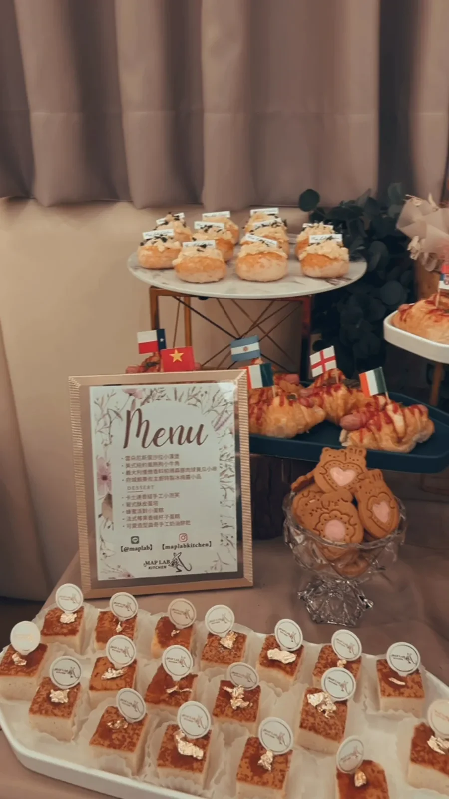
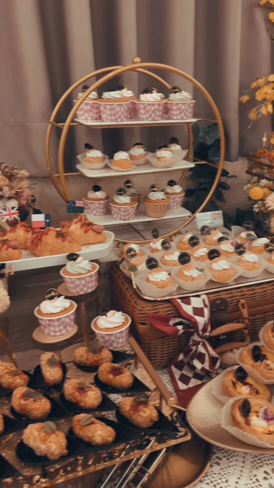

# 台南托嬰畢業典禮外燴｜成長日甜點桌｜MAPLAB

孩子準備離開熟悉的教室，走向下一段旅程。畢業典禮讓老師、家長與孩子聚在一起，也讓平常細小的成長被好好看見。這場台南托嬰畢業典禮外燴，以一口點心與花藝組成明亮的慶祝桌景，讓祝福自然地留在相聚的時間裡。

## 一張甜點桌，收藏成長的喜悅

奶油色與金棕色的點心錯落陳列，黃色花材在桌面輕輕展開。柔和的色彩與圓潤器皿讓畫面維持明亮，大人與孩子都能清楚看見餐點的位置。

餐點與器皿安排在不同高度，讓桌面從遠處看有清楚的輪廓，走近時仍保留可以慢慢欣賞的細節。對親子活動來說，這樣的陳列也能讓拍照、取餐與交談各自保有舒服的空間。

## 一口份量，讓大人孩子自在分享

畢業典禮的流程通常會穿插致詞、合照與家長交流，餐點適合做成容易拿取、方便分享的份量。小巧的鹹食與烘焙點心，較方便在致詞、合照與交流之間取用，也讓不同年齡的賓客依自己的節奏選擇。

菜單規劃可以從甜鹹比例、活動時段與停留時間開始思考。下午茶時段適合以甜點、烘焙小食與飲品為主；若活動跨過正餐時間，則可以增加較有飽足感的品項。更多搭配方向可參考 [台南外燴菜單設計靈感](https://www.maplabkitchen.com/tainan-custom-catering-menu/)。

如果活動是家庭型的成長慶祝，也可以參考 [台南週歲派對外燴規劃](https://www.maplabkitchen.com/catering-one-year-old-party-tainan/)，再依孩子年齡、流程與來賓組成調整；托嬰畢業典禮與週歲派對是不同活動，不需要套用同一套形式。

## 親子畢業典禮的餐桌配置重點

### 讓取餐路線簡單清楚

餐點、餐具與飲品可以依使用順序安排，讓賓客不必在桌邊來回尋找。若現場同時有孩子與大人，桌面周圍也需要保留足夠的移動空間，避免拍照與取餐互相擠在一起。

### 用主題色連結典禮氣氛

花藝、桌布、器皿與甜點不必堆滿相同顏色。選擇一至兩個主色，再以奶油白、木質色或透明器皿留出空間，畫面通常會更輕盈，也更容易和場地原有的佈置相處。

### 先照顧活動節奏

餐點出現的時間會影響現場感受。典禮開始前可以先保留桌景的完整，合照或主要流程結束後再引導取餐；若賓客分批抵達，也可以事先安排補餐方式，讓桌面在活動過程中維持整齊。

## 詢問畢業典禮外燴前，可以先準備什麼？

第一次討論時，先整理以下資訊，通常就能更快抓到適合的方向：

- 活動地點與使用空間
- 預計人數，以及成人與孩子的大致比例
- 典禮開始、合照與取餐的時間安排
- 希望以甜點茶會、輕食或較有飽足感的餐點為主
- 場地是否已有桌椅、電源、冷藏與清潔動線
- 喜歡的主題色、花藝或桌面氣氛

這些資訊不需要一次非常完整。先說明已確定的部分，MAPLAB 會依活動性質一起整理菜單與配置。也可以先看 [台南外燴 LINE 詢問指南](https://www.maplabkitchen.com/tainan-catering-line-inquiry-guide/)，確認第一次聯絡時最需要提供的內容。

## 台南畢業典禮外燴常見問題

### 托嬰畢業典禮適合準備哪些餐點？

可以先依活動時段、停留時間與賓客年齡，安排容易拿取的一口鹹食、烘焙點心與甜點。若跨過正餐時間，再增加較有飽足感的品項。

### 親子活動茶點桌怎麼安排取餐動線？

餐點、餐具與飲品依取用順序配置，桌邊保留拍照與通行空間；主要流程結束後再引導取餐，也較容易維持桌面完整。

### 詢問畢業典禮甜點桌前要準備哪些資訊？

先提供活動地點、預計人數、成人與孩子比例、流程時間、餐點方向及場地設備，就能開始整理菜單與桌面配置。

## 一起規劃孩子的成長日

從花藝、餐點到整體桌景，每一個細節都圍繞著「長大」這件值得慶祝的事。當孩子準備往下一站出發，這張甜點桌也替老師、家長與孩子留下一份溫柔而明亮的共同記憶。

正在規劃台南的托嬰畢業典禮、親子活動或成長紀念茶點嗎？把活動地點、預計人數與喜歡的氣氛告訴我們，MAPLAB 會和你一起整理適合的餐點、桌面與活動節奏。

**[加入 MAPLAB 官方 LINE，開始討論活動](https://lin.ee/IP8nt4n)**
